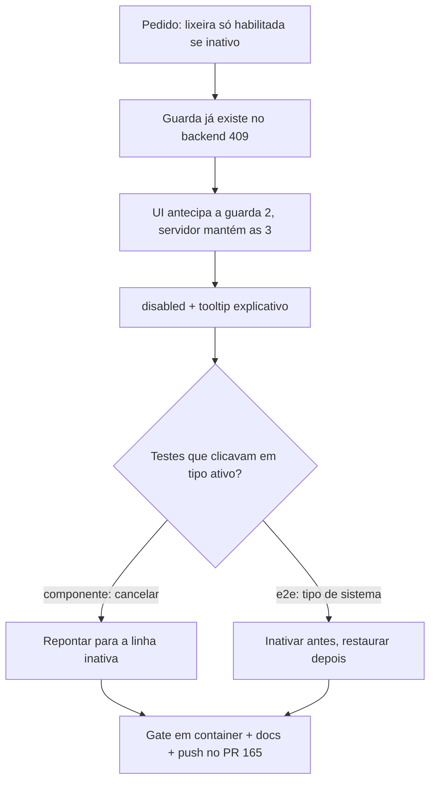

# Prompt 004 — Lixeira habilitada só em tipo inativo

## Prompt original

> em /admin/tipos-arquivos o botão excluir só deve está habilitado se o registro estiver inativo

Sanitização: não aplicável — o prompt não contém dados sensíveis.

## Interpretação semântica

Refinamento sobre a entrega do prompt 003. A guarda "só item inativo pode ser excluído" já existia no
backend (`TipoDocumentoAtivoNaoExcluivel` → 409), mas a UI deixava clicar e só então exibia o erro. O
solicitante quer que a tela **antecipe** essa regra: enquanto o tipo estiver ativo, o botão fica
desabilitado.

## Entidades envolvidas

| Camada | Artefato |
|---|---|
| Frontend | `frontend/src/pages/admin/TiposArquivos.tsx` |
| i18n | `frontend/src/i18n/locales/{pt-BR,en,es}.json` (`admin.tiposArquivos.acao.excluirBloqueado`) |
| Testes | `frontend/src/pages/admin/TiposArquivos.test.tsx`, `frontend/cypress/e2e/tipos-arquivos-excluir.cy.ts` |
| Docs | `spec/manuais/manual-administrador.md` §19, `docs/dev/2026-07-26-registro-excluir-tipo-arquivo.md` |

## Intenção principal

Impedir na interface um clique que o servidor sempre recusaria, deixando explícita a ordem
**inativar → excluir**.

## Intenções secundárias

- Comunicar o motivo do bloqueio (tooltip), em vez de apenas travar o botão.
- Preservar a guarda do backend — a UI orienta, o servidor decide.

## Restrições identificadas

- Não relaxar nenhuma validação do backend: as três guardas continuam íntegras (DEC-STR-19 / defesa em profundidade).
- Nova string visível passa pelos três idiomas (DEC-STR-33).
- Suíte roda em container (DEC-STR-34).
- Casos de teste que clicavam na lixeira de um tipo **ativo** precisam ser reescritos, sob pena de virarem vazios.

## Ambiguidades

Nenhuma — pedido objetivo e verificável.

## Plano de ação derivado

1. `disabled={s.ativo || excluir.isPending}` + `title`/`aria-label` condicional na lixeira.
2. Chave `acao.excluirBloqueado` nos três idiomas.
3. Testes: estado desabilitado por linha, tooltip, clique inerte em ativo; corrigir o caso "cancelar" que
   passaria a clicar num botão desabilitado; ajustar o E2E (o caso do tipo de sistema passa a inativar antes,
   e restaura o estado ao final).
4. Atualizar manual §19, registro técnico e PRJ-DEC-18.
5. Gate em container e push na branch do PR #165.

## Fluxo de raciocínio

