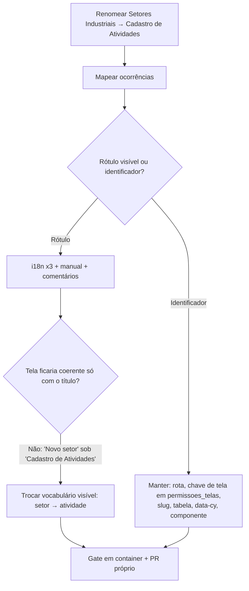

# Prompt 005 — "Setores Industriais" → "Cadastro de Atividades"

## Prompt original

> Altere "Setores Industriais" para "Cadastro de Atividades"

Sanitização: não aplicável — o prompt não contém dados sensíveis.

## Interpretação semântica

Renomear o rótulo da tela do Painel Admin hoje chamada **"Setores Industriais (CNAE)"**
(`/admin/setores-industriais`, RF021) para **"Cadastro de Atividades"**, no menu lateral e no cabeçalho.

Como toda a tela fala "setor" (*Novo setor*, *Editar setor*, *Nenhum setor cadastrado*), manter só o
título trocado deixaria a interface incoerente — o campo já se chama "Descrição da atividade". A leitura
adotada é que o solicitante está renomeando o **conceito**, e não apenas um cabeçalho; portanto o
vocabulário visível da tela passa de *setor* para *atividade*, nos três idiomas.

## Entidades envolvidas

| Camada | Artefato |
|---|---|
| i18n | `frontend/src/i18n/locales/{pt-BR,en,es}.json` — `common.nav.setoresIndustriais` e `admin.setoresIndustriais.*` |
| Frontend | `frontend/src/pages/admin/SetoresIndustriais.tsx` (comentário de cabeçalho) |
| Backend | `backend/src/permissoes/domain/tela-admin.ts` (comentário da matriz padrão) |
| E2E | `frontend/cypress/e2e/manual-admin.cy.ts` (nome do caso) |
| Docs | `spec/manuais/manual-administrador.md` (sumário, §1, §18, §23) |

## Intenção principal

Alinhar o nome exibido ao vocabulário que o solicitante quer usar no produto.

## Intenções secundárias

- Coerência interna da tela (botões, estados vazios, tooltips e modais).
- Paridade entre os três idiomas (DEC-STR-33).

## Restrições identificadas

- **Nenhum identificador pode mudar.** A chave de tela `setoresIndustriais` está **persistida em
  `permissoes_telas`** (matriz perfil × tela): renomeá-la exigiria migração de dados e derrubaria as
  permissões já customizadas. Idem para a rota `/admin/setores-industriais`, o slug `setores-cnae`, a
  tabela `setores_cnae`, os atributos `data-cy` e o nome do componente.
- Os testes selecionam por `data-cy`, não por texto — a troca de rótulo não os quebra.
- Suíte roda em container (DEC-STR-34).

## Ambiguidades e como foram resolvidas

| Ambiguidade | Resolução |
|---|---|
| Trocar só o título ou o vocabulário todo? | Vocabulário visível da tela, para não deixar "Novo setor" sob "Cadastro de Atividades". Reportado ao solicitante. |
| Renomear identificadores/rota? | **Não.** Só apresentação — o custo (migração de `permissoes_telas`) não traz ganho ao usuário. |
| A aba "Setores (CNAE)" da tela Catálogos? | **Fora do escopo** — é outro rótulo, em outra tela, e não corresponde à string pedida. Sinalizado como decisão do solicitante. |

## Plano de ação derivado

1. Trocar os rótulos em `common.nav` e `admin.setoresIndustriais.*` nos três idiomas.
2. Atualizar comentários de código que citam o nome antigo (frontend e backend).
3. Atualizar o manual do administrador e o nome do caso E2E.
4. Rodar o gate em container e abrir PR próprio (branch separada do PR #165, que trata de outra feature).

## Fluxo de raciocínio

