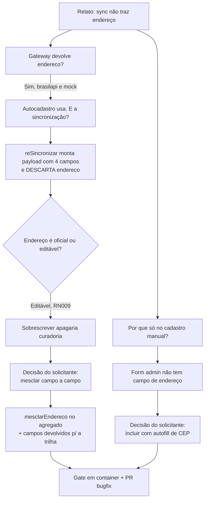

# Prompt 006 — Sincronização não traz o endereço da Receita

## Prompt original

> Sincronização dos dados do fornecedor com a Receita Federal
> Ao cadastrar um fornecedor manualmente e posteriormente realizar a sincronização com a Receita Federal,
> o sistema está trazendo apenas os dados básicos da empresa. Os dados de endereço, como logradouro,
> número, bairro, município, estado e CEP, não estão sendo preenchidos

Sanitização: não aplicável — o prompt não contém dados sensíveis.

## Interpretação semântica

Defeito confirmado. O endereço **chega** da Receita e é **descartado** pelo caso de uso de
re-sincronização. Diagnóstico do caminho completo:

| Etapa | Estado |
|---|---|
| `ReceitaGateway.DadosCnpj` | Já declara `endereco?: EnderecoEmpresa` |
| `receita-brasilapi.ts` | **Mapeia** o endereço (`mapearEndereco`) |
| `receita-mock.ts` | **Tem** endereço na semente |
| `CadastrarFornecedor` (autocadastro público) | **Usa** o endereço oficial |
| `GerirConta.reSincronizar` | **Descartava** — montava o payload só com `razaoSocial`, `porte`, `cnaes`, `situacao` |
| `CriarFornecedorAdmin` (cadastro manual) | Não tinha campo de endereço — o fornecedor nascia sem nenhum |

Ou seja: o defeito é de **uma linha de payload**, e o cadastro manual sem campo de endereço é o que o
torna visível (no autocadastro o endereço já vinha).

## Entidades envolvidas

| Camada | Artefato |
|---|---|
| Domínio | `catalogo/domain/fornecedor.ts` — `aplicarSincronizacao`, novo `mesclarEndereco` |
| Aplicação | `catalogo/application/gerir-conta.ts`, `criar-fornecedor-admin.ts` |
| Adapters | `catalogo/adapters/fornecedores-admin-controller.ts`, `shared/acl/receita/receita-mock.ts` |
| Frontend | `pages/admin/ModalFornecedor.tsx`, `lib/api.ts`, `i18n/locales/{pt-BR,en,es}.json` |
| Docs | `spec/manuais/manual-administrador.md` §12 |

## Intenção principal

Fazer a sincronização preencher o endereço do fornecedor a partir da Receita.

## Intenções secundárias

- Não destruir endereço que o operador/fornecedor tenha informado (o endereço é campo **editável**, RN009).
- Permitir informar o endereço já no cadastro manual, sem depender da sincronização.

## Restrições identificadas

- **RN009:** endereço vive em `contato`, junto de nome fantasia e telefone — é editável, ao contrário de
  razão social/porte/CNAEs/situação. O endereço da Receita é o **fiscal**, que pode divergir do de
  correspondência: sobrescrever a cada clique seria perda silenciosa de dado.
- **AD-18:** a trilha não pode afirmar que atualizou o endereço quando não atualizou.
- i18n nos três idiomas (DEC-STR-33); suíte em container (DEC-STR-34).

## Ambiguidades levantadas ao solicitante

| Questão | Resolução do solicitante |
|---|---|
| Endereço já existente: sobrescrever ou preservar? | **Preencher só o que estiver vazio**, campo a campo. |
| Incluir endereço no formulário "Novo fornecedor"? | **Sim**, com autofill por CEP. |

## Plano de ação derivado

1. `aplicarSincronizacao` recebe `endereco?` e mescla campo a campo; devolve os campos realmente
   atualizados, para a trilha.
2. `GerirConta.reSincronizar` repassa `r.valor.endereco` e emite os campos devolvidos pelo agregado.
3. `CriarFornecedorAdmin` + rota `POST /admin/fornecedores` aceitam `endereco`, normalizando e
   descartando o objeto todo em branco.
4. Formulário "Novo fornecedor" ganha os campos com autofill de CEP.
5. Semente do mock da Receita ganha uma segunda empresa, para o fluxo manual→sincronizar ser
   exercitável em dev/teste.
6. Gate em container, documentação e PR de `bugfix/*`.

## Fluxo de raciocínio

