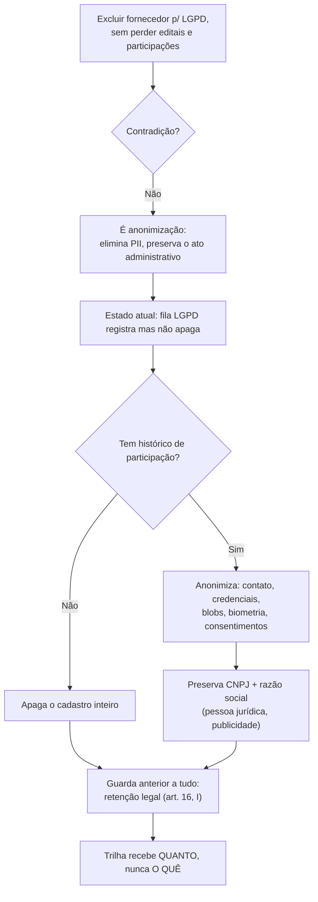

# Prompt 007 — Exclusão de fornecedor (LGPD)

## Prompt original

> @tech-lead Exclusão de fornecedor
> Disponibilizar uma opção para exclusão do cadastro do fornecedor, especialmente para atendimento de
> solicitações relacionadas à LGPD. A funcionalidade deve considerar os vínculos e o histórico do
> fornecedor no sistema, evitando a perda de informações relacionadas a editais, documentos e
> participações anteriores

Sanitização: não aplicável — o prompt não contém dados pessoais nem segredos.

## Interpretação semântica

A frase carrega uma tensão explícita: **eliminar** o cadastro (LGPD art. 18, V) **sem perder** editais,
documentos e participações. Não é contradição — é a descrição de uma **anonimização**: elimina-se o dado
pessoal e preserva-se o registro do ato administrativo.

Estado encontrado: a fila de Atendimento LGPD **registra** a decisão (`atender`/`recusar`/`descartar`)
mas **não elimina nada** — `avaliarDescarte` confere o prazo de retenção e marca a solicitação como
atendida com um texto. Existe o processo, falta a execução.

## Entidades envolvidas

| Contém dado pessoal (alvo) | Histórico a preservar |
|---|---|
| `fornecedores.contato` (telefone, endereço, nome fantasia) | `credenciamentos`, `distribuicoes` |
| `usuarios` (e-mail, nome, hash de senha) | `contestacoes_cnae`, `bloqueios` |
| `contas_acesso.identificador` | `malotes` (processo SEI formalizado) |
| `documentos_conteudo` (blob cifrado, PII de sócios) | `documentos` (metadados da covalidação) |
| `fornecedor_biometria.template` (**sensível**, art. 11) | `auditoria` (append-only, AD-18) |
| `consentimentos`, `notificacoes` | |

## Intenção principal

Executar de fato o direito de eliminação sobre o cadastro do fornecedor.

## Intenções secundárias

- Não quebrar integridade referencial de editais/credenciamentos/distribuições/malotes.
- Manter a publicidade do ato administrativo (quem foi credenciado).
- Deixar rastro auditável do atendimento sem gravar o dado eliminado na trilha.

## Restrições identificadas

- **LGPD art. 16, I** — obrigação legal de guarda prevalece sobre o pedido: reusar a `PoliticaRetencao`
  já existente (cadastral 730 dias; fiscal/contratual 1825).
- **AD-18** — trilha append-only nunca é apagada; logo, não pode receber dado pessoal.
- **AD-28** — migração forward-only.
- i18n nos três idiomas (DEC-STR-33); suíte em container (DEC-STR-34).

## Ambiguidades levantadas ao solicitante

| Questão | Resolução |
|---|---|
| Exclusão física, anonimização ou híbrido? | **Híbrido**: sem histórico de participação apaga; com histórico anonimiza. |
| CNPJ e razão social na anonimização? | **Preservar** — dados de pessoa jurídica que integram o ato administrativo. |
| Quem dispara? | **Só pela fila de Atendimento LGPD**, a partir de uma solicitação `exclusao` pendente. |

Decisões tomadas pelo Tech Lead, por já estarem formalizadas no projeto: reutilizar a política de
retenção existente como guarda, e jamais tocar a tabela `auditoria`.

## Plano de ação derivado

1. Migração 0039 (`anonimizado_em`) + `Fornecedor.anonimizar()` no agregado.
2. Caso de uso `ExecutarExclusaoFornecedor` com portas locais (diretório do titular, histórico, purga).
3. Adaptadores: purga pg em **uma transação**; espelho em memória para o modo sem banco.
4. Rota `POST /titular/solicitacoes/:id/executar-exclusao`, restrita a DPO/Administrador.
5. Botão "Executar exclusão" na fila LGPD, com confirmação; i18n ×3.
6. Testes (caso de uso, rota, tela), gate em container, documentação e PR.

## Fluxo de raciocínio

