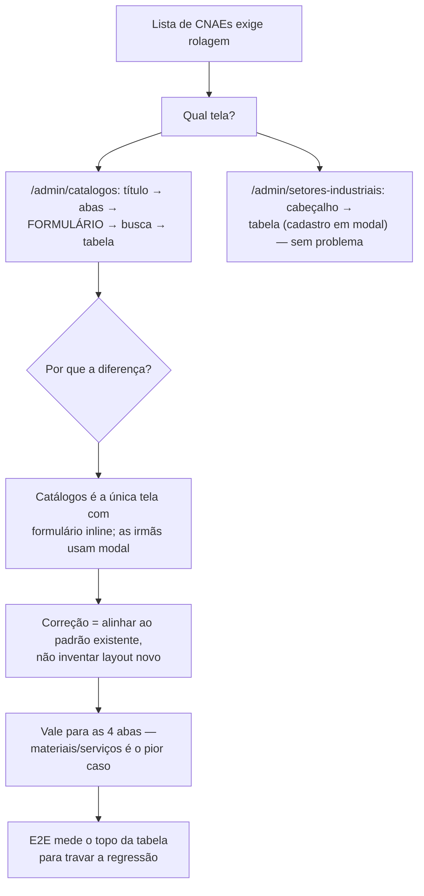

# Prompt 008 — Lista de CNAEs abaixo da dobra

## Prompt original

> @tech-lead Visualização da lista de CNAEs ativos
> A guia ou seção de CNAEs ativos não fica visível de forma imediata na tela, sendo necessário rolar a
> página para localizá-la. Isso pode dificultar a identificação da listagem e a navegação do usuário.

Sanitização: não aplicável.

## Interpretação semântica

A queixa é de **ordem visual**, não de dado ausente. A tela **Catálogos** (`/admin/catalogos`) renderiza,
nesta ordem: título + subtítulo → abas → **formulário de criação** → barra de busca → **tabela**. O
formulário fica entre a aba e a listagem e empurra os itens para baixo da dobra.

A tela dedicada **Cadastro de Atividades** (`/admin/setores-industriais`) não tem o problema: lá o
cadastro é um modal aberto por "+ Novo" e a tabela vem logo abaixo do cabeçalho. As telas irmãs
(Secretarias, Tipos de Arquivos) seguem o mesmo padrão — **Catálogos era a única com formulário inline**.

## Entidades envolvidas

| Camada | Artefato |
|---|---|
| Frontend | `frontend/src/pages/admin/ManterCatalogos.tsx` |
| i18n | `frontend/src/i18n/locales/{pt-BR,en,es}.json` (`admin.catalogos.novoCadastro`, `.modalTitulo`, `.modalSubtitulo`) |
| Testes | `ManterCatalogos.test.tsx`, `cypress/e2e/catalogos-layout.cy.ts` |

## Intenção principal

Fazer a listagem aparecer na primeira tela, sem rolagem.

## Intenções secundárias

- Uniformizar Catálogos com o padrão de cadastro das telas irmãs.
- Resolver para as **quatro** abas — materiais e serviços tem o maior formulário, logo o pior sintoma.

## Restrições identificadas

- Preservar os `data-cy` do contrato de testes (`form-catalogo`, `campo-*`, `criar`, `tabela-catalogo`).
- i18n nos três idiomas (DEC-STR-33); suíte em container (DEC-STR-34).
- O E2E `catalogos-layout.cy.ts` mede o formulário — precisa abrir o modal antes de medir.

## Ambiguidades levantadas ao solicitante

| Questão | Resolução |
|---|---|
| Qual correção? | **Formulário vira modal "+ Novo"**, alinhando ao padrão das telas irmãs |
| Só a aba de CNAE ou a tela toda? | **As quatro abas** — compartilham o mesmo layout |

## Plano de ação derivado

1. Extrair o formulário para um modal (`ModalCadastro`), disparado por "+ Novo cadastro" no cabeçalho.
2. Subir a barra de busca e a tabela para logo abaixo das abas.
3. Fechar o modal ao criar com sucesso e ao trocar de aba (cada catálogo tem campos próprios).
4. i18n ×3; ajustar testes de componente e E2E; **novo caso E2E que mede o topo da tabela** contra a
   altura da janela — é a regressão que interessa travar.
5. Gate em container, documentação e PR.

## Fluxo de raciocínio

