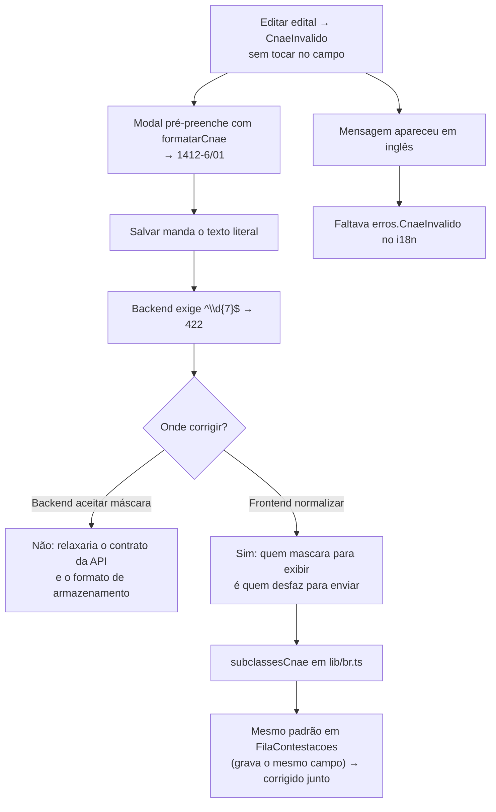

# Prompt 009 — Editar edital falha com `CnaeInvalido`

## Prompt original

> @tech-lead Erro ao editar edital com CNAE cadastrado
> Ao editar um edital já cadastrado, o sistema exibe o CNAE em um formato diferente do padrão de sete
> dígitos aceito na validação. Ao tentar salvar novamente, mesmo sem alterar o CNAE, o sistema apresenta
> a mensagem:
> Invalid CNAE: expected a 7 digit subclass

Sanitização: não aplicável.

## Interpretação semântica

O relato já contém o diagnóstico: a tela **exibe** o CNAE mascarado e a API **exige** 7 dígitos. Três
camadas se somando:

1. `GerirEditais.tsx` — o modal de edição pré-preenche o campo com `formatarCnae` (`1412-6/01`);
2. o `mutationFn` de salvar fazia `split(',').map(c => c.trim())` — **manda o texto literal**, com máscara;
3. o backend valida `^\d{7}$` e responde `422 CnaeInvalido`.

E uma quarta, que explica o texto em inglês visto pelo usuário: **não existia `erros.CnaeInvalido`** no
i18n, então o frontend caía no fallback e exibia a mensagem crua do backend.

## Entidades envolvidas

| Camada | Artefato |
|---|---|
| Frontend | `pages/admin/GerirEditais.tsx` (criar e editar), `pages/admin/FilaContestacoes.tsx` (acatar) |
| Util | `lib/br.ts` — novo `subclassesCnae` |
| i18n | `locales/{pt-BR,en,es}.json` — `erros.CnaeInvalido` |
| Backend | `editais/application/gerir-editais.ts` — validação `^\d{7}$` (**não alterada**) |

## Intenção principal

Fazer a edição de edital salvar sem exigir que o usuário reescreva um campo que ele não alterou.

## Intenções secundárias

- Manter a máscara na tela (é a forma legível, usada em todo o app).
- Traduzir o erro, para quando ele legitimamente ocorrer.

## Restrições identificadas

- **Não relaxar a validação do backend:** `^\d{7}$` é o contrato da API e o formato de armazenamento; a
  normalização é responsabilidade de quem apresenta o dado mascarado.
- i18n nos três idiomas (DEC-STR-33); suíte em container (DEC-STR-34).

## Ambiguidades

Nenhuma — relato preciso e reproduzível por leitura do código.

## Achado adicional

`FilaContestacoes.tsx` (acatar contestação) usava **o mesmo padrão não normalizado** e escreve o **mesmo
campo** (`cnaesAlvo` do edital). Corrigido junto: é o mesmo defeito, a uma chamada de distância, no fluxo
que grava o mesmo dado. Registrado no relatório como extensão consciente do escopo relatado.

## Plano de ação derivado

1. `subclassesCnae` em `lib/br.ts` (separa por vírgula, descarta não-dígitos, remove vazios).
2. Usar em criar/editar edital e em acatar contestação.
3. `erros.CnaeInvalido` nos três idiomas.
4. Testes: o cenário do relato (editar sem tocar no campo) + múltiplos CNAEs + unidade do normalizador.
5. Gate em container, documentação e PR.

## Fluxo de raciocínio

