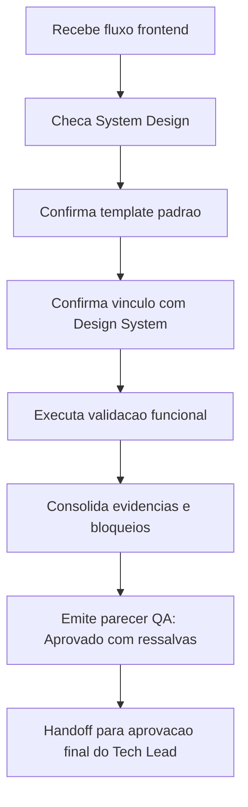

# Validação QA de Fluxos Frontend — Refresh de UI do Portal do Fornecedor

> Baseado em `.github/agents/templates/qa-validacao-frontend-template.md`.

> **Adendo 2026-07-02 (resolução parcial de ressalvas):** a ressalva de **Design System formal** foi **resolvida** — produzido `docs/ux/design-system.md` (tokens/componentes/a11y verificados no código) e o **System Design agora o referencia** (`docs/system-design.md`, seção obrigatória de Design System, DEC-STR-09). Evidência de gate re-executado **no container** (DEC-STR-34) em 2026-07-02: `docker compose --profile test run --rm frontend-test` → lint + typecheck + **vitest 4/4** verdes (exit 0). Permanecem abertas: **E2E Cypress** em ambiente com backend/stubs (CI) e **Storybook.js** (DEC-STR-10). Novas divergências sinalizadas pelo Design System: **D1** (paleta navy `#0A2A52` vs `#003A68` do contrato antigo) e **D2** (`tokens.ts` vs `index.css`; `tokens.ts` é código não importado).

## Identificação

- **Projeto ou produto:** compraMais — Portal do Fornecedor
- **Responsável QA:** QA Expert (delegado pelo Tech Lead)
- **Data da validação:** 2026-07-01
- **Escopo validado:** Refresh visual do Portal do Fornecedor a partir do mockup `spec/AI-UI-Design/Compra Mais - Portal do Fornecedor .html` (PR #12 / PRJ-DEC-10). Telas: Início, Vitrine de Editais, Meus Credenciamentos, Gestão de Documentos, Demandas distribuídas, Minha conta, wizard de Credenciamento e fluxos de auth (cadastro/login). Consistência do shell no Admin.
- **Status:** **Aprovado com ressalvas**

## Precondição documental

- O System Design existe?: **Sim** — `docs/system-design.md`
- O System Design usou `templates/system-design-template.md`?: Sim (baseline de arquitetura/infra)
- Em caso de não, existe justificativa explícita?: N/A
- O System Design referencia o documento de Design System?: **Não** — Design System formal ainda pendente (backlog UX). A linguagem visual está materializada no mockup `spec/AI-UI-Design` e no código, mas não há documento formal de Design System vinculado. **Ressalva registrada.**
- Link ou referência do System Design: `docs/system-design.md`
- Link ou referência do Design System: **Pendente (UX)** — fonte visual de facto: `spec/AI-UI-Design/Compra Mais - Portal do Fornecedor .html` e `spec/AI-UI-Design/Dashboard do Fornecedor/_ds/`
- Link ou referência de Figma: Não fornecido
- Link ou referência de Storybook.js: Não configurado (pendente — DEC-STR-10 / backlog)

## Checagem de coerência documental

| Item verificado | Evidência encontrada | Status | Observações |
|---|---|---|---|
| Vínculo entre System Design e Design System | System Design não referencia Design System formal | ⚠️ Ressalva | Design System formal não produzido; refresh baseado no mockup AI-UI-Design |
| Uso do template padrão de System Design | `docs/system-design.md` segue o template | ✅ OK | Requisitos funcionais de negócio ainda "a definir" |
| Referência de Figma quando aplicável | Não fornecido | ➖ N/A | Mockup HTML compilado supre a referência visual |
| Referência de Storybook.js quando aplicável | Não configurado | ⚠️ Pendente | Ownership UX/Dev (DEC-STR-10) |
| Evidências visuais disponíveis | Mockup HTML + PNGs de referência em `spec/AI-UI-Design` | ✅ OK | Fonte da verdade visual versionada no PR |

## Fluxos frontend validados

| Fluxo | Objetivo | Tipo de validação | Resultado | Evidências |
|---|---|---|---|---|
| Cadastro (CNPJ→endereço→CEP→QSA) | Autofill Receita + fallback manual | Automatizada (vitest smoke + contrato data-cy) + revisão estática vs mockup | ✅ Passa | `vitest` 4/4; `data-cy` cadastro preservados |
| Login local (JWT) → /inicio | Autenticar e cair no shell do fornecedor | Contrato data-cy + revisão | ✅ Passa (E2E real pendente) | `aba-entrar`,`email`,`senha`,`entrar`,`app-shell` presentes |
| Início ("Bem-vindo") | Home com alertas, KPIs e painéis | Revisão estática vs mockup + build | ✅ Passa | Fidelidade ao mockup `02-inicio` |
| Vitrine de Editais | Só compatíveis + estado vazio | Contrato data-cy + revisão | ✅ Passa (E2E real pendente) | `edital-item`+`data-compativel`, `estado-vazio` |
| Meus Credenciamentos | Pendências + próximos passos | Contrato data-cy + revisão | ✅ Passa | `pendencia`, `sem-pendencias` |
| Gestão de Documentos | Upload + status vigente/expirado | Contrato data-cy + revisão | ✅ Passa | `upload`; Pill de status |
| Demandas distribuídas | Agregados públicos | Contrato data-cy + revisão | ✅ Passa | `editais-vigentes`, `secretaria`, `segmento` |
| Minha conta | Dados oficiais + editáveis + sync + CPF | Contrato data-cy + revisão | ✅ Passa | `card-sync`,`sincronizar`,`cep`,`cpf`,`cpf-ok`,`cpf-erro` |
| Wizard de Credenciamento | Capacidade→docs→prova de vida→enviado | Revisão estática vs mockup | ✅ Passa | Novo fluxo; `credenciamento`, `prova-de-vida` |
| Shell (sidebar/topbar/dropdowns) | Navegação, notificações, perfil, recolher | Serve smoke + revisão | ✅ Passa | HTTP 200; CSS `cm-*` no bundle |

## Evidências de execução

- **Gates automatizados (local + CI PR #12):** `tsc --noEmit` 0 erros · `eslint .` 0 · `vitest run` 4/4 · `vite build` 231 módulos ok · CI "Lint & Test (frontend)" **pass**.
- **Serve smoke:** `vite preview` → HTTP 200, `<title>Compra Mais — Portal do Fornecedor</title>`, classes de shell (`cm-sidebar`, `cm-navbtn`, `auth-card`, `cm-grid-4`) presentes no CSS compilado.
- **Contrato de seletores Cypress:** todos os `data-cy` referenciados pelas specs verificados como presentes no código pós-refresh.
- **Ambiente validado:** build de produção local + CI GitHub Actions.
- **Dados de teste utilizados:** dados de demonstração do mockup (telas estáticas) e stubs `cy.intercept` definidos nas specs (não executados end-to-end aqui).

## Bloqueios e ressalvas

| Tipo | Descrição | Impacto | Ação recomendada | Owner |
|---|---|---|---|---|
| Ressalva | Suíte **Cypress E2E** não executada em ambiente com backend/stubs (sem browser/API neste ambiente) | Médio | Rodar `cypress run` no CI com o Painel/API servidos antes do merge | QA / CI |
| Ressalva | **Design System formal** não existe; System Design não o referencia | Médio | UX formalizar Design System e vincular ao System Design (DEC-STR-09) | UX Expert / BA |
| Ressalva | **Storybook.js** não configurado | Baixo | Estruturar Storybook alinhado ao Design System (DEC-STR-10) | UX / Senior Dev |
| Observação | Campos do mockup sem contrato de dados (validade de documento, rateio por-demanda) renderizados só com dado real, sem inventar campos | Baixo | Evoluir contratos de API nas próximas fases | Senior Dev / BA |

## Parecer final

- **Resultado final:** **Aprovado com ressalvas** — qualidade de build/tipos/lint/unit e fidelidade visual ao mockup confirmadas; contrato de testes preservado. Aceite pleno condicionado à execução real do E2E Cypress no CI.
- **Condições para aceite:** (1) `cypress run` verde no CI com backend/stubs; (2) ciência do Tech Lead sobre a ressalva do Design System formal.
- **Necessidade de retorno ao Business Analyst:** Sim (vincular Design System ao System Design quando produzido).
- **Necessidade de retorno ao UX Expert:** Sim (formalizar Design System + Storybook).
- **Necessidade de retorno ao Tech Lead:** Sim — para consolidar aprovação final considerando as ressalvas.
- **Documento de aprovação final do Tech Lead que deve receber esta validação:** `templates/aprovacao-final-tech-lead-template.md` (a ser emitido no fechamento do PR #12).
- **Trecho a reutilizar no fechamento final:** "Refresh de UI aprovado com ressalvas — gates estáticos verdes e contrato de testes preservado; E2E Cypress e Design System formal pendentes."

