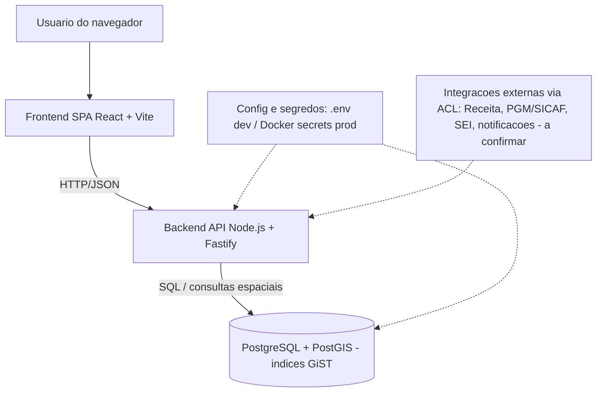
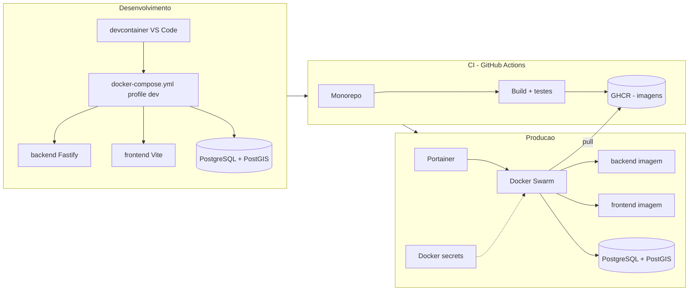
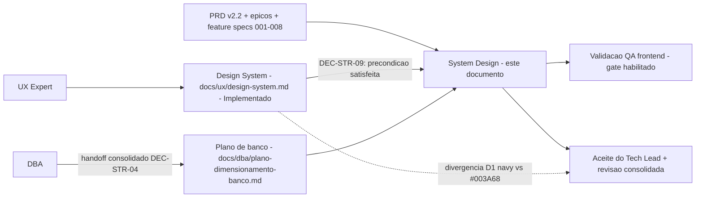

# System Design — compraMais

## Identificacao

- Projeto ou produto: compraMais — aplicacao web com dados georreferenciados
- Responsavel Business Analyst: Business Analyst
- Responsavel tecnico principal: Tech Lead
- Data da versao: 2026-07-02
- Status: Em validacao

> Documento elaborado a partir de `.github/agents/templates/system-design-template.md`, consolidando as decisoes fechadas pelo Tech Lead em `.github/agents/memoria/MEMORIA-PROJETO.md` (PRJ-DEC-03..08 e resolucoes Q-01..Q-03). As decisoes citadas sao base factual e nao sao reabertas aqui.
>
> **Atualizacao 2026-07-02 (Business Analyst):** consolidados o escopo funcional ([PRD v2.2](../spec/docs/prd.md), [epicos](../spec/docs/epics.md), feature specs `spec/001..008`), a referencia ao [Design System](ux/design-system.md) (DEC-STR-09) e o handoff do [plano de dimensionamento do banco](dba/plano-dimensionamento-banco.md) do DBA (DEC-STR-04). Itens que permanecem em aberto: sign-off final do solicitante, volumetria real e confirmacao das integracoes externas.

## Objetivo do documento

- Problema de negocio enderecado: **definido e ratificado** no [PRD v2.2 (2026-06-29)](../spec/docs/prd.md). O compraMais e uma plataforma B2G de gestao de compras publicas municipalizadas na modalidade de credenciamento (Lei 14.133/21, art. 79; Lei Municipal 2.027) para a Prefeitura de Rio Branco — um "marketplace reverso" auditavel que conecta demandas de secretarias a fornecedores locais, com distribuicao matematicamente justa atrelada a capacidade produtiva. Enderecca o retrabalho da CPL na conferencia de certidoes, a "caca a editais" pelos fornecedores e as fraudes/suspeitas de favorecimento na distribuicao manual de cotas. O escopo funcional esta detalhado em [`spec/docs/epics.md`](../spec/docs/epics.md) (9 epicos, 31 historias) e nas feature specs `spec/001..008`. Esta versao do System Design consolida a arquitetura e a infraestrutura ja decididas e passa a referenciar o escopo funcional ja formalizado; permanecem em aberto apenas o sign-off final do solicitante, a volumetria real e a confirmacao de integracoes externas (ver "Escopo fora" e "Proximos passos").
- Escopo contemplado:
  - Arquitetura logica e de implantacao de uma aplicacao web com backend Node.js (Fastify, TypeScript), frontend React SPA (Vite, TypeScript) e persistencia PostgreSQL + PostGIS.
  - Monorepo unico com `backend/` e `frontend/`, orquestracao local por `docker-compose.yml` unico com `profiles` dev/prod e ambiente de desenvolvimento via devcontainer.
  - Pipeline de build/publicacao de imagens no GHCR via GitHub Actions e deploy em producao por imagem em Docker Swarm orquestrado por Portainer.
  - Estrategia de variaveis de ambiente e segredos sem versionamento.
  - Capacidade de consultas geoespaciais (PostGIS, indices GiST).
  - Escopo funcional de negocio ja formalizado (referenciado, nao reespecificado aqui): onboarding de fornecedor por CNAE (`spec/001`), covalidacao de elegibilidade (`spec/002`), editais individualizados (`spec/003`), auditoria/consulta/exportacao (`spec/004`), malote SEI (`spec/005`), contestacao e direitos LGPD (`spec/006`), paineis de transparencia (`spec/007`) e autenticacao (`spec/008`) — motor de distribuicao justa (water-filling + maiores restos) descrito no PRD/epicos.
- Escopo fora:
  - Detalhamento de fluxos que ja possuem PRD/feature spec — este documento referencia esses artefatos, nao os reespecifica.
  - Sign-off final do solicitante sobre o PRD v2.2 e a volumetria real de producao (em aberto).
  - Confirmacao final das integracoes externas de negocio (ex.: Receita/autopreenchimento CNPJ, PGM/SICAF para inadimplencia, SEI, notificacoes e-mail/SMS) — os contratos existem nas feature specs, mas a disponibilidade/credenciais de cada integracao externa permanecem **a confirmar com o solicitante**.
  - Design System (existe — ver secao obrigatoria) permanece em evolucao continua; Storybook e capturas reais ainda pendentes.
- Premissas:
  - As decisoes PRJ-DEC-03..07 e Q-01..Q-03 estao vigentes e sao tratadas como verdade de projeto.
  - O projeto e greenfield: `backend/`, `frontend/` e `spec/source/` estao vazios na data desta versao.
  - Backend e frontend sao servicos distintos no mesmo repositorio (monorepo unico — Q-01).
  - Os dados georreferenciados justificam o uso de PostGIS e indices espaciais GiST (PRJ-DEC-04).
  - Producao nao builda imagens: apenas faz pull do GHCR (PRJ-DEC-06).
- Restricoes:
  - Segredos nunca podem ser versionados; usar `.env` local em dev e Docker secrets/Portainer em producao (PRJ-DEC-07).
  - Orquestracao local deve usar um unico `docker-compose.yml` parametrizado por `profiles` dev/prod, com variaveis centralizadas no compose (PRJ-DEC-05).
  - Stack fixada: Node.js/Fastify/TypeScript no backend e React SPA/Vite/TypeScript no frontend (Q-02).
  - Registry e CI/CD fixados: GHCR + GitHub Actions; deploy por imagem (Q-03/PRJ-DEC-06).
  - Idioma dos artefatos de governanca: portugues do Brasil.

## Visao geral da solucao

- Resumo executivo da arquitetura: o compraMais e uma aplicacao web em monorepo unico. O frontend e uma SPA React (Vite) servida ao navegador que consome uma API HTTP do backend Node.js (Fastify, TypeScript). O backend concentra as regras de negocio e o acesso a dados, persistindo em PostgreSQL com a extensao PostGIS para consultas geoespaciais com indices GiST. O ambiente de desenvolvimento e padronizado por devcontainer e orquestrado localmente por um unico `docker-compose.yml` com `profiles` dev/prod. Em producao, as imagens sao construidas e publicadas no GHCR por GitHub Actions e implantadas em um cluster Docker Swarm gerenciado por Portainer, que faz pull das imagens (deploy por imagem, sem build em producao).
- Principais capacidades do sistema:
  - Servir uma SPA web ao usuario final.
  - Expor uma API HTTP de dominio no backend.
  - Persistir e consultar dados georreferenciados (PostGIS / GiST).
  - Operar de forma reproduzivel em desenvolvimento (devcontainer + compose) e em producao (Swarm/Portainer + GHCR).
  - Gerir configuracao e segredos por ambiente sem versiona-los.
  - Releases automatizados por pipeline de build/publish de imagens.
- Escopo funcional consolidado: o produto esta definido no [PRD v2.2](../spec/docs/prd.md), decomposto em [epicos/historias](../spec/docs/epics.md) e detalhado nas feature specs `spec/001..008`, com a espinha de arquitetura (monolito modular + DDD + Clean Architecture, 33 ADs) em [`spec/docs/architecture/ARCHITECTURE-SPINE.md`](../spec/docs/architecture/ARCHITECTURE-SPINE.md). O Design System esta implementado (ver secao obrigatoria) e o plano de dimensionamento do banco foi consolidado (ver secao do banco).
- Principais riscos arquiteturais:
  - Volumetria real ainda nao estimada, o que mantem o dimensionamento de carga como baseline conservador a validar (nao mais bloqueado pela ausencia de escopo).
  - Custo de consultas geoespaciais sob crescimento de dados sem indices/particionamento adequados.
  - Vazamento de segredos por configuracao incorreta de env/secrets entre dev e prod.
  - Divergencia de paleta entre o contrato UX antigo (`#003A68`) e a implementacao navy (`#0A2A52`) — divergencia D1, ainda em ratificacao (ver "Divergencias").
  - Dependencia de integracoes externas (Receita, PGM/SICAF, SEI, notificacoes) cujas credenciais/disponibilidade seguem a confirmar.
  - Drift entre imagem publicada no GHCR e a stack definida em producao (Swarm/Portainer).

## Componentes e responsabilidades

| Componente | Responsabilidade | Entradas | Saidas | Dependencias | Observacoes |
|---|---|---|---|---|---|
| Frontend SPA (`frontend/`, React + Vite + TS) | Interface web do usuario (Portal do Fornecedor); consome a API; renderiza dados (incl. geoespaciais) | Interacoes do usuario, respostas da API | Requisicoes HTTP, UI renderizada | Backend API, [Design System](ux/design-system.md) | Build estatico servido em producao; telas e Design System implementados (navy/ambar/Poppins) — ver secao obrigatoria |
| Backend API (`backend/`, Node.js + Fastify + TS) | Regras de negocio (monolito modular + DDD/Clean Architecture), validacao, autenticacao e acesso a dados | Requisicoes HTTP do frontend | Respostas HTTP/JSON, escritas/leituras no banco | PostgreSQL + PostGIS, configuracao/segredos | Framework Fastify (Q-02); contratos de API por feature em `spec/001..008/contracts/` e specs (ver "Integracoes e contratos") |
| PostgreSQL + PostGIS | Persistencia transacional e consultas geoespaciais | Escritas/leituras do backend | Dados consistentes e resultados espaciais | Infra de banco, extensao PostGIS | Indices GiST para consultas espaciais (PRJ-DEC-04); modelo de dados a cargo do DBA |
| Orquestracao local (`docker-compose.yml` + devcontainer) | Subir/parametrizar servicos em dev e prod via `profiles` | Variaveis de ambiente, `.env` (dev) | Servicos em execucao | Docker, VS Code (devcontainer) | Compose unico com `profiles` dev/prod (PRJ-DEC-05) |
| Pipeline CI (GitHub Actions) | Build, teste e publicacao de imagens no GHCR | Push/PR no repositorio | Imagens versionadas no GHCR | GHCR, segredos de CI | Sem build em producao (PRJ-DEC-06) |
| Orquestracao de producao (Docker Swarm + Portainer) | Deploy/operacao por imagem em cluster | Imagens do GHCR, stack/config, Docker secrets | Servicos em producao | GHCR, Docker secrets | Pull de imagens; deploy por imagem (PRJ-DEC-06) |
| Gestao de configuracao e segredos | Prover env por ambiente sem versionar segredos | `.env` (dev), Docker secrets/Portainer (prod) | Variaveis injetadas nos servicos | Compose, Swarm/Portainer | Segredos nunca versionados (PRJ-DEC-07) |

## Integracoes e contratos

Os contratos de API por feature ja existem no repositorio, versionados junto de cada feature spec. Contratos formais em `contracts/`: [onboarding](../spec/001-onboarding-fornecedor-cnae/contracts/onboarding-api.md), [credenciamento/covalidacao](../spec/002-covalidacao-elegibilidade/contracts/credenciamento-api.md), [editais](../spec/003-editais-individualizados/contracts/editais-api.md) e [auditoria](../spec/004-auditoria-consulta-exportacao/contracts/auditoria-api.md); as features 005 (malote SEI), 006 (contestacao/LGPD), 007 (transparencia) e 008 (autenticacao) definem seus contratos/entidades em `spec.md`/`data-model.md`. O detalhamento dos endpoints e schemas e responsabilidade dessas specs; este documento apenas os referencia.

| Integracao | Tipo | Origem | Destino | Contrato ou protocolo | Risco principal |
|---|---|---|---|---|---|
| Frontend -> Backend | Sincrona | Frontend SPA | Backend API | HTTP/JSON (REST); contratos por feature em `spec/001..008` (`contracts/` para 001-004; `spec.md`/`data-model.md` para 005-008) | Evolucao dos contratos a manter sincronizada entre spec e implementacao |
| Backend -> Banco | Sincrona | Backend API | PostgreSQL + PostGIS | Protocolo PostgreSQL; SQL/consultas espaciais | Custo de consultas geoespaciais sob escala |
| CI -> GHCR | Sincrona (pipeline) | GitHub Actions | GHCR | Push de imagem OCI autenticado | Falha/credencial de publicacao |
| Swarm/Portainer -> GHCR | Sincrona (pull) | Cluster de producao | GHCR | Pull de imagem OCI autenticado | Indisponibilidade do registry / tag incorreta |
| Backend -> Integracoes externas de negocio (Receita/CNPJ, PGM/SICAF, SEI, notificacoes e-mail/SMS) | Sincrona/assincrona | Backend API (via Anti-Corruption Layer) | Servicos externos | Descritos nas feature specs (ex.: onboarding/Receita, covalidacao/inadimplencia, malote/SEI); politica de indisponibilidade **fail-open + flag** (AD-12 / RN002) | Credenciais e disponibilidade reais **a confirmar com o solicitante** |

## Arquitetura de desenvolvimento

- Ambientes necessarios: estacao de desenvolvimento com VS Code + Docker; devcontainer do repositorio; servicos locais via `docker-compose.yml` (`profile` dev).
- Dependencias locais: Docker e Docker Compose; Node.js + gerenciador de pacotes (no devcontainer); PostgreSQL + PostGIS em container; toolchain TypeScript (backend e frontend).
- Servicos de apoio: container PostgreSQL/PostGIS; servico do backend Fastify; servico do frontend Vite (dev server); arquivo `.env` local nao versionado para segredos de desenvolvimento.
- Observacoes de setup:
  - Variaveis de ambiente centralizadas no `docker-compose.yml`; valores sensiveis vem do `.env` local (PRJ-DEC-05/07).
  - O scaffolding de `backend/` e `frontend/` ainda nao existe (greenfield); o Senior Developer prepara os prerequisitos do projeto e do container conforme o protocolo.
  - Seed/migracoes de banco e habilitacao da extensao PostGIS serao detalhados no handoff do DBA — **pendente**.
  - Os passos de comando exatos dependem do scaffolding inicial e serao formalizados pelo Senior Developer.

## Arquitetura de producao

- Topologia: cluster Docker Swarm gerenciado por Portainer; servicos de backend e frontend implantados por imagem (pull do GHCR); banco PostgreSQL/PostGIS conforme estrategia de persistencia (modo de provisionamento — gerenciado vs container no cluster — **a definir com o DBA/solicitante**).
- Componentes implantados: imagem do backend Fastify; imagem do frontend (build estatico servido); instancia(s) de PostgreSQL + PostGIS; configuracao e Docker secrets via Portainer.
- Observabilidade: **A definir com o solicitante.** Baseline recomendado: logs centralizados dos servicos, health checks por servico e metricas basicas de API e banco.
- Alta disponibilidade e resiliencia: baseline recomendado de pelo menos duas replicas por servico stateless (backend/frontend) no Swarm; estrategia de HA e backup do banco **a definir no handoff do DBA**.
- Politica de rollback: rollback por imagem (redeploy da tag anterior publicada no GHCR via Swarm/Portainer); migracoes de banco devem ter plano reversivel controlado pelo DBA. Como nao ha build em producao, o rollback de aplicacao e a troca de tag de imagem.

## Implantacao

### Desenvolvimento

1. Abrir o repositorio no VS Code e reabrir no devcontainer.
2. Prover o `.env` local (nao versionado) com os segredos de desenvolvimento.
3. Subir os servicos com `docker-compose.yml` no `profile` dev (banco PostgreSQL/PostGIS, backend e frontend).
4. Aplicar migracoes e habilitar PostGIS conforme handoff do DBA (pendente) e iniciar os servicos de backend e frontend.
5. Validacoes apos implantacao: health check do backend, carregamento da SPA, conexao com o banco e execucao de ao menos uma consulta geoespacial de fumaca. Criterios funcionais de fluxo **a definir com o solicitante**.

### Producao

1. CI (GitHub Actions) builda, testa e publica as imagens versionadas no GHCR (gatilho de release a definir no pipeline).
2. Atualizar a stack no Portainer/Swarm para as novas tags de imagem (pull do GHCR), com configuracao e Docker secrets do ambiente de producao.
3. Aplicar migracoes de banco aprovadas em janela controlada pelo DBA (plano reversivel).
4. Validacoes apos implantacao: health checks dos servicos, fluxo critico de negocio (**a definir com o solicitante**), verificacao de consultas geoespaciais e monitoramento dos servicos.

## Dimensionamento da aplicacao

- Premissas de carga: **A definir com o solicitante.** Nao ha numeros de usuarios, requisicoes ou picos definidos, pois o escopo funcional de negocio ainda nao foi especificado.
- Volume esperado: **A definir com o solicitante.** Volume de dados georreferenciados e de transacoes ainda nao estimado.
- Estrategia de escala: escala horizontal dos servicos stateless (backend Fastify e frontend) no Docker Swarm aumentando replicas; banco escalado verticalmente e, futuramente, com replica de leitura conforme plano do DBA.
- Gargalos conhecidos (baseline, a confirmar com carga real): consultas geoespaciais sobre grandes volumes sem indices/particionamento adequados; banco como ponto stateful unico.
- Plano de expansao: revisar replicas dos servicos com base em metricas reais; introduzir cache de leitura quando consultas repetidas crescerem; otimizar/expandir indices espaciais; este plano deve ser atualizado a partir dos testes de exaustao do QA Expert (**pendente — ainda nao executados**).

## Plano de dimensionamento e expansao do banco

- Fonte do handoff do DBA: **consolidado.** O handoff formal do plano de dimensionamento e expansao do banco (protocolo item 24 / regra 24 e DEC-STR-04, referenciando `templates/plano-dimensionamento-expansao-banco-template.md`) foi recebido e esta consolidado neste System Design a partir de [`docs/dba/plano-dimensionamento-banco.md`](dba/plano-dimensionamento-banco.md) (data do handoff: 2026-06-27). O plano marca `Necessita revisao do Tech Lead: Sim` para aceite do baseline de dados e do gate de PostGIS antes da primeira migration.
- Persistencia e imagem: **PostgreSQL 16 + PostGIS 3.4**, imagem com tag fixada `postgis/postgis:16-3.4` (nunca `latest`, para deploy reproduzivel por imagem — PRJ-DEC-06); volume persistente obrigatorio em qualquer ambiente.
- Modelagem geoespacial: dados em **SRID 4326 (WGS84)**; `geography(Point,4326)` para distancias em metros (`ST_DWithin`/`ST_Distance`) e `geometry(...,4326)` para areas/poligonos (`ST_Contains`/`ST_Intersects`); reprojecao metrica apenas sob demanda na query, nunca no storage.
- Indexacao e extensoes: **GiST** obrigatorio em toda coluna geo consultada (KNN `<->`, `ST_DWithin`, `ST_Contains`), **B-tree** em FKs/filtros; extensoes `postgis` (obrigatoria) e `btree_gist` (recomendada quando aplicavel), `postgis_topology`/`pg_trgm` condicionais/opcionais. Regra operacional: nenhuma coluna geo vai a producao sem GiST validado por `EXPLAIN (ANALYZE, BUFFERS)`.
- Capacidade MVP e gatilhos de expansao (PRJ-DEC-08): instancia unica **2 vCPU / 4 GB RAM / 20 GB** para o MVP; expansao vertical primeiro; **replica de leitura** quando a leitura sustentada passar de ~70% da primaria; particionamento de `eventos` por tempo; gatilhos de CPU > 70% por 15 min, uso de volume > 75% e latencia p95 geo acima da meta.
- Operacao e seguranca: senha via `.env` (dev) e **Docker secret** (`POSTGRES_PASSWORD_FILE`, prod), nunca versionada (PRJ-DEC-07); backend conecta por **pool de conexoes** (PgBouncer como gatilho de expansao); backup `pg_dump` diario (`-Fc`) com retencao 7-30 dias, evoluindo a PITR; migrations versionadas e idempotentes com plano de rollback.
- Riscos de persistencia: crescimento de dados espaciais impactando custo de consulta; exaustao de conexoes sob carga do Fastify; locks em migracoes de tabelas grandes; ponto stateful unico do banco; divergencia da volumetria real frente as premissas.
- **Item aberto:** a **volumetria real** (entidades, crescimento, janela de retencao) permanece marcada como "A estimar com o solicitante" no plano do DBA, com revisao trimestral dos gatilhos. Este e o unico item em aberto desta secao apos a consolidacao do handoff.

## Secao obrigatoria - Referencia ao Design System

> **VINCULACAO SATISFEITA (DEC-STR-09).** O Design System do compraMais existe e esta formalizado em [`docs/ux/design-system.md`](ux/design-system.md), mantido pelo UX Expert. Conforme o protocolo (AGENTS.md item 16), esta referencia explicita satisfaz a precondicao bloqueante de validacao de QA e criterio de aceite do Tech Lead para fluxos de frontend. O codigo (`frontend/src/index.css`, `frontend/src/design-system/`) e a fonte da verdade; o mockup `spec/AI-UI-Design/` e a referencia visual de origem.

- Existe frontend ou interface relevante?: Sim (SPA React/Vite — Portal do Fornecedor), implementado.
- Documento de Design System referenciado: [`docs/ux/design-system.md`](ux/design-system.md) — status **Implementado (evolucao continua)**.
- Tokens e identidade: **navy institucional `#0A2A52`** (base estrutural) + **ambar de acao `#F2B705`** (acento assinatura), tipografia **Poppins** (400-700); tokens de cor/tipografia/espacamento (base-4)/raio/sombra definidos em `index.css` (`:root`).
- Componentes: 9 componentes React um-por-arquivo (Avatar, BarraAcessibilidade, Botao, Campo, Card, Etiqueta, Pill, Stepper, Tag) + shell aplicacional (AppShell, AuthLayout, LanguageSwitcher) sobre primitivas CSS (`.btn`, `.card`, `.pill`, `.tag`, `.input`).
- Acessibilidade: meta **WCAG 2.1 AA / e-MAG** — foco visivel ambar de 3px, status por texto + icone + cor, navegacao por teclado; auditoria formal de contraste AA ainda pendente.
- Responsividade: breakpoints **`max-width: 920px`** (sidebar vira drawer, grids em 1 coluna) e **`min-width: 921px`** (sidebar recolhivel 78px).
- i18n: nenhum texto fixado no design; toda string vem do i18n (react-i18next; pt-BR padrao/fallback, en, es).
- Responsavel UX: UX Expert; sustentacao tecnica do Storybook/tokens: Senior Developer (DEC-STR-10).
- Link ou referencia de Figma: **N/A** — nao ha arquivo Figma; a origem de design e o mockup HTML de IA (`spec/AI-UI-Design/`).
- Link ou referencia de Storybook.js: **Pendente** (nao configurado; estrutura de categorias Fundamentos/Componentes/Telas ja proposta no Design System — DEC-STR-10).
- Evidencias visuais disponiveis: mockups em `spec/AI-UI-Design/` (PNGs de referencia por tela); capturas reais via Cypress ainda **pendentes** (gerar no CI — falta `libnss3.so` no ambiente local).
- Divergencias conhecidas entre System Design e Design System: **D1** — paleta do contrato UX antigo (`spec/docs/ux/DESIGN.md`, `#003A68`) diverge da navy implementada (`#0A2A52`); em ratificacao (ver "Divergencias identificadas"). Divergencia secundaria interna **D2** (`tokens.ts` vs `index.css`) registrada no proprio Design System.
- Plano de tratamento das divergencias / precondicao: ratificar a navy implementada como oficial OU reconciliar com o brandbook da Prefeitura (`spec/AI-UI-Design/Design system prefeitura Rio Branco/`), atualizando `DESIGN.md` apos a decisao; a vinculacao ao Design System ja habilita o gate de QA frontend (`templates/qa-validacao-frontend-template.md`) e o criterio de aceite do Tech Lead (`templates/aprovacao-final-tech-lead-template.md`).

## Criterios de aceite e rastreabilidade

- Requisitos cobertos nesta versao: requisitos de arquitetura e infraestrutura derivados de PRJ-DEC-03..08 e Q-01..Q-03. Requisitos funcionais de negocio: **formalizados** no [PRD v2.2](../spec/docs/prd.md), [epicos](../spec/docs/epics.md) e feature specs `spec/001..008` (criterios de aceite por historia nas proprias specs); pendente apenas o sign-off final do solicitante.
- Criterios de aceite por capacidade:
  - Monorepo unico com `backend/` (Fastify+TS) e `frontend/` (React+Vite+TS) — verificavel pela estrutura do repositorio apos scaffolding.
  - `docker-compose.yml` unico sobe o ambiente nos `profiles` dev e prod com variaveis centralizadas e segredos via `.env`/secrets — verificavel por execucao em cada profile sem segredos versionados.
  - Persistencia PostgreSQL com PostGIS habilitado e ao menos uma consulta geoespacial usando indice GiST — verificavel por teste de fumaca.
  - CI publica imagens no GHCR e producao implanta por pull (sem build em producao) — verificavel pelo pipeline e pela stack do Swarm/Portainer.
  - Nenhum segredo versionado no repositorio — verificavel por inspecao do compose e do controle de versao.
  - Criterios de aceite funcionais de negocio: definidos por historia nas feature specs `spec/001..008`; verificaveis contra os contratos de API (`contracts/`) e data-models correspondentes.
- Evidencias de validacao esperadas: testes (TDD/integracao com Testcontainers e E2E com Cypress quando aplicavel), parecer do DBA sobre o plano de banco (consolidado — ver secao do banco), validacao frontend via `templates/qa-validacao-frontend-template.md` contra o [Design System](ux/design-system.md), e resultados de testes de exaustao do QA para revisar dimensionamento.
- Dependencias de QA, UX e DBA:
  - QA: validar fluxos e executar testes de exaustao (pendente); validacao frontend contra o [Design System](ux/design-system.md) — precondicao ja satisfeita.
  - UX: Design System entregue ([`docs/ux/design-system.md`](ux/design-system.md)); pendentes Storybook, capturas reais e resolucao da divergencia D1.
  - DBA: handoff de dimensionamento/expansao do banco **entregue e consolidado** ([`docs/dba/plano-dimensionamento-banco.md`](dba/plano-dimensionamento-banco.md)); pendente aceite do baseline pelo Tech Lead e volumetria real.

## Decisoes e trade-offs

| Decisao | Alternativas consideradas | Justificativa | Impacto |
|---|---|---|---|
| Monorepo unico com `backend/` e `frontend/` (Q-01) | Multi-repo | Compose, devcontainer e CI unicos; menor atrito de orquestracao | Acoplamento de versao no mesmo repo; pipeline unico |
| Backend Node.js com Fastify + TS (Q-02) | NestJS, Express | Stack enxuta e performatica; alinhada a skill `nodejs-best-practices` | Padroes proprios de modularizacao a definir na implementacao |
| Frontend React SPA com Vite + TS (Q-02) | Next.js (SSR) | SPA simples para app web; build estatico para deploy por imagem | Sem SSR nativo; SEO/perf inicial a avaliar se necessario |
| PostgreSQL + PostGIS (PRJ-DEC-04) | Banco sem extensao espacial / banco geoespacial dedicado | Suporte maduro a dados georreferenciados e indices GiST | Operacao do banco e migracoes exigem governanca do DBA |
| Compose unico com `profiles` dev/prod (PRJ-DEC-05) | Compose separado por ambiente | Ponto unico de orquestracao e configuracao | Cuidado com vazamento de config entre profiles |
| Deploy por imagem via GHCR + Swarm/Portainer (PRJ-DEC-06/Q-03) | Build em producao / outro registry | Releases reproduziveis, sem build em prod | Exige pipeline CI confiavel e versionamento de tags |
| Segredos via `.env` (dev) e Docker secrets/Portainer (prod), nunca versionados (PRJ-DEC-07) | Segredos no compose versionado | Baseline de seguranca do pacote | Disciplina operacional de gestao de segredos por ambiente |

## Riscos e mitigacoes

| Risco | Impacto | Probabilidade | Mitigacao | Owner |
|---|---|---|---|---|
| Sign-off final do solicitante sobre o PRD v2.2 pendente | Medio | Media | Escopo ja formalizado (PRD/epicos/specs); obter aprovacao formal antes do fechamento | Business Analyst |
| Volumetria real ainda nao estimada | Medio | Alta | Baseline conservador no plano do DBA; revisao trimestral dos gatilhos com carga real | DBA |
| Custo de consultas geoespaciais sob escala | Alto | Media | Indices GiST, otimizacao de consultas, particionamento e cache; validar com testes de carga | DBA |
| Vazamento de segredos por config incorreta | Alto | Media | `.env`/Docker secrets, revisao de PR, sem segredos no compose versionado | Tech Lead |
| Divergencia D1 de paleta (navy vs `#003A68`) nao ratificada | Medio | Media | Ratificar navy ou reconciliar com brandbook; atualizar `DESIGN.md` | UX Expert / Tech Lead |
| Integracoes externas (Receita, PGM/SICAF, SEI, notificacoes) nao confirmadas | Medio | Media | Confirmar disponibilidade/credenciais; ACL + politica fail-open + flag (AD-12) | Tech Lead / Business Analyst |
| Dimensionamento sem dados de carga reais | Medio | Media | Atualizar plano apos testes de exaustao do QA | QA Expert |
| Drift entre imagem do GHCR e stack de producao | Medio | Baixa | Versionamento de tags, pipeline unico e revisao da stack no Portainer | Tech Lead |

## Diagramas Mermaid

### Contexto e componentes

### Implantacao: dev, CI e producao

### Vinculacao System Design ↔ Design System ↔ DBA (consolidada)

## Proximos passos

> **Consolidados:** o escopo funcional esta formalizado (PRD v2.2 + epicos + feature specs `spec/001..008`); o Design System esta implementado e vinculado (DEC-STR-09); o handoff do plano de banco do DBA esta consolidado (DEC-STR-04). Os itens abaixo sao o que permanece em aberto.

1. Obter o **sign-off final do solicitante** sobre o PRD v2.2 e os criterios de aceite funcionais.
2. Estimar a **volumetria real** (usuarios, entidades geo, ofertas, retencao de `eventos`) e revisar o dimensionamento da aplicacao e do banco (revisao trimestral dos gatilhos do plano do DBA).
3. Confirmar as **integracoes externas** (Receita/CNPJ, PGM/SICAF para inadimplencia, SEI, notificacoes e-mail/SMS): disponibilidade, credenciais e ambientes.
4. Resolver a divergencia **D1** de paleta (ratificar navy `#0A2A52` ou reconciliar com o brandbook da Prefeitura) e atualizar `spec/docs/ux/DESIGN.md`.
5. Concluir pendencias de frontend do Design System: configurar Storybook (DEC-STR-10), gerar capturas reais no CI e concluir a auditoria de contraste AA.
6. Executar os testes de exaustao do QA e atualizar dimensionamento/plano de expansao com carga real.
7. Manter este documento sincronizado com mudancas de arquitetura, implantacao, capacidade ou integracao, e registrar decisoes relevantes na memoria de projeto.

## Divergencias identificadas (para a revisao consolidada do Tech Lead)

| Divergencia | Origem | Estado / Recomendacao |
|---|---|---|
| Prompt original citava "multi repo" | Log `2026-06-27_001` | Resolvido: Q-01 fixou monorepo unico. Sem acao. |
| Prompt original citava NestJS/Express e build frontend nao definido | Log `2026-06-27_001` | Resolvido: Q-02 fixou Fastify+TS e React SPA/Vite+TS. Sem acao. |
| Requisitos funcionais de negocio ausentes | Material de apoio | Resolvido: escopo formalizado no PRD v2.2, epicos e feature specs `spec/001..008`. Aberto apenas o sign-off final do solicitante. |
| Plano de dimensionamento do banco nao recebido | Protocolo item 24 / DEC-STR-04 | Resolvido: handoff do DBA consolidado a partir de [`docs/dba/plano-dimensionamento-banco.md`](dba/plano-dimensionamento-banco.md). Aberto apenas a volumetria real (revisao trimestral). |
| Design System inexistente para fluxo frontend | AGENTS.md item 16 / DEC-STR-09 | Resolvido: Design System implementado e vinculado ([`docs/ux/design-system.md`](ux/design-system.md)); precondicao de frontend satisfeita. Storybook e capturas reais pendentes. |
| **D1 — paleta azul: contrato antigo vs implementacao** | [`docs/ux/design-system.md`](ux/design-system.md) (D1) / `spec/docs/ux/DESIGN.md` | **Aberto (bloqueante de ratificacao).** Contrato antigo usa `azul-900 #003A68`; implementacao usa navy `#0A2A52` (`azul-700 #14467F`). **Impacto:** governanca/brandbook divergem do produto real, risco de inconsistencia de marca com a Prefeitura e retrabalho. **Recomendacao:** ratificar a navy implementada como oficial OU reconciliar formalmente com o brandbook (`spec/AI-UI-Design/Design system prefeitura Rio Branco/`) e atualizar `DESIGN.md`. **Owner:** UX Expert (proposta) + Tech Lead / Business Analyst (validacao com a Prefeitura). |
| D2 — inconsistencia interna de tokens (`tokens.ts` vs `index.css`) | [`docs/ux/design-system.md`](ux/design-system.md) (D2) | Aberto (nao bloqueante): eleger `index.css` como fonte unica de tokens e derivar `tokens.ts`. Owner: Senior Developer + UX Expert. |
