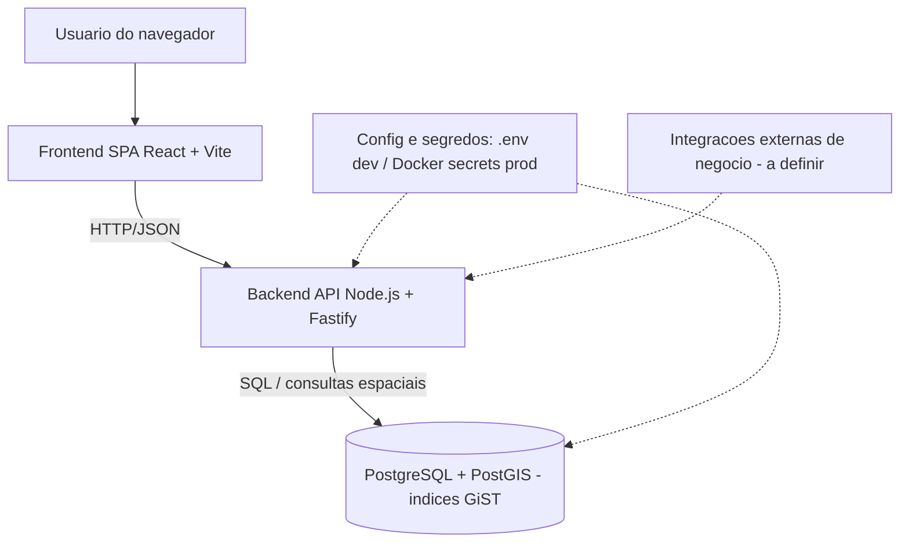
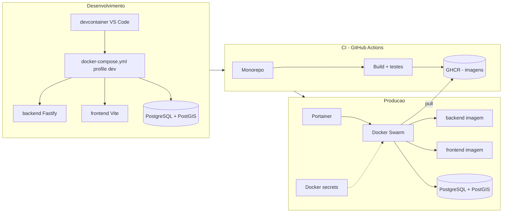

# System Design — compraMais

## Identificacao

- Projeto ou produto: compraMais — aplicacao web com dados georreferenciados
- Responsavel Business Analyst: Business Analyst
- Responsavel tecnico principal: Tech Lead
- Data da versao: 2026-06-27
- Status: Em validacao

> Documento elaborado a partir de `.github/agents/templates/system-design-template.md`, consolidando as decisoes fechadas pelo Tech Lead em `.github/agents/memoria/MEMORIA-PROJETO.md` (PRJ-DEC-03..07 e resolucoes Q-01..Q-03). As decisoes citadas sao base factual e nao sao reabertas aqui.

## Objetivo do documento

- Problema de negocio enderecado: **A definir com o solicitante.** O escopo funcional de negocio do compraMais (o que e comprado/ofertado, atores de negocio, regras de transacao e papel exato dos dados georreferenciados no fluxo de usuario) ainda nao foi especificado. Esta versao do System Design consolida a arquitetura e a infraestrutura ja decididas; os requisitos funcionais de negocio serao incorporados quando definidos com o solicitante e formalizados (PRD/historias).
- Escopo contemplado:
  - Arquitetura logica e de implantacao de uma aplicacao web com backend Node.js (Fastify, TypeScript), frontend React SPA (Vite, TypeScript) e persistencia PostgreSQL + PostGIS.
  - Monorepo unico com `backend/` e `frontend/`, orquestracao local por `docker-compose.yml` unico com `profiles` dev/prod e ambiente de desenvolvimento via devcontainer.
  - Pipeline de build/publicacao de imagens no GHCR via GitHub Actions e deploy em producao por imagem em Docker Swarm orquestrado por Portainer.
  - Estrategia de variaveis de ambiente e segredos sem versionamento.
  - Capacidade de consultas geoespaciais (PostGIS, indices GiST).
- Escopo fora:
  - Requisitos funcionais de negocio especificos do compraMais (a serem definidos com o solicitante e formalizados em PRD/historias).
  - Design System e telas do frontend (frontend ainda nao desenhado — ver secao obrigatoria de Design System).
  - Integracoes externas de negocio (pagamento, terceiros, mapas externos) nao confirmadas — **A definir com o solicitante.**
  - Modelo de dados detalhado e plano de capacidade do banco (dependem do handoff do DBA — ver secao do banco).
- Premissas:
  - As decisoes PRJ-DEC-03..07 e Q-01..Q-03 estao vigentes e sao tratadas como verdade de projeto.
  - O projeto e greenfield: `backend/`, `frontend/` e `spec/source/` estao vazios na data desta versao.
  - Backend e frontend sao servicos distintos no mesmo repositorio (monorepo unico — Q-01).
  - Os dados georreferenciados justificam o uso de PostGIS e indices espaciais GiST (PRJ-DEC-04).
  - Producao nao builda imagens: apenas faz pull do GHCR (PRJ-DEC-06).
- Restricoes:
  - Segredos nunca podem ser versionados; usar `.env` local em dev e Docker secrets/Portainer em producao (PRJ-DEC-07).
  - Orquestracao local deve usar um unico `docker-compose.yml` parametrizado por `profiles` dev/prod, com variaveis centralizadas no compose (PRJ-DEC-05).
  - Stack fixada: Node.js/Fastify/TypeScript no backend e React SPA/Vite/TypeScript no frontend (Q-02).
  - Registry e CI/CD fixados: GHCR + GitHub Actions; deploy por imagem (Q-03/PRJ-DEC-06).
  - Idioma dos artefatos de governanca: portugues do Brasil.

## Visao geral da solucao

- Resumo executivo da arquitetura: o compraMais e uma aplicacao web em monorepo unico. O frontend e uma SPA React (Vite) servida ao navegador que consome uma API HTTP do backend Node.js (Fastify, TypeScript). O backend concentra as regras de negocio e o acesso a dados, persistindo em PostgreSQL com a extensao PostGIS para consultas geoespaciais com indices GiST. O ambiente de desenvolvimento e padronizado por devcontainer e orquestrado localmente por um unico `docker-compose.yml` com `profiles` dev/prod. Em producao, as imagens sao construidas e publicadas no GHCR por GitHub Actions e implantadas em um cluster Docker Swarm gerenciado por Portainer, que faz pull das imagens (deploy por imagem, sem build em producao).
- Principais capacidades do sistema:
  - Servir uma SPA web ao usuario final.
  - Expor uma API HTTP de dominio no backend.
  - Persistir e consultar dados georreferenciados (PostGIS / GiST).
  - Operar de forma reproduzivel em desenvolvimento (devcontainer + compose) e em producao (Swarm/Portainer + GHCR).
  - Gerir configuracao e segredos por ambiente sem versiona-los.
  - Releases automatizados por pipeline de build/publish de imagens.
- Principais riscos arquiteturais:
  - Escopo funcional de negocio ainda nao definido, o que impede dimensionamento de carga preciso e modelagem de dados final.
  - Custo de consultas geoespaciais sob crescimento de dados sem indices/particionamento adequados.
  - Vazamento de segredos por configuracao incorreta de env/secrets entre dev e prod.
  - Divergencia entre o frontend e um Design System ainda inexistente (precondicao pendente).
  - Drift entre imagem publicada no GHCR e a stack definida em producao (Swarm/Portainer).

## Componentes e responsabilidades

| Componente | Responsabilidade | Entradas | Saidas | Dependencias | Observacoes |
|---|---|---|---|---|---|
| Frontend SPA (`frontend/`, React + Vite + TS) | Interface web do usuario; consome a API; renderiza dados (incl. geoespaciais) | Interacoes do usuario, respostas da API | Requisicoes HTTP, UI renderizada | Backend API, Design System (pendente) | Build estatico servido em producao; telas/Design System ainda nao desenhados |
| Backend API (`backend/`, Node.js + Fastify + TS) | Regras de negocio, validacao, autenticacao (a definir) e acesso a dados | Requisicoes HTTP do frontend | Respostas HTTP/JSON, escritas/leituras no banco | PostgreSQL + PostGIS, configuracao/segredos | Framework Fastify (Q-02); contratos de API **a definir com o solicitante** |
| PostgreSQL + PostGIS | Persistencia transacional e consultas geoespaciais | Escritas/leituras do backend | Dados consistentes e resultados espaciais | Infra de banco, extensao PostGIS | Indices GiST para consultas espaciais (PRJ-DEC-04); modelo de dados a cargo do DBA |
| Orquestracao local (`docker-compose.yml` + devcontainer) | Subir/parametrizar servicos em dev e prod via `profiles` | Variaveis de ambiente, `.env` (dev) | Servicos em execucao | Docker, VS Code (devcontainer) | Compose unico com `profiles` dev/prod (PRJ-DEC-05) |
| Pipeline CI (GitHub Actions) | Build, teste e publicacao de imagens no GHCR | Push/PR no repositorio | Imagens versionadas no GHCR | GHCR, segredos de CI | Sem build em producao (PRJ-DEC-06) |
| Orquestracao de producao (Docker Swarm + Portainer) | Deploy/operacao por imagem em cluster | Imagens do GHCR, stack/config, Docker secrets | Servicos em producao | GHCR, Docker secrets | Pull de imagens; deploy por imagem (PRJ-DEC-06) |
| Gestao de configuracao e segredos | Prover env por ambiente sem versionar segredos | `.env` (dev), Docker secrets/Portainer (prod) | Variaveis injetadas nos servicos | Compose, Swarm/Portainer | Segredos nunca versionados (PRJ-DEC-07) |

## Integracoes e contratos

| Integracao | Tipo | Origem | Destino | Contrato ou protocolo | Risco principal |
|---|---|---|---|---|---|
| Frontend -> Backend | Sincrona | Frontend SPA | Backend API | HTTP/JSON (REST; especificacao **a definir com o solicitante**) | Contrato indefinido ate especificacao funcional |
| Backend -> Banco | Sincrona | Backend API | PostgreSQL + PostGIS | Protocolo PostgreSQL; SQL/consultas espaciais | Custo de consultas geoespaciais sob escala |
| CI -> GHCR | Sincrona (pipeline) | GitHub Actions | GHCR | Push de imagem OCI autenticado | Falha/credencial de publicacao |
| Swarm/Portainer -> GHCR | Sincrona (pull) | Cluster de producao | GHCR | Pull de imagem OCI autenticado | Indisponibilidade do registry / tag incorreta |
| Integracoes externas de negocio (mapas, pagamento, terceiros) | A definir | A definir | A definir | **A definir com o solicitante** | Escopo nao confirmado |

## Arquitetura de desenvolvimento

- Ambientes necessarios: estacao de desenvolvimento com VS Code + Docker; devcontainer do repositorio; servicos locais via `docker-compose.yml` (`profile` dev).
- Dependencias locais: Docker e Docker Compose; Node.js + gerenciador de pacotes (no devcontainer); PostgreSQL + PostGIS em container; toolchain TypeScript (backend e frontend).
- Servicos de apoio: container PostgreSQL/PostGIS; servico do backend Fastify; servico do frontend Vite (dev server); arquivo `.env` local nao versionado para segredos de desenvolvimento.
- Observacoes de setup:
  - Variaveis de ambiente centralizadas no `docker-compose.yml`; valores sensiveis vem do `.env` local (PRJ-DEC-05/07).
  - O scaffolding de `backend/` e `frontend/` ainda nao existe (greenfield); o Senior Developer prepara os prerequisitos do projeto e do container conforme o protocolo.
  - Seed/migracoes de banco e habilitacao da extensao PostGIS serao detalhados no handoff do DBA — **pendente**.
  - Os passos de comando exatos dependem do scaffolding inicial e serao formalizados pelo Senior Developer.

## Arquitetura de producao

- Topologia: cluster Docker Swarm gerenciado por Portainer; servicos de backend e frontend implantados por imagem (pull do GHCR); banco PostgreSQL/PostGIS conforme estrategia de persistencia (modo de provisionamento — gerenciado vs container no cluster — **a definir com o DBA/solicitante**).
- Componentes implantados: imagem do backend Fastify; imagem do frontend (build estatico servido); instancia(s) de PostgreSQL + PostGIS; configuracao e Docker secrets via Portainer.
- Observabilidade: **A definir com o solicitante.** Baseline recomendado: logs centralizados dos servicos, health checks por servico e metricas basicas de API e banco.
- Alta disponibilidade e resiliencia: baseline recomendado de pelo menos duas replicas por servico stateless (backend/frontend) no Swarm; estrategia de HA e backup do banco **a definir no handoff do DBA**.
- Politica de rollback: rollback por imagem (redeploy da tag anterior publicada no GHCR via Swarm/Portainer); migracoes de banco devem ter plano reversivel controlado pelo DBA. Como nao ha build em producao, o rollback de aplicacao e a troca de tag de imagem.

## Implantacao

### Desenvolvimento

1. Abrir o repositorio no VS Code e reabrir no devcontainer.
2. Prover o `.env` local (nao versionado) com os segredos de desenvolvimento.
3. Subir os servicos com `docker-compose.yml` no `profile` dev (banco PostgreSQL/PostGIS, backend e frontend).
4. Aplicar migracoes e habilitar PostGIS conforme handoff do DBA (pendente) e iniciar os servicos de backend e frontend.
5. Validacoes apos implantacao: health check do backend, carregamento da SPA, conexao com o banco e execucao de ao menos uma consulta geoespacial de fumaca. Criterios funcionais de fluxo **a definir com o solicitante**.

### Producao

1. CI (GitHub Actions) builda, testa e publica as imagens versionadas no GHCR (gatilho de release a definir no pipeline).
2. Atualizar a stack no Portainer/Swarm para as novas tags de imagem (pull do GHCR), com configuracao e Docker secrets do ambiente de producao.
3. Aplicar migracoes de banco aprovadas em janela controlada pelo DBA (plano reversivel).
4. Validacoes apos implantacao: health checks dos servicos, fluxo critico de negocio (**a definir com o solicitante**), verificacao de consultas geoespaciais e monitoramento dos servicos.

## Dimensionamento da aplicacao

- Premissas de carga: **A definir com o solicitante.** Nao ha numeros de usuarios, requisicoes ou picos definidos, pois o escopo funcional de negocio ainda nao foi especificado.
- Volume esperado: **A definir com o solicitante.** Volume de dados georreferenciados e de transacoes ainda nao estimado.
- Estrategia de escala: escala horizontal dos servicos stateless (backend Fastify e frontend) no Docker Swarm aumentando replicas; banco escalado verticalmente e, futuramente, com replica de leitura conforme plano do DBA.
- Gargalos conhecidos (baseline, a confirmar com carga real): consultas geoespaciais sobre grandes volumes sem indices/particionamento adequados; banco como ponto stateful unico.
- Plano de expansao: revisar replicas dos servicos com base em metricas reais; introduzir cache de leitura quando consultas repetidas crescerem; otimizar/expandir indices espaciais; este plano deve ser atualizado a partir dos testes de exaustao do QA Expert (**pendente — ainda nao executados**).

## Plano de dimensionamento e expansao do banco

- Fonte do handoff do DBA: **Pendente.** O handoff formal do plano de dimensionamento e expansao do banco (conforme `templates/plano-dimensionamento-expansao-banco-template.md` e o protocolo item 24) ainda nao foi recebido. Esta secao sera preenchida quando o DBA entregar o plano.
- Premissas de crescimento: **A definir** no handoff do DBA (dependem do volume de negocio, ainda nao especificado).
- Estrategia de capacidade: baseline esperado — indices GiST para colunas geometricas/geograficas (PostGIS), indices de apoio por atributos consultados, e avaliacao de particionamento conforme crescimento; detalhamento a cargo do DBA.
- Riscos de persistencia: crescimento de dados espaciais impactando custo de consulta; locks em migracoes de tabelas grandes; ponto stateful unico do banco.
- Acoes recomendadas: receber e incorporar o handoff do DBA; definir backup/recuperacao e estrategia de HA do banco; validar consultas espaciais criticas com dados representativos; revisar capacidade apos os testes de exaustao do QA.

## Secao obrigatoria - Referencia ao Design System

> **PENDENCIA / PRECONDICAO FUTURA.** O frontend do compraMais ainda nao foi desenhado e nao existe Design System nesta data. Conforme o protocolo (AGENTS.md item 16) e a persona do Business Analyst, em fluxos frontend o System Design deve referenciar explicitamente o documento de Design System do UX Expert, e essa vinculacao e precondicao de validacao do QA e criterio de aceite do Tech Lead. Enquanto o Design System nao existir, esta vinculacao permanece como pendencia bloqueante para o fechamento formal de qualquer entrega de frontend.

- Existe frontend ou interface relevante?: Sim (SPA React/Vite), porem ainda nao desenhado.
- Documento de Design System referenciado: **Inexistente nesta data (precondicao futura).** Quando criado, deve seguir `.github/agents/templates/design-system-completo-template.md`, mantido pelo UX Expert.
- Responsavel UX: UX Expert (a designar para a fase de desenho do frontend).
- Link ou referencia de Figma: **A definir** (ainda nao produzido).
- Link ou referencia de Storybook.js: **A definir** (Storybook ainda nao configurado; UX define a estrutura funcional e o Senior Developer a configuracao tecnica — AGENTS.md item 23).
- Evidencias visuais disponiveis: Nenhuma (frontend nao desenhado).
- Divergencias conhecidas entre System Design e Design System: Nao aplicavel ainda, por ausencia de Design System.
- Plano de tratamento das divergencias / precondicao: acionar o UX Expert para produzir o Design System antes do desenvolvimento das telas; vincular o documento neste System Design; tratar a vinculacao como gate de QA frontend (`templates/qa-validacao-frontend-template.md`) e criterio de aceite do Tech Lead (`templates/aprovacao-final-tech-lead-template.md`). Ate la, entregas de frontend nao devem ser fechadas formalmente.

## Criterios de aceite e rastreabilidade

- Requisitos cobertos nesta versao: requisitos de arquitetura e infraestrutura derivados de PRJ-DEC-03..07 e Q-01..Q-03. Requisitos funcionais de negocio: **A definir com o solicitante.**
- Criterios de aceite por capacidade:
  - Monorepo unico com `backend/` (Fastify+TS) e `frontend/` (React+Vite+TS) — verificavel pela estrutura do repositorio apos scaffolding.
  - `docker-compose.yml` unico sobe o ambiente nos `profiles` dev e prod com variaveis centralizadas e segredos via `.env`/secrets — verificavel por execucao em cada profile sem segredos versionados.
  - Persistencia PostgreSQL com PostGIS habilitado e ao menos uma consulta geoespacial usando indice GiST — verificavel por teste de fumaca.
  - CI publica imagens no GHCR e producao implanta por pull (sem build em producao) — verificavel pelo pipeline e pela stack do Swarm/Portainer.
  - Nenhum segredo versionado no repositorio — verificavel por inspecao do compose e do controle de versao.
  - Criterios de aceite funcionais de negocio: **A definir com o solicitante.**
- Evidencias de validacao esperadas: testes (TDD/integracao com Testcontainers e E2E com Cypress quando aplicavel), parecer do DBA sobre o plano de banco, validacao frontend via `templates/qa-validacao-frontend-template.md` (apos existir Design System), e resultados de testes de exaustao do QA para revisar dimensionamento.
- Dependencias de QA, UX e DBA:
  - QA: validar fluxos e executar testes de exaustao (pendente); validacao frontend depende do Design System.
  - UX: produzir o Design System (precondicao do frontend) — pendente.
  - DBA: entregar o handoff de dimensionamento/expansao do banco — pendente.

## Decisoes e trade-offs

| Decisao | Alternativas consideradas | Justificativa | Impacto |
|---|---|---|---|
| Monorepo unico com `backend/` e `frontend/` (Q-01) | Multi-repo | Compose, devcontainer e CI unicos; menor atrito de orquestracao | Acoplamento de versao no mesmo repo; pipeline unico |
| Backend Node.js com Fastify + TS (Q-02) | NestJS, Express | Stack enxuta e performatica; alinhada a skill `nodejs-best-practices` | Padroes proprios de modularizacao a definir na implementacao |
| Frontend React SPA com Vite + TS (Q-02) | Next.js (SSR) | SPA simples para app web; build estatico para deploy por imagem | Sem SSR nativo; SEO/perf inicial a avaliar se necessario |
| PostgreSQL + PostGIS (PRJ-DEC-04) | Banco sem extensao espacial / banco geoespacial dedicado | Suporte maduro a dados georreferenciados e indices GiST | Operacao do banco e migracoes exigem governanca do DBA |
| Compose unico com `profiles` dev/prod (PRJ-DEC-05) | Compose separado por ambiente | Ponto unico de orquestracao e configuracao | Cuidado com vazamento de config entre profiles |
| Deploy por imagem via GHCR + Swarm/Portainer (PRJ-DEC-06/Q-03) | Build em producao / outro registry | Releases reproduziveis, sem build em prod | Exige pipeline CI confiavel e versionamento de tags |
| Segredos via `.env` (dev) e Docker secrets/Portainer (prod), nunca versionados (PRJ-DEC-07) | Segredos no compose versionado | Baseline de seguranca do pacote | Disciplina operacional de gestao de segredos por ambiente |

## Riscos e mitigacoes

| Risco | Impacto | Probabilidade | Mitigacao | Owner |
|---|---|---|---|---|
| Escopo funcional de negocio indefinido | Alto | Alta | Especificar com o solicitante e formalizar PRD/historias antes de implementar fluxos | Business Analyst |
| Custo de consultas geoespaciais sob escala | Alto | Media | Indices GiST, otimizacao de consultas, particionamento e cache; validar com testes de carga | DBA |
| Vazamento de segredos por config incorreta | Alto | Media | `.env`/Docker secrets, revisao de PR, sem segredos no compose versionado | Tech Lead |
| Ausencia de Design System bloqueando frontend | Medio | Alta | Acionar UX Expert para produzir o Design System antes das telas | UX Expert |
| Plano de banco do DBA ainda nao recebido | Medio | Alta | Solicitar handoff formal e incorporar ao System Design | DBA |
| Dimensionamento sem dados de carga reais | Medio | Media | Atualizar plano apos testes de exaustao do QA | QA Expert |
| Drift entre imagem do GHCR e stack de producao | Medio | Baixa | Versionamento de tags, pipeline unico e revisao da stack no Portainer | Tech Lead |

## Diagramas Mermaid

### Contexto e componentes

### Implantacao: dev, CI e producao

### Vinculacao com Design System (precondicao futura)

## Proximos passos

1. Especificar com o solicitante o escopo funcional de negocio do compraMais e formalizar PRD/historias; atualizar este System Design com requisitos e criterios de aceite funcionais.
2. Receber o handoff do DBA com o plano de dimensionamento e expansao do banco e preencher a secao correspondente.
3. Acionar o UX Expert para produzir o Design System (precondicao do frontend) e vincula-lo nesta secao obrigatoria.
4. Apos scaffolding do Senior Developer, detalhar os passos exatos de implantacao em dev e o gatilho de release do CI.
5. Atualizar dimensionamento e plano de expansao com base nos testes de exaustao do QA quando executados.
6. Manter este documento sincronizado com mudancas de arquitetura, implantacao, capacidade ou integracao, e registrar decisoes relevantes na memoria de projeto.

## Divergencias identificadas (para a revisao consolidada do Tech Lead)

| Divergencia | Origem | Estado / Recomendacao |
|---|---|---|
| Prompt original citava "multi repo" | Log `2026-06-27_001` | Resolvido: Q-01 fixou monorepo unico. Sem acao. |
| Prompt original citava NestJS/Express e build frontend nao definido | Log `2026-06-27_001` | Resolvido: Q-02 fixou Fastify+TS e React SPA/Vite+TS. Sem acao. |
| Requisitos funcionais de negocio ausentes | Material de apoio | Pendente: especificar com o solicitante antes de implementar fluxos. |
| Plano de dimensionamento do banco nao recebido | Protocolo item 24 | Pendente: solicitar handoff formal do DBA. |
| Design System inexistente para fluxo frontend | AGENTS.md item 16 | Precondicao bloqueante: acionar UX Expert antes do fechamento de frontend. |
