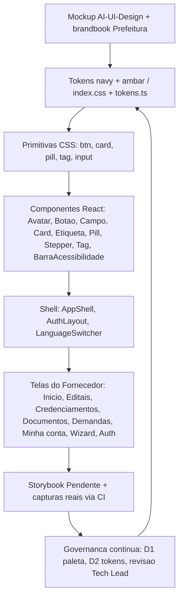

# Design System — compraMais · Portal do Fornecedor

## Identificação

- **Projeto ou produto:** compraMais — Portal do Fornecedor (Prefeitura de Rio Branco).
- **Responsável UX:** UX Expert (pacote de agents compraMais).
- **Responsável técnico Storybook:** Senior Developer (sustentação técnica — DEC-STR-10).
- **Data da versão:** 2026-07-02.
- **Fonte principal de referência:** Aplicação real (código implementado) — `frontend/src/index.css`, `frontend/src/design-system/`. O mockup `spec/AI-UI-Design/` é a referência visual de origem; o **código é a fonte da verdade**.

## Objetivo do documento

- **Escopo do Design System:** identidade visual e biblioteca de componentes/primitivas do Portal do Fornecedor — tokens de cor/tipografia/espaçamento/raio/sombra, componentes React um-por-arquivo, primitivas CSS (`.btn`, `.card`, `.pill`, `.tag`, `.input`), shell aplicacional (`AppShell`, `AuthLayout`, `LanguageSwitcher`) e inventário de ícones.
- **Problemas de experiência que resolve:** consistência visual navy + âmbar em todo o portal; padrões acessíveis (e-MAG / WCAG 2.1 AA); reuso de componentes com semântica clara; responsividade sidebar/drawer; internacionalização sem texto fixo no design.
- **Público consumidor do documento:** UX Expert, Senior Developer, QA Expert, Tech Lead e Business Analyst.
- **Status:** **Implementado (evolução contínua).**

Identidade da marca: **azul institucional `#0061AE`** (ação/estrutura — manual da Prefeitura de Rio Branco, ratificado pela ARBITRAGEM-01, 2026-07-16, resposta 1=B) + **âmbar de ação** (acento assinatura, usado com parcimônia), tipografia **Poppins** (400–700). *(A divergência D1 — navy `#0A2A52` da implementação anterior × azul do manual — foi resolvida a favor do manual; a migração da paleta está aplicada.)*

## Fundamentos visuais

### Princípios de design

1. **Institucional e confiável** — azul institucional como base estrutural; âmbar reservado a foco e chamadas de ação pontuais.
2. **Clareza e hierarquia** — títulos em azul escuro, corpo em cinza neutro, superfícies claras com sombras azul-tingidas suaves.
3. **Acessível por padrão** — foco visível âmbar de 3px, status comunicado por texto + ícone + cor (nunca só cor), navegação por teclado.
4. **Localizável** — nenhum texto fixado no design; toda string vem do i18n.

### Tokens de cor

Valores reais de `frontend/src/index.css` (`:root`) — fonte de runtime das classes de shell/primitivas.

**Azul institucional (marca):**

| Token CSS | Valor | Uso |
|---|---|---|
| `--azul-900` | `#003A68` | mais escuro — headers, hero, títulos fortes |
| `--azul-800` | `#004C87` | títulos sobre claro, hover primário |
| `--azul-700` | `#0061AE` | ação primária, links, item ativo — azul institucional oficial |
| `--azul-600` | `#1F77BD` | foco de input, links `<a>` |
| `--azul-500` | `#3385C4` | — |
| `--azul-300` | `#80B2DC` | — |
| `--azul-100` | `#CCE0F0` | anel de foco suave, avatar |
| `--azul-50` | `#E9F2FA` | superfície tint / item de menu ativo |

**Âmbar (acento — usar com parcimônia):**

| Token CSS | Valor | Uso |
|---|---|---|
| `--ambar-700` | `#7A4E12` | texto/ícone sobre âmbar (botão amber) |
| `--ambar-500` | `#B5701A` | atenção |
| `--ambar-400` | `#D99425` | hover do botão amber |
| `--ambar-300` | `#F2B705` | acento assinatura / anel de foco (`--focus-ring`) |
| `--ambar-100` | `#FBEACB` | fundo de atenção |

Observação: em composições do shell (`AppShell`) o texto sobre âmbar aparece também como `#8A5410` (token `ambarEscuro` de `tokens.ts`) — ver divergência secundária em "Divergências".

**Neutros:**

| Token CSS | Valor | Uso |
|---|---|---|
| `--cinza-900` | `#14181D` | texto primário |
| `--cinza-700` | `#3D434C` | corpo |
| `--cinza-500` | `#6B7280` | meta / secundário |
| `--cinza-400` | `#9AA3AE` | muted |
| `--cinza-300` | `#CBD2DA` | bordas fortes / scrollbar |
| `--cinza-200` | `#E2E7EE` | bordas |
| `--cinza-100` | `#F1F4F8` | divisores |
| `--branco` | `#FFFFFF` | superfície de cartão |

**Status (funcionais, com fundo `-bg`):**

| Papel | Cor | Fundo |
|---|---|---|
| Sucesso | `--sucesso #1E7A46` | `--sucesso-bg #E6F2EB` |
| Atenção | `--atencao #B5701A` | `--atencao-bg #FBEACB` |
| Erro | `--erro #C0362C` (hover `--erro-700 #9E2C24`) | `--erro-bg #FBE7E5` |
| Info | `--info #0061AE` | `--info-bg #CCE0F0` |

**Aliases semânticos** (mapeiam para os tokens acima): `--bg-page #F6F8FB`, `--surface-card`, `--surface-tint`, `--text-strong/--text-heading/--text-title/--text-body/--text-muted`, `--text-link`, `--brand` / `--brand-hover`, `--accent` / `--accent-hover`, `--border #E6EBF1`, `--border-strong`, `--divider #F0F3F7`, `--focus-ring` (= `--ambar-300`). Há ainda **aliases legados** (`--navy-*`, `--ambar`, `--borda`, `--texto`…) para páginas ainda não migradas (admin, titular, contestar-cnae).

### Tipografia

- **Família:** `"Poppins", system-ui, -apple-system, sans-serif` — usada tanto no corpo (`--font-body`) quanto no display (`--font-display`).
- **Pesos:** 400–700 (600 predominante em títulos, botões e navegação).
- **Títulos:** `h1–h3` em `--azul-900`, peso 600, `letter-spacing -0.01em`.
- Tamanhos de referência: título de página 22px, corpo 14px, meta 11–13px.

### Espaçamento e grid

- **Base-4** (múltiplos de 4px em paddings/gaps). Escala TS (`tokens.ts`): `xs 8 · sm 12 · md 16 · lg 20 · xl 28` (px).
- Grades utilitárias do shell: `.cm-grid-2` (1.5fr/1fr), `.cm-grid-3` (3×), `.cm-grid-4` (4×), gap 16px; colapsam para 1 coluna em mobile.
- Layout: sidebar `262px` (recolhida `78px`), topbar `66px`, conteúdo `max-width 1160px`.

### Iconografia

- SVG **inline** estilo **Lucide** (stroke arredondado, `viewBox 0 0 24 24`, `stroke-width` 1.8 padrão, `currentColor`), em `frontend/src/design-system/icons.tsx`.
- Inventário (26 ícones): Início, Editais, Credenciamentos, Documentos, Demandas (navegação); Sino, Busca, Menu, Chevron, Prédio, Usuário, Sair (topbar/shell); Seta, Voltar, Alerta, Relógio, Check, CheckCírculo, Fechar, Filtro, Download, Upload, Sync, Cadeado, Câmera, Info (ações/status).

### Elevação e sombras

Sombras azul-tingidas (`rgba(10,42,82,·)`), suaves:

| Token | Valor |
|---|---|
| `--shadow-xs` | `0 1px 3px rgba(10,42,82,.05)` |
| `--shadow-sm` | `0 2px 8px rgba(10,42,82,.06)` |
| `--shadow-md` | `0 4px 16px rgba(10,42,82,.08)` |
| `--shadow-lg` | `0 12px 32px rgba(10,42,82,.12)` |

### Raios

`--r-sm 8px` · `--r 12px` · `--r-lg 14px` · `--radius-pill 999px` (também `--radius-sm 7`, `--radius-md 8`, `--radius-lg 12`, `--radius-xl 16`). Escala TS: `sm 8 · base 12 · lg 14 · pill 999`.

## Componentes do sistema

Componentes React um-por-arquivo em `frontend/src/design-system/components/`; estilos em `index.css`. Storybook ainda **Pendente** (DEC-STR-10). Figma **N/A** (não há arquivo Figma; a origem visual é o mockup HTML de IA).

| Componente | Objetivo | Estados | Variações | Link Storybook | Referência Figma | Status |
|---|---|---|---|---|---|---|
| **Avatar** | Círculo com iniciais | default (tamanho configurável via `size`, padrão 40px) | `size`, `className` | Pendente | N/A | Implementado |
| **BarraAcessibilidade** | Controles e-MAG (alto contraste, A+/A-) | default (lógica de toggle no app) | 3 botões: contraste, aumentar/diminuir fonte | Pendente | N/A | Implementado (parcial — lógica de toggle pendente no app) |
| **Botao** | Ação primária/secundária | default, hover, disabled, block (`.btn-block`) | `primario` (`.btn-primary`), `amber` (`.btn-amber`), `secundario` e `terciario` (ambos → `.btn-ghost`) | Pendente | N/A | Implementado |
| **Campo** | Rótulo + controle de formulário | default (envolve `.label` + input) | `label`, `htmlFor` | Pendente | N/A | Implementado |
| **Card** | Superfície de conteúdo | default | claro (`.card`), navy (`.card-navy`, gradiente 800→900) via prop `navy` | Pendente | N/A | Implementado |
| **Etiqueta** | Rótulo retangular (ex.: sigla de secretaria) | default | única (`.tag`, azul-50/azul-700) | Pendente | N/A | Implementado |
| **Pill** | Selo de estado por tom | default | `success`, `warn`, `error` (`.pill-*`); CSS também define `info` | Pendente | N/A | Implementado |
| **Stepper** | Progresso de wizard (1–2–3) | passo `active`, `done` (CSS), pendente | `passos: string[]`, `ativo: number` | Pendente | N/A | Implementado |
| **Tag** | Pill de status semântica com bolinha | default | `ativa`→success, `pendente`→warn, `bloqueado`→error | Pendente | N/A | Implementado |
| **AppShell** | Shell do portal: sidebar recolhível + topbar + conteúdo | sidebar aberta/recolhida/drawer; popovers de notificação e perfil | menu configurável, chip de usuário, notificações | Pendente | N/A | Implementado |
| **AuthLayout** | Layout de autenticação em painel dividido (institucional claro + navy) | default | painel esquerdo oculto em mobile (`cm-hide-sm`) | Pendente | N/A | Implementado |
| **LanguageSwitcher** | Seletor de idioma pt-BR · en · es | default | `variante` `claro` / `escuro` | Pendente | N/A | Implementado |

**Notas de implementação:**
- `Botao` mapeia `secundario` e `terciario` para o mesmo estilo `.btn-ghost` — não há hoje diferenciação visual entre os dois (ver "Próximos passos").
- `Pill` (componente) expõe apenas `success/warn/error`; o tom `info` existe na primitiva CSS (`.pill-info`) mas não na API do componente.
- `Tag` e `Pill` compartilham a base CSS `.pill` (com bolinha `::before`).

### Primitivas CSS (base dos componentes)

`.btn` + variantes (`.btn-primary`, `.btn-amber`, `.btn-ghost`, `.btn-danger`, `.btn-block`), `.input` (+ `input[type=...]`, `select`, `textarea`, estados `:focus` e `[readonly]`), `.label`, `.card` / `.card-navy`, `.pill` (+ `-success/-warn/-error/-info`), `.tag`, `.avatar`, `.stepper`/`.step`, e o conjunto `cm-*` do shell (sidebar, topbar, navegação, popovers, grids, cabeçalho de página).

## Interfaces e padrões de composição

Telas do Fornecedor (em `frontend/src/pages/publico/`, exceto onde indicado) e os componentes que utilizam:

| Interface ou fluxo | Componentes envolvidos | Objetivo de uso | Status | Observações |
|---|---|---|---|---|
| **Início** (`Inicio.tsx`) | AppShell, Card/Card navy, Pill, Tag, Etiqueta, ícones | Dashboard do fornecedor (visão geral, avisos, atalhos) | Implementado | Ref. `ref/dashboard.png` |
| **Vitrine de Editais** (`Editais.tsx`) | AppShell, Card, Tag, Etiqueta, Filtro, Botao | Listagem/consulta de editais compatíveis | Implementado | Ref. `ref/editais.png` |
| **Meus Credenciamentos** (`Credenciamento.tsx` / seção) | AppShell, Card, Tag (ativa/pendente/bloqueado), Pill | Estado dos credenciamentos do fornecedor | Implementado | Ref. `ref/credenciamentos.png` |
| **Gestão de Documentos** (`Documentos.tsx`) | AppShell, Card, Botao, Upload/Download, Pill/Tag | Envio e acompanhamento de documentos | Implementado | — |
| **Demandas distribuídas** (`Contestacao.tsx` / `ContestarCnae.tsx`) | AppShell, Card, Botao, Pill, Alerta | Demandas/contestações direcionadas ao fornecedor | Implementado | Ref. `ref/demanda-distribuida.png` |
| **Minha conta** (`MinhaConta.tsx`) | AppShell, Card, Campo, Botao, Avatar | Dados cadastrais e preferências | Implementado | Ref. `ref/minha-conta.png`, `minha-conta2.png`, `dados-cadastrais.png` |
| **Wizard Credenciamento** (`Credenciamento.tsx`) | AuthLayout/AppShell, Stepper, Campo, Botao, Card | Onboarding passo-a-passo (capacidade → documentos → …) | Implementado | Stepper multi-etapa |
| **Autenticação — cadastro/login** (`AuthPanel.tsx`) | AuthLayout, LanguageSwitcher, abas, Campo, Botao | Entrar / criar conta (CNPJ) | Implementado | Painel dividido navy + logo oficial |

## Imagens de proposta

| Item | Descrição | Origem da imagem | Caminho ou referência | Observações |
|---|---|---|---|---|
| Mockup geral | Portal do Fornecedor compilado (navy + âmbar) | Mockup IA (HTML) | `spec/AI-UI-Design/Compra Mais - Portal do Fornecedor .html` | Origem visual da paleta e do shell |
| Dashboard | Tela Início | PNG de referência | `spec/AI-UI-Design/Dashboard do Fornecedor/ref/dashboard.png` | — |
| Editais | Vitrine de editais | PNG | `.../ref/editais.png` | — |
| Credenciamentos | Meus credenciamentos | PNG | `.../ref/credenciamentos.png` | — |
| Demanda distribuída | Demandas | PNG | `.../ref/demanda-distribuida.png` | — |
| Minha conta / dados | Conta e dados cadastrais | PNG | `.../ref/minha-conta.png`, `minha-conta2.png`, `dados-cadastrais.png`, `dados-cadastrais2.png` | — |
| Design system Prefeitura | Referência de identidade | Diretório | `spec/AI-UI-Design/Design system prefeitura Rio Branco/` | Base de brandbook (a reconciliar) |

## Imagens reais após implementação

| Item | Descrição | Origem da captura | Caminho ou referência | Diferenças para proposta |
|---|---|---|---|---|
| Capturas de telas reais | Screenshots das telas implementadas | Aplicação (via Cypress) | **Pendente** | Captura local indisponível — falta `libnss3.so` no ambiente; gerar no CI. Owner: Senior Developer / QA Expert. |

## Storybook.js

- **URL ou localização:** **Pendente** (não configurado). DEC-STR-10 — UX define a estrutura; Senior Developer sustenta a configuração técnica.
- **Estrutura de categorias proposta:**
  - **Fundamentos** — Cores (navy, âmbar, neutros, status), Tipografia (Poppins), Espaçamento & Grid, Raios, Sombras, Iconografia (galeria dos 24 ícones).
  - **Componentes** — Avatar, BarraAcessibilidade, Botao (primario/amber/secundario/terciario/disabled/block), Campo, Card (claro/navy), Etiqueta, Pill (success/warn/error/info), Stepper, Tag (ativa/pendente/bloqueado).
  - **Telas (composições)** — AppShell, AuthLayout, LanguageSwitcher, e mocks das telas do fornecedor (Início, Editais, Credenciamentos, Documentos, Demandas, Minha conta, Wizard, Auth).
- **Convenções de stories propostas:** um `*.stories.tsx` por componente; controls para as props públicas; decorator com `I18nextProvider` (idioma pt-BR padrão) e import do `index.css`; nomear stories pelas variantes reais.
- **Cobertura atual:** 0% (Pendente).
- **Pendências técnicas:** instalar/config Storybook, decorators de i18n e CSS global, integração no gate de container.

## Referências de Figma quando disponível

- **Projeto ou arquivo:** N/A — não há arquivo Figma. A origem de design é o **mockup HTML gerado por IA** (`spec/AI-UI-Design/`) e o diretório "Design system prefeitura Rio Branco".
- **Páginas consultadas:** N/A.
- **Componentes ou fluxos relevantes:** shell, autenticação, telas do fornecedor.
- **Divergências entre referência e implementação:** ver seção "Divergências".

## Critérios de acessibilidade e responsividade

### Acessibilidade (meta WCAG 2.1 AA / e-MAG)

- **Foco visível:** `*:focus-visible { outline: 3px solid var(--focus-ring); outline-offset: 2px }` — anel âmbar de 3px em todos os elementos focáveis.
- **Navegação por teclado:** shell e controles navegáveis; popovers com `role="region"` e `aria-label` traduzidos; menu com `aria-current="page"` no item ativo.
- **Status por texto + ícone + cor:** nunca só cor — Pill/Tag combinam rótulo textual, bolinha e, no shell, ícone (Relógio/Editais nas notificações por tom).
- **Rótulos acessíveis:** `aria-label`/`aria-hidden` em botões de ícone, busca, hambúrguer, seletor de idioma (`cm-visually-hidden`), avatar/chip de usuário.
- **BarraAcessibilidade:** controles e-MAG de alto contraste e ajuste de fonte (região com `aria-label`).

### Responsividade (breakpoints)

- **`max-width: 920px` (mobile/tablet):** sidebar vira **drawer** (`translateX(-100%)`, abre com `data-open`), overlay escurecido, hambúrguer visível; grids colapsam para 1 coluna; `cm-hide-sm` oculta elementos secundários; busca da topbar oculta.
- **`min-width: 921px` (desktop):** sidebar **recolhível** (`data-collapsed` → `78px`), ocultando rótulos e exibindo a marca mini; conteúdo ajusta `margin-left`.

### Estados críticos contemplados

Disabled (`.btn:disabled`), readonly (`.input[readonly]`), foco de input (borda azul-600 + halo azul-100), ativo/hover de navegação, estados vazios de notificações (texto dedicado). Animações: `cmspin`, `cmfade`, `cmpulse`.

### Pendências conhecidas

- Auditoria formal de contraste AA por par cor/fundo (owner: UX Expert / QA Expert).
- Lógica funcional dos toggles da BarraAcessibilidade no app.
- Diferenciação visual `secundario` vs `terciario` no `Botao`.

## Internacionalização (i18n)

- Toda string visível vem do **i18n** (react-i18next): `useTranslation()` → `t('area.chave')` / `<Trans>` (DEC-STR-33). O Design System **não fixa textos** — define apenas padrões visuais e de composição.
- Idiomas: **pt-BR (padrão e fallback)**, en, es — chaves nos JSON `frontend/src/i18n/locales/{pt-BR,en,es}.json` (namespace `translation`).
- Componentes recebem rótulos já traduzidos do chamador (ex.: `Stepper.passos`, `AppShell` usa `rotuloKey` como chave i18n). `LanguageSwitcher` persiste a escolha (localStorage `compramais.lang`) e aparece na topbar e na tela de autenticação.

## Divergências (sinalização obrigatória — DEC-STR-12)

### D1 — Paleta azul: contrato anterior vs implementação (BLOQUEANTE de ratificação)

- **Divergência:** o contrato UX anterior `spec/docs/ux/DESIGN.md` define o azul institucional como `azul-900 #003A68`, `azul-800 #00497F`, `azul-700 (ação) #0061AE`. A **implementação atual** (pós-refresh PRJ-DEC-10, alinhada ao mockup `spec/AI-UI-Design`) usa **navy** `--azul-900 #0A2A52`, `--azul-800 #0E3A6E`, `--azul-700 #14467F`. As paletas são visivelmente distintas (navy mais escuro e dessaturado).
- **Impacto:** documentos de governança e brandbook divergem do produto real; risco de inconsistência de marca com a identidade oficial da Prefeitura e de retrabalho se o brandbook for imposto depois.
- **Recomendação:** **ratificar a paleta navy implementada (`#0A2A52 / #14467F`) como oficial** do Portal do Fornecedor OU reconciliar formalmente com o brandbook da Prefeitura de Rio Branco (`spec/AI-UI-Design/Design system prefeitura Rio Branco/`). Atualizar `DESIGN.md` após a decisão.
- **Owner:** UX Expert (proposta) + Tech Lead / Business Analyst (validação com a Prefeitura). **Status:** Aberto.

### D2 — Divergência secundária: `tokens.ts` vs `index.css` (consistência interna)

- **Divergência:** alguns valores diferem entre `frontend/src/design-system/tokens.ts` e `frontend/src/index.css`. Exemplos: `azul500` TS `#3B82C4` vs CSS `#2C72C4`; `azul300` TS `#5B9BD5` vs CSS `#8FB8E6`; `azul100` TS `#CCE0F0` vs CSS `#DCE9F8`; `azul50` TS `#E8F0FB` vs CSS `#EEF4FC`; sucesso TS `#2E9E5B` vs CSS `#1E7A46`; texto sobre âmbar TS `ambarEscuro #8A5410` vs primitiva `--ambar-700 #7A4E12` (o shell usa `#8A5410`; o botão amber usa `#7A4E12`); `bgPage` TS `#F4F4F5` vs CSS `--bg-page #F6F8FB`.
- **Impacto:** dois "fontes de token" podem divergir silenciosamente; risco de inconsistência visual conforme o consumidor use TS ou CSS.
- **Recomendação:** eleger o `index.css` (`:root`) como fonte única de tokens em runtime e derivar/gerar `tokens.ts` a partir dele (ou vice-versa), removendo duplicações e alinhando o texto sobre âmbar.
- **Owner:** Senior Developer (implementação) + UX Expert (validação visual). **Status:** Aberto.

## Governança e manutenção

- **Responsável pela evolução visual:** UX Expert.
- **Responsável pela sustentação técnica:** Senior Developer (Storybook, tokens, primitivas).
- **Frequência de revisão:** a cada incremento de frontend que toque tokens/componentes/telas; revisão consolidada no fechamento do Tech Lead.
- **Gatilhos para atualização:** mudança de tokens, novo componente/variante, alteração de shell/telas, decisão sobre a paleta (D1), configuração do Storybook, geração das capturas reais no CI. Registrar mudanças relevantes na memória compartilhada.

## Próximos passos

1. Resolver **D1** (ratificar navy ou reconciliar com brandbook) e atualizar `spec/docs/ux/DESIGN.md`.
2. Resolver **D2** (fonte única de tokens `index.css` ↔ `tokens.ts`).
3. Configurar **Storybook** com a estrutura de categorias proposta (Fundamentos / Componentes / Telas) — DEC-STR-10.
4. Gerar as **capturas reais** das telas no CI (Cypress) e preencher a seção "Imagens reais".
5. Diferenciar visualmente `secundario` vs `terciario` no `Botao` e expor `info` na API do `Pill` (opcional, alinhar com uso real).
6. Implementar a lógica funcional da `BarraAcessibilidade` (contraste / ajuste de fonte) e concluir auditoria de contraste AA.
7. Manter imagens reais e este documento sincronizados a cada mudança de implementação; registrar na memória compartilhada.

