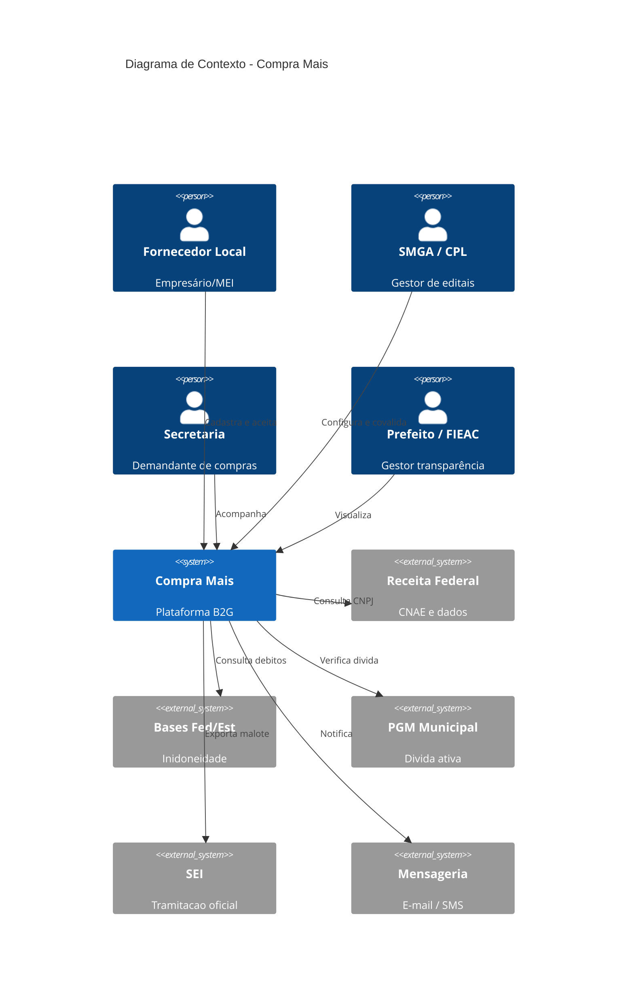
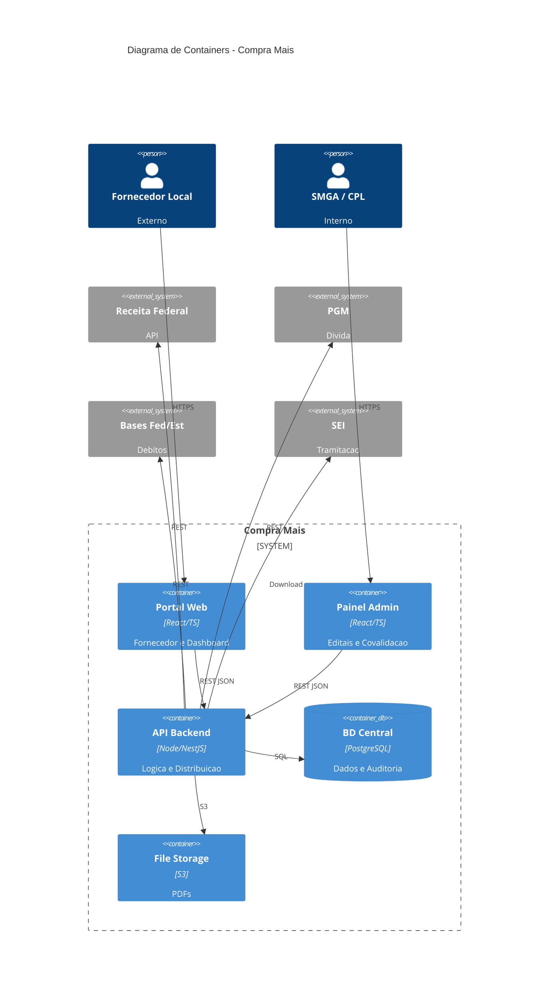

# Compra Mais - Plataforma de Compras Municipalizadas

## Arquitetura

---

**Projeto:** Compra Mais  
**Cliente:** Prefeitura Municipal de Rio Branco  
**Versão:** 1.0  
**Data:** 2026-06-22  
**Autor:** Equipe Arquitetura  

---

## Controle de Versão

| Versão | Data | Autor | Alteração |
|---------|---------|---------|---------|
| 1.0 | 2026-06-22 | Equipe Arquitetura | Versão inicial - Padronização estrutural |

---

## Sumário

1. [Visão Geral da Arquitetura](#visão-geral-da-arquitetura)
2. [Contexto da Solução](#contexto-da-solução)
3. [C4 - Context Diagram (Nível 1)](#c4--context-diagram-nível-1)
4. [C4 - Container Diagram (Nível 2)](#c4--container-diagram-nível-2)
5. [Módulos da Aplicação (Visão DDD)](#módulos-da-aplicação-visão-ddd)
6. [Integrações](#integrações)
7. [Modelo de Dados Conceitual](#modelo-de-dados-conceitual)
8. [Segurança](#segurança)
9. [Requisitos Não Funcionais Arquiteturais](#requisitos-não-funcionais-arquiteturais)
10. [Riscos Arquiteturais](#riscos-arquiteturais)
11. [Decisões Arquiteturais (ADRs Iniciais)](#decisões-arquiteturais-adrs-iniciais)

---

## Visão Geral da Arquitetura
A arquitetura proposta para o Compra Mais será baseada no padrão de Monolito Modular com princípios de Domain-Driven Design (DDD). A solução será estruturada com um frontend em Single Page Application (SPA) e um backend que concentra as regras de negócio em domínios bem delimitados, utilizando integrações externas via camadas de anticorrupção (ACL).
Justificativa: Um monolito bem estruturado entrega velocidade e simplicidade, sendo a escolha ideal para o lançamento de novas soluções e MVPs
. Adotar microsserviços precocemente traria um alto overhead operacional desnecessário para este estágio do projeto
. A abordagem modular garante que componentes como "Motor de Distribuição" e "Geração de Malote SEI" tenham alta coesão e baixo acoplamento, facilitando uma futura extração para microsserviços caso o sistema exija escalabilidade independente.
## Contexto da Solução
O Compra Mais não atua de forma isolada; ele funciona como um orquestrador B2G (Business-to-Government) inserido no ecossistema da administração pública
.
Usuários do sistema: Fornecedores locais (empresários, MEIs), Administradores da SMGA, pregoeiros/equipe da CPL e Secretarias Demandantes (SAÚDE, RBTRANS, SEINFRA, etc.)
. A sociedade, o Prefeito e a FIEAC atuarão como espectadores da transparência
.
Sistemas externos: Receita Federal, Sistemas de Dívida e Inidoneidade (Federais e Estaduais), Sistema SEI (Prefeitura) e PGM (Dívida Ativa Municipal)
.
Órgãos envolvidos: SMGA (Gestão Central), CPL (Comissão de Licitação), PGM (Procuradoria Geral do Município) e Secretarias Demandantes
.
Fluxos de informação: A necessidade nasce via processo físico/SEI nas secretarias
. A CPL formata o edital no Compra Mais. O fornecedor insere seu CNPJ, o sistema consome a Receita Federal e valida pendências nas bases PGM, Estaduais e Federais
. Após a submissão de PDFs, a CPL audita e aprova
. O sistema distribui o quantitativo e consolida os PDFs em um malote otimizado que retorna para o SEI
.
## C4 - Context Diagram (Nível 1)
Fornecedor: Usuário externo que busca editais e se credencia.
Administrador SMGA / CPL: Usuários internos que publicam editais e validam documentos.
Secretarias Demandantes: Clientes internos que geram as demandas originais.
Órgãos de Controle (Prefeito/FIEAC): Usuários do dashboard de transparência pública.
Receita Federal / Bases de Dívida (Federais/Estaduais) / PGM: Provedores de dados para bloqueio antifraude e verificação de inadimplência
.
SEI: Destino do malote processual consolidado
.
Serviços de E-mail/SMS: Provedores de mensageria para alertas de vencimento de certidões.

## C4 - Container Diagram (Nível 2)
Portal do Fornecedor / Transparência (SPA): Aplicação frontend em React ou Vue.js voltada ao público externo
.
Portal Administrativo (SPA): Aplicação frontend para os servidores da CPL/SMGA
.
API de Negócio (Backend): O Monolito Modular (ex: Node.js ou Spring Boot) com os controllers e lógicas de distribuição
.
Banco de Dados: Banco relacional para consistência transacional (ex: PostgreSQL).
File Storage: Bucket estilo S3 para PDFs e comprovantes.
Serviço de Malote / Auditoria: Workers assíncronos para compressão pesada de PDFs (para não estourar o limite de megabytes do SEI).

## Módulos da Aplicação (Visão DDD)
Módulo
Responsabilidades
Funcionalidades
Dependências
Catálogo/Cadastros base
Onboarding e perfis de usuários externos.
Busca via CNPJ, atualização de CNAE, captura de contrato social
.
Integração API Receita Federal.
Credenciamento e Covalidação
Gestão de adesões, travas de inadimplência e aprovação
.
Fila de "Segunda Demanda", tela de Aprovar/Reprovar com justificativa
.
API PGM e Bases Federais/Estaduais de Dívida.
Gestão de Editais
Individualização de demandas ("1 Edital = 1 Demanda")
.
Publicação, definição de lotes e itens, configuração de prazos.
Módulo Catálogo/Cadastros base.
Administração do Sistema
Painel interno de acompanhamento e gestão operacional dos cadastros,
pendências, análises e notificações.
Dashboard administrativo de cadastros pendentes, histórico de auditorias e alertas de vencimento.
Integração com todos os módulos operacionais.
Distribuição Inteligente
Motor matemático do sistema.
Rateio igualitário limitado à capacidade produtiva informada
.
Credenciamento e Covalidação
Integração Processual (Malote)
Consolidação documental.
Organiza, mescla e comprime os PDFs respeitando os MB do SEI
.
Object Storage, Credenciamento e Covalidação.
Auditoria e Logs
Compliance e segurança jurídica.
Registrar eventos imutáveis (quem, quando, o quê).
Todos os módulos.
Dashboard (BI Público)
Transparência de dados.
Exibir valores investidos, áreas beneficiadas e editais vigentes em painel azul padrão
.
Leitura de banco de dados (Views Otimizadas).
## Integrações
Integração
Objetivo
Tipo
Dados Trafegados
Dependências e Riscos
Receita Federal
Popular automaticamente dados do Fornecedor
.
API REST (JSON)
CNPJ (Entrada) -> CNAE, Razão Social, Porte (Saída).
Baixo Risco. API governamental estável.
PGM Municipal
Bloquear fornecedores com dívida ativa local
.
API REST
CNPJ (Entrada) -> Status de Inadimplência (Saída).
Alto Risco. API carece de ofícios de liberação e mapeamento técnico pela TI da prefeitura.
Sistemas de Débitos (Federais e Estaduais)
Checagem ampla de inidoneidade/penalidades e débitos estaduais e federais (sem dependência exclusiva de um único sistema como o SICAF)
.
API REST
CNPJ (Entrada) -> Status de Certidões Negativas (Saída).
Risco Médio. Depende do mapeamento dos endpoints corretos e autorizações.
Sistema SEI
Permitir tramitação oficial da compra para formalização de empenhos
.
Exportação (Download)
Malote unificado (PDF Comprimido)
.
Risco Médio. O limite exato em MB aceito pelo SEI municipal ainda precisa ser configurado
.
E-mail / SMS
Notificar fornecedor do vencimento de certidões
.
Serviço Cloud
Texto e links.
Baixo Risco. Serviços commodities.
## Modelo de Dados Conceitual
Fornecedor: Entidade central (CNPJ, Razão Social, CNAEs, Porte). (1:N com Documento, 1:N com Credenciamento).
Edital: Representa a demanda de uma secretaria (Objeto, Data Vigência, Itens). Diferente do sistema estadual, aqui ele atende apenas uma Secretaria por vez
. (1:N com Credenciamento, 1:N com Lotes/Itens).
Documento: Arquivos de habilitação (Balanço Patrimonial, Contrato Social, Atestado). Possui Status (Pendente, Aprovado, Reprovado) e Justificativa
.
Credenciamento: Tabela associativa entre Fornecedor e Edital. Gerencia as fases de Requerente, Credenciado e Fornecedor
, bem como a flag de "Segunda Demanda/Fila de Espera"
.
Distribuição: Registra o cálculo do motor matemático vinculando o Lote/Item à capacidade produtiva proposta
.
Auditoria: Tabela append-only (somente inserção) que guarda a trilha de segurança (JSON com payload de mudanças).
## Segurança
Controle de Acesso (RBAC): Múltiplos níveis — Fornecedor (visão isolada dos seus dados), Gerente/Secretarias (modo visualização de suas demandas), Administrador/CPL (acesso total à aprovação e geração de malote)
.
Covalidação Obrigatória: Travas sistêmicas onde PDFs sensíveis exigem que o perfil CPL digite o "Motivo" em caso de reprovação
.
Auditoria e Rastreabilidade: Todos os fluxos de Covalidação e Alteração de Status geram uma trilha irrefutável com IP, Timestamp e Usuário.
Proteção de Dados (LGPD): Criptografia em trânsito e em repouso para dados de procuradores e sócios
.
## Requisitos Não Funcionais Arquiteturais
Performance (Compressão): Capacidade imperativa de mesclar N arquivos PDF e comprimi-los eficientemente para aderir ao limite em MB do sistema SEI
.
Disponibilidade: O credenciamento é legalmente contínuo
; a arquitetura web deve prover alta disponibilidade na nuvem.
Observabilidade: Instrumentação da API para monitorar timeouts nas integrações com PGM e Receita.
Usabilidade visual: O frontend público (Dashboard/BI) precisa aderir rigorosamente ao Brandbook Azul da prefeitura
.
## Riscos Arquiteturais
Sistemas Legados e Múltiplas APIs de Dívida: Depender de vários sistemas federais e estaduais para consulta de idoneidade e da PGM (municipal)
. Recomenda-se implementação com mecanismo de Fallback/Circuit Breaker para evitar que a inoperância de uma API governamental trave todo o sistema.
Biometria Facial (Scope Creep): A equipe sugeriu validação facial para upload de documentos
. Risco Alto. Introduz latência, custo e atrito. Recomendação: Manter o login por credenciais para o MVP e isolar a biometria para a fase 2.
Processamento de Arquivos Pesados: Unificar PDFs grandes na thread principal da API pode derrubar o servidor. Mitigação: Processar a "Geração de Malote SEI" em um fluxo assíncrono e notificar o usuário quando o download estiver pronto.
## Decisões Arquiteturais (ADRs Iniciais)
ADR 001 - Padrão de Arquitetura: Adotaremos um Monolito Modular ao invés de Microsserviços para simplificar a entrega inicial do MVP
.
ADR 002 - Validações de Inadimplência Agnósticas: A verificação de débitos não dependerá exclusivamente de um único sistema estadual ou federal. A arquitetura de validação (API) será modular, permitindo plugar consultas a múltiplas bases federais e estaduais, além da PGM
.
ADR 003 - Motor de Distribuição Baseado em Fila: Os ingressos tardios entrarão com uma flag isolada de "Segunda Demanda" para evitar inconsistência matemática em contratos já assinados no SEI
.
12. Próximos Passos
Protótipos Alta Fidelidade: Geração de wireframes do Portal Administrativo e da Landing Page azul para a apresentação do dia 30/06
.
Dicionário de Dados: Mapeamento em nível de coluna para subida do banco de dados relacional.
Matriz de Integrações Técnica: Reunião com a TI do Município para colher os Endpoints, Headers e Autenticações das APIs de Dívida Ativa (Federal, Estadual e PGM)
.
Carga Inicial: Levantamento de massa de dados históricos (fardamento, panificação) para injetar no banco de testes
---

## Documentos Relacionados

- [01 - Descritivo do Produto](01-DescritivoProduto.md)
- [02 - Declaração de Escopo](02-DeclaracaoEscopo.md)
- [03 - HDR (Requisitos)](03-HDR.md)
- [05 - Histórias de Usuário](05-HistoriasUsuario.md)
- [06 - Casos de Uso](06-CasosUso.md)
- [07 - Backlog](07-Backlog.md)
- [08 - BPMN](08-BPMN.md)

---

**Documento gerado automaticamente com padronização Hydros v1**  
*Última atualização: 2026-06-22*.