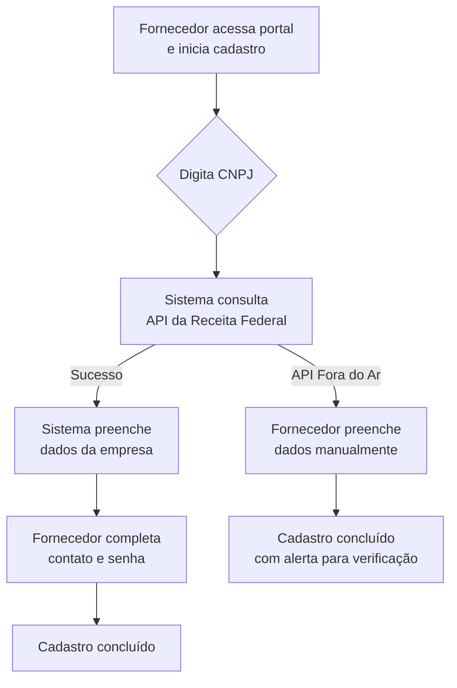

# Documento de Validação de Regras de Negócio e Fluxo - Compra Mais

# 1. Cadastro de Fornecedor

## Objetivo

Facilitar a entrada de empresas locais na plataforma, preenchendo seus dados de forma automática a partir do CNPJ para evitar erros de digitação e agilizar o processo.

---

## Como o processo inicia

Um empresário local (fornecedor) acessa o portal público do Compra Mais e inicia seu cadastro fornecendo o número do CNPJ da sua empresa.

---

## Fluxo do Processo

1.  O fornecedor acessa a tela de cadastro e digita seu CNPJ.
2.  O sistema consulta automaticamente a base de dados da Receita Federal.
3.  O sistema preenche os campos de Razão Social, Nome Fantasia, Porte e Ramo de Atividade (CNAE).
4.  O fornecedor completa o cadastro com seus dados de contato (e-mail, telefone) e cria uma senha.
5.  O cadastro é concluído e o fornecedor ganha acesso ao portal.

---

## Como o processo termina

O fornecedor tem seu perfil criado no sistema e já pode visualizar os editais de compra abertos pela prefeitura que são compatíveis com seu ramo de atividade.

---

## Regras de Negócio

*   **Cadastro via CNPJ:** O ponto de partida é sempre o CNPJ, para garantir que os dados da empresa venham de uma fonte oficial.
*   **Fallback Manual:** Se o sistema da Receita Federal estiver fora do ar, o fornecedor poderá preencher os dados manualmente, mas seu cadastro receberá um alerta para uma verificação mais rigorosa pela equipe da prefeitura.

---

## Checklist de Validação

*   [ ] O início do processo está correto?
*   [ ] O fluxo representa corretamente o processo atual?
*   [ ] Existe alguma etapa faltando?
*   [ ] Existe alguma regra que precisa ser alterada?
*   [ ] Existe alguma exceção que deve ser tratada?
*   [ ] Existem integrações com outros sistemas?
*   [ ] O resultado final está de acordo com a necessidade do órgão?

---

## Observações

Espaço para anotações da reunião.

---

# 2. Publicação de Edital de Compra

## Objetivo

Permitir que a equipe da prefeitura (Comissão de Licitação - CPL) crie e publique uma chamada pública para a compra de um produto ou serviço específico, destinado a uma única secretaria.

---

## Como o processo inicia

Um servidor da CPL/SMGA acessa a área administrativa do sistema, vai para a seção de "Editais" e clica para criar um novo edital.

---

## Fluxo do Processo

1.  O servidor preenche as informações do edital (ex: "Compra de 500 carteiras escolares").
2.  Ele vincula o edital à secretaria que fez o pedido (ex: Secretaria de Educação).
3.  Ele define os itens a serem comprados e quais ramos de atividade (CNAEs) podem participar.
4.  O edital é salvo como "Rascunho" para revisão.
5.  Após a revisão, o servidor clica em "Publicar".

---

## Como o processo termina

O edital é publicado e fica visível no portal para todos os fornecedores cadastrados que possuam o ramo de atividade (CNAE) compatível com a compra.

---

## Regras de Negócio

*   **Um Edital por Demanda:** Cada edital deve atender à necessidade de uma única secretaria. É proibido criar editais "guarda-chuva" para várias secretarias ao mesmo tempo, garantindo o controle do orçamento.
*   **Filtro por Ramo de Atividade (CNAE):** O edital deve obrigatoriamente especificar quais tipos de empresa podem participar, para que o sistema possa filtrar e notificar apenas os fornecedores corretos.

---

## Checklist de Validação

*   [ ] O início do processo está correto?
*   [ ] O fluxo representa corretamente o processo atual?
*   [ ] Existe alguma etapa faltando?
*   [ ] Existe alguma regra que precisa ser alterada?
*   [ ] Existe alguma exceção que deve ser tratada?
*   [ ] Existem integrações com outros sistemas?
*   [ ] O resultado final está de acordo com a necessidade do órgão?

---

## Observações

Espaço para anotações da reunião.

---

# 3. Credenciamento do Fornecedor no Edital

## Objetivo

Permitir que um fornecedor interessado participe de um edital, enviando seus documentos de habilitação e informando sua capacidade de produção.

---

## Como o processo inicia

Um fornecedor logado no sistema visualiza um edital compatível com sua empresa e clica no botão para "Participar" ou "Credenciar".

---

## Fluxo do Processo

1.  O fornecedor manifesta interesse em participar do edital.
2.  O sistema realiza uma verificação automática para saber se a empresa possui dívidas com o município (PGM) ou pendências federais. Se houver dívidas, o processo é bloqueado.
3.  Se a empresa estiver regular, o sistema apresenta a tela para envio de documentos.
4.  O fornecedor anexa os documentos exigidos (ex: Balanço Patrimonial, Contrato Social).
5.  O fornecedor informa qual a sua capacidade máxima de fornecimento para aquele item.
6.  A proposta é enviada para a análise da equipe da prefeitura.

---

## Como o processo termina

A solicitação de credenciamento do fornecedor entra em uma fila de análise para a equipe da CPL, com o status de "Pendente de Análise".

---

## Regras de Negócio

*   **Tolerância Zero com Dívidas:** O sistema bloqueará automaticamente a participação de qualquer empresa que tenha dívidas ativas com a prefeitura ou outras pendências graves. O objetivo é garantir que apenas empresas regulares contratem com o poder público.
*   **Filtro por Ramo de Atividade (CNAE):** O fornecedor só consegue visualizar e participar de editais que sejam do seu ramo de atividade. Uma padaria não verá um edital para compra de peças de trator, por exemplo.
*   **Reaproveitamento de Documentos:** Se o fornecedor já enviou um documento (como o Contrato Social) em outro edital e ele ainda está válido, o sistema o reaproveita, evitando que o empresário tenha que enviar o mesmo papel repetidas vezes.

---

## Checklist de Validação

*   [ ] O início do processo está correto?
*   [ ] O fluxo representa corretamente o processo atual?
*   [ ] Existe alguma etapa faltando?
*   [ ] Existe alguma regra que precisa ser alterada?
*   [ ] Existe alguma exceção que deve ser tratada?
*   [ ] Existem integrações com outros sistemas? (Validar com o Cliente: A integração para consultar dívidas no sistema da Procuradoria (PGM) depende de uma API. Precisamos confirmar a viabilidade técnica.)
*   [ ] O resultado final está de acordo com a necessidade do órgão?

---

## Observações

Espaço para anotações da reunião.

---

# 4. Análise e Aprovação de Documentos

## Objetivo

Permitir que a equipe da CPL analise os documentos enviados pelos fornecedores, aprovando os que estão corretos e rejeitando os que possuem erros, garantindo a segurança e a legalidade do processo.

---

## Como o processo inicia

Um servidor da CPL acessa o painel de "Análises Pendentes" e seleciona um fornecedor para verificar sua documentação.

---

## Fluxo do Processo

1.  O servidor abre o documento enviado pelo fornecedor dentro do próprio sistema.
2.  Ele analisa visualmente se o documento está correto e legível.
3.  Ele clica em "Aprovar" ou "Reprovar".
4.  Caso clique em "Reprovar", o sistema o obriga a escrever o motivo da rejeição (ex: "Balanço ilegível" ou "Certidão vencida").
5.  O fornecedor é notificado da decisão, podendo corrigir o documento em caso de rejeição.

---

## Como o processo termina

O fornecedor é habilitado no edital (status "Credenciado") ou é notificado para corrigir sua documentação. A decisão e a justificativa ficam salvas no histórico para auditoria.

---

## Regras de Negócio

*   **Justificativa Obrigatória:** É impossível reprovar um documento sem explicar o motivo. Isso dá transparência ao fornecedor e protege o servidor, que deixa registrada a razão técnica de sua decisão.
*   **Validade do Balanço:** O sistema deve ser configurado para aceitar apenas o Balanço Patrimonial do último ano fiscal, conforme a lei.

---

## Checklist de Validação

*   [ ] O início do processo está correto?
*   [ ] O fluxo representa corretamente o processo atual?
*   [ ] Existe alguma etapa faltando?
*   [ ] Existe alguma regra que precisa ser alterada?
*   [ ] Existe alguma exceção que deve ser tratada? (Validar com o Cliente: Foi sugerido o uso de biometria facial para evitar fraudes. Devemos incluir isso agora ou deixar para uma segunda fase do projeto?)
*   [ ] Existem integrações com outros sistemas?
*   [ ] O resultado final está de acordo com a necessidade do órgão?

---

## Observações

Espaço para anotações da reunião.

---

# 5. Distribuição Inteligente da Demanda

## Objetivo

Dividir a quantidade total de itens a serem comprados de forma justa e matemática entre todos os fornecedores habilitados, respeitando a capacidade de produção de cada um.

---

## Como o processo inicia

Após o fim do prazo de credenciamento, um servidor da CPL aciona a função "Calcular Distribuição" no edital.

---

## Fluxo do Processo

1.  O sistema identifica a quantidade total de itens que a secretaria precisa (ex: 1.000 fardamentos).
2.  O sistema verifica quantos fornecedores foram habilitados (ex: 10 malharias).
3.  O sistema faz a divisão igualitária (1.000 / 10 = 100 fardamentos para cada).
4.  O sistema verifica a capacidade de produção que cada fornecedor informou.
5.  Se uma malharia pequena disse que só consegue produzir 50 fardamentos, o sistema limita a cota dela a 50 e redistribui os 50 restantes entre as outras empresas maiores.
6.  O sistema gera o mapa final de distribuição.

---

## Como o processo termina

O sistema define exatamente quantos itens cada empresa deverá fornecer, garantindo que tanto pequenas quanto grandes empresas possam participar do mesmo edital.

---

## Regras de Negócio

*   **Respeito à Capacidade Produtiva:** A principal regra é que o sistema nunca vai atribuir a uma empresa uma quantidade maior do que ela declarou que consegue produzir. Isso protege os pequenos negócios de contratos que não conseguiriam cumprir.

---

## Checklist de Validação

*   [ ] O início do processo está correto?
*   [ ] O fluxo representa corretamente o processo atual?
*   [ ] Existe alguma etapa faltando?
*   [ ] Existe alguma regra que precisa ser alterada?
*   [ ] Existe alguma exceção que deve ser tratada?
*   [ ] Existem integrações com outros sistemas?
*   [ ] O resultado final está de acordo com a necessidade do órgão?

---

## Observações

Espaço para anotações da reunião.

---

# 6. Gestão de Retardatários (Cadastro de Reserva)

## Objetivo

Resolver um problema legal: a lei exige que o credenciamento fique sempre aberto, mas a prefeitura não pode parar um contrato em andamento para incluir um novo fornecedor. A solução é criar uma fila de espera organizada.

---

## Como o processo inicia

Um fornecedor se credencia e é aprovado em um edital cuja demanda inicial já foi distribuída entre as primeiras empresas.

---

## Fluxo do Processo

1.  O servidor da CPL aprova a documentação de um fornecedor "atrasado".
2.  O sistema identifica que a distribuição principal daquele edital já aconteceu.
3.  Automaticamente, o sistema coloca esse novo fornecedor em uma fila chamada "Cadastro de Reserva".
4.  O contrato que já está em andamento com as outras empresas não é afetado.
5.  Se um dos fornecedores principais desistir ou falhar na entrega, a CPL poderá chamar o primeiro da fila do Cadastro de Reserva para assumir a demanda.

---

## Como o processo termina

O fornecedor que chegou tarde fica em uma fila de espera justa e transparente, e a prefeitura cumpre a lei sem prejudicar o andamento das compras.

---

## Regras de Negócio

*   **Não Recalcular:** A regra de ouro é que a entrada de um retardatário no Cadastro de Reserva NUNCA altera a distribuição que já foi feita para os fornecedores que estão executando o contrato.
*   **Ordem da Fila:** O Cadastro de Reserva também segue uma ordem cronológica de chegada.

---

## Checklist de Validação

*   [ ] O início do processo está correto?
*   [ ] O fluxo representa corretamente o processo atual?
*   [ ] Existe alguma etapa faltando?
*   [ ] Existe alguma regra que precisa ser alterada? (Validar com o Cliente: Quais são os critérios exatos para convocar alguém do Cadastro de Reserva? Apenas em caso de falha do titular?)
*   [ ] Existe alguma exceção que deve ser tratada?
*   [ ] Existem integrações com outros sistemas?
*   [ ] O resultado final está de acordo com a necessidade do órgão?

---

## Observações

Espaço para anotações da reunião.

---

# 7. Geração de Malote para o SEI

## Objetivo

Eliminar um dos maiores trabalhos manuais da CPL: a organização e compressão de documentos para iniciar o processo de pagamento no Sistema Eletrônico de Informações (SEI).

---

## Como o processo inicia

Após a distribuição da demanda, o servidor da CPL seleciona um fornecedor contratado e clica na opção "Gerar Malote para o SEI".

---

## Fluxo do Processo

1.  O servidor aciona a funcionalidade.
2.  O sistema busca todos os documentos aprovados daquele fornecedor.
3.  O sistema junta todos os PDFs em um único arquivo.
4.  O sistema organiza os documentos na ordem exata exigida pela lei (1º CNPJ, 2º Doc. Pessoal, etc.).
5.  O sistema comprime o arquivo final para garantir que ele não seja barrado pelo limite de tamanho do SEI.
6.  O servidor baixa o arquivo pronto para ser anexado ao processo no SEI.

---

## Como o processo termina

O servidor da CPL tem em mãos um arquivo único, organizado e comprimido, economizando tempo e eliminando a necessidade de usar outros programas para juntar e diminuir o tamanho dos PDFs.

---

## Regras de Negócio

*   **Ordem Obrigatória:** A ordem dos documentos no arquivo final é fixa e não pode ser alterada, para seguir o padrão processual.
*   **Compressão Inteligente:** O sistema deve ser capaz de reduzir o tamanho do arquivo sem deixar os documentos ilegíveis.

---

## Checklist de Validação

*   [ ] O início do processo está correto?
*   [ ] O fluxo representa corretamente o processo atual?
*   [ ] Existe alguma etapa faltando?
*   [ ] Existe alguma regra que precisa ser alterada?
*   [ ] Existe alguma exceção que deve ser tratada?
*   [ ] Existem integrações com outros sistemas? (Validar com o Cliente: Qual é o limite exato, em Megabytes (MB), que o nosso sistema SEI aceita para upload de arquivos?)
*   [ ] O resultado final está de acordo com a necessidade do órgão?

---

## Observações

Espaço para anotações da reunião.

---

# 8. Transparência e Auditoria

## Objetivo

Prestar contas à sociedade e aos órgãos de controle, mostrando os dados de investimento do programa e mantendo um registro detalhado e seguro de todas as ações realizadas no sistema.

---

## Como o processo inicia

Um cidadão ou gestor acessa a página pública do Compra Mais, ou um auditor acessa o módulo de auditoria com um login especial.

---

## Fluxo do Processo

1.  **Visão Pública:** O usuário acessa o portal e visualiza um painel com gráficos simples mostrando o total investido, o número de empresas locais contratadas e os setores mais beneficiados.
2.  **Visão de Auditoria:** O auditor acessa uma área restrita, pesquisa por um edital ou fornecedor e visualiza uma linha do tempo com todas as ações: quem aprovou, quando, qual foi a justificativa da reprovação, etc.

---

## Como o processo termina

A gestão municipal ganha uma ferramenta de transparência e o processo de compra se torna totalmente rastreável, aumentando a segurança jurídica para os servidores e para a prefeitura.

---

## Regras de Negócio

*   **Identidade Visual:** O painel público deve obrigatoriamente usar a cor azul e a identidade visual da Prefeitura de Rio Branco.
*   **Logs Imutáveis:** Os registros de auditoria não podem ser alterados ou apagados, garantindo a integridade do histórico.

---

## Checklist de Validação

*   [ ] O início do processo está correto?
*   [ ] O fluxo representa corretamente o processo atual?
*   [ ] Existe alguma etapa faltando?
*   [ ] Existe alguma regra que precisa ser alterada?
*   [ ] Existe alguma exceção que deve ser tratada?
*   [ ] Existem integrações com outros sistemas?
*   [ ] O resultado final está de acordo com a necessidade do órgão?

---

## Observações

---
