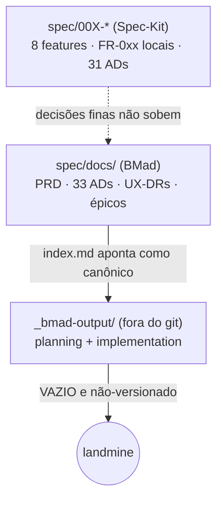

# Convergência de Documentação — Compra Mais

**Data:** 2026-07-02
**Autoria:** Sessão BMad Party Mode (roster software-development) — Paige (Tech Writer), Mary (BA), Winston (Arquiteto), John (PM), Sally (UX), Amelia (Dev), Murat (Test Architect)
**Decisão do solicitante (Sales):** convergir as linhagens de documentação numa única fonte de verdade, elegendo **BMad (`spec/docs/`)** como espinha e **migrando o que só existia no Spec-Kit antes de arquivá-lo**.

---

## 1. Diagnóstico

O projeto mantinha **três linhagens de documentação concorrentes**:

Problemas concretos encontrados:

1. **Canônico fantasma:** `spec/docs/index.md` declarava `_bmad-output/implementation-artifacts/` como "fila de trabalho viva canônica" — mas o diretório está **vazio e fora do git**. Quem clonasse o repo não teria as histórias, e `bmad-dev-story` leria de um caminho inexistente.
2. **Colisão de numeração:** `FR-0xx` **locais por feature** no Spec-Kit colidiam com `RF0xx` **globais** (ex.: `FR-014` = Procurador local vs `RF014` = Auditoria global).
3. **Drift de âncoras:** Spec-Kit citava **31 ADs** e "Constituição v2.0.0/v3.3.0"; a espinha BMad já estava em **33 ADs**.
4. **Decisões finas presas:** cada `spec/00X` resolveu Clarifications testáveis que **nunca subiram** ao PRD/épicos (13 no total).
5. **Fork de UI:** o PRD apontava para `source/AI-UI-Design/` (**inexistente**); os mockups reais — incluindo as telas de Admin ditas "a derivar" — estavam em `spec/AI-UI-Design/`, sem doc apontando.

## 2. Decisão

**BMad (`spec/docs/`) é a fonte de verdade única e versionada.** Spec-Kit arquivado após resgate. `_bmad-output/` deixa de ser referenciado.

## 3. Regra de numeração

> **A numeração global `RFxxx` / `RNxxx` / `RNFxxx` / `AD-xx` / `UX-DRx` é a única canônica.**
> A numeração local `FR-0xx` do Spec-Kit está **abolida**. Referências a requisitos usam sempre o identificador global. Os `spec/00X` arquivados preservam sua numeração local apenas como **registro histórico**, não como identificador vigente.

## 4. Movimentos executados

| # | Movimento | Resultado |
|---|---|---|
| 1 | **Cravar o canônico** | `index.md` reescrito (fonte = `spec/docs/`, sem ponteiro a `_bmad-output/`); `epics.md` declarado fila de histórias; refs quebradas da espinha (frontmatter, AD-3, AD-20) corrigidas |
| 2 | **Regra de numeração** | RF global canônica, FR-0xx local abolida (§3 acima) |
| 3 | **Resgate das 13 decisões** | Migradas a PRD (RF019, RN010–RN013, §15, §16), espinha (AD-34/35/36) e épicos (Refinamentos de Aceite) — ver §5 |
| 4 | **Consolidar UI + arquivar** | Painel Admin ligado ao contrato de UX (EXPERIENCE.md); `spec/00X-*` movidos p/ `spec/archive/2026-06-29-spec-kit/` com `git mv` |

## 5. Rastreabilidade do resgate (13 decisões)

| # | Decisão resgatada | Origem | Destino canônico |
|---|---|---|---|
| 1 | CNAE = match exato de subclasse (7 dígitos) | `spec/001` | RF003, RN001, épico 1.3/3.2 |
| 2 | Procurador é convidado/removido pelo titular | `spec/001` | RN010, AD-30/AD-35, épico 1.7 |
| 3 | Endereço estruturado p/ análise territorial | `spec/001` (FR-012 local) | **RF019** (novo), épico 1.3 |
| 4 | Data de fim de penalidade híbrida (oficial + fallback CPL) | `spec/002` | RN002, épico 4.2 |
| 5 | Covalidação sem SLA; exibe fila + tempo decorrido | `spec/002` | RN011, épico 2.2 |
| 6 | QBE só em listagem de coleção (agregação/único isentos) | `spec/002` | **AD-34**, épico 2.2 |
| 7 | Edital publicado editável com auditoria | `spec/003` | RN012, épico 3.1 |
| 8 | Contestação de CNAE por qualquer fornecedor ativo | `spec/003` | RN012, épico 3.3 |
| 9 | Auditoria sem mascaramento (salvaguarda = RBAC) | `spec/004` | RNF007, épico 8.1 |
| 10 | Papel `auditor` somente-leitura; export streaming/50k | `spec/004` | **AD-35**, §16 (`AUDITORIA_EXPORT_TETO`), épico 8.2 |
| 11 | Malote: fila durável+retry; peça única isolada; limite global | `spec/005` | RNF002, §16 (`SEI_MALOTE_LIMITE_MB`), épico 6.1/6.2 |
| 12 | Retenção por categoria; `dpo` atende direitos (CPL não) | `spec/006` | RNF007, AD-35, §16 (`RETENCAO_POR_CATEGORIA`), épico 7.3 |
| 13 | Transparência: sob demanda, só agregados não-identificáveis | `spec/007` | RN013, épico 9.2 |

## 6. Estado após a convergência

- **PRD** v2.3 — RF001–RF019, RNF001–RNF008, RN001–RN013, §15 (RBAC), §16 (parâmetros).
- **Espinha** — 36 ADs (AD-34 QBE, AD-35 RBAC, AD-36 parâmetros); refs internas corrigidas.
- **Épicos** — 9 épicos / 31 histórias + seção "Refinamentos de Aceite" (Given/When/Then das 13).
- **UX** — Painel Admin com mockup ratificado; Portal Público ainda a derivar (**UX-DR10 fecha na metade Admin**).
- **Arquivo** — `spec/archive/2026-06-29-spec-kit/` (8 features + README de rastreabilidade).

## 7. Pendências que a convergência NÃO resolve (permanecem)

Estas continuam sendo decisões externas, apenas agora rastreadas num lugar só:

- 🔒 **Item × Lote** (SMGA/TCE) — bloqueia o Épico 5.
- ⚖️ Valores de parâmetro a ratificar (§16 do PRD): desempate do motor, política de indisponibilidade, retenção LGPD, `SEI_MALOTE_LIMITE_MB`, `AUDITORIA_EXPORT_TETO`.
- 🎨 **LAYOUT A/B** do login e **cor azul oficial** (brandbook); **Portal Público** a derivar (UX-DR10).
- 🔴 **LAC-09** — parecer LGPD/DPO/RIPD (institucional).

---
*Registro produzido na convergência de 2026-07-02. Fonte de verdade do projeto: este diretório (`spec/docs/`).*
