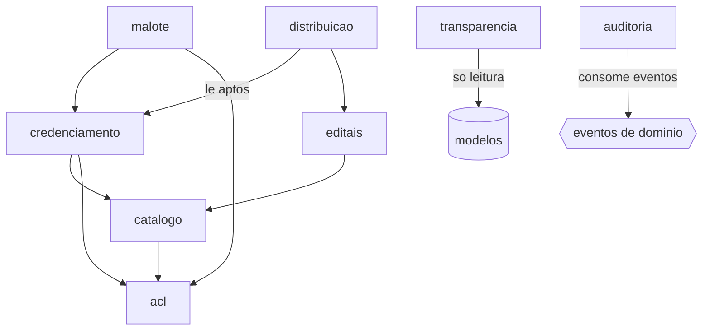
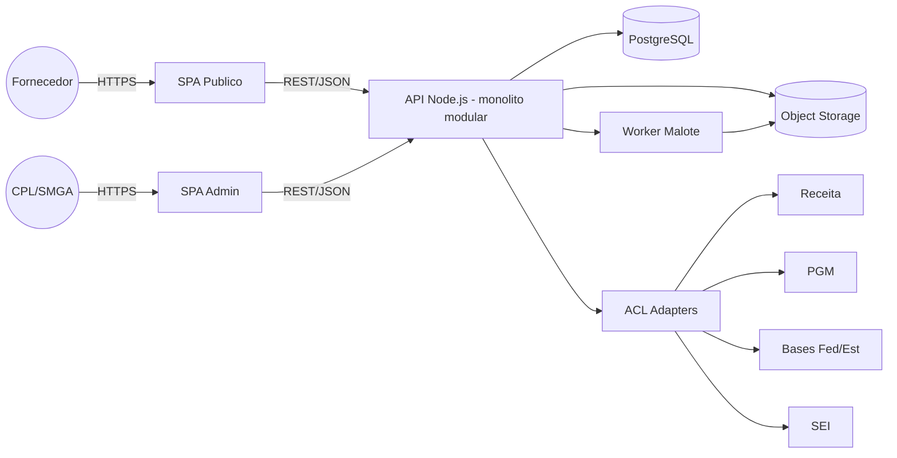
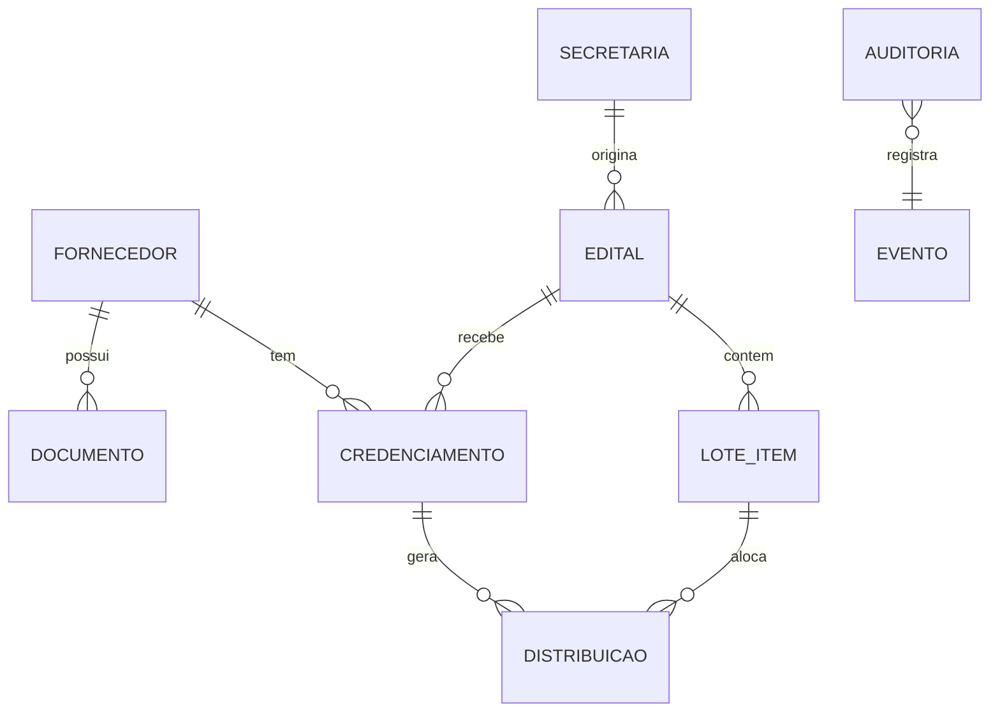

# Architecture Spine — Compra Mais

## Design Paradigm

**Monólito Modular + DDD + Clean Architecture.** Um único deployable; módulos de domínio com fronteiras internas rígidas, comunicação síncrona in-process por padrão e **eventos de domínio** para cruzamentos de propriedade. Internamente cada módulo segue **Clean Architecture** — camadas concêntricas Domínio → Casos de Uso → Adaptadores → Infra, com **regra de dependência apontando para dentro** (Domínio/Casos de Uso não conhecem framework, banco nem I/O; o framework HTTP é detalhe de infra plugável). Toda integração externa atravessa uma **Anti-Corruption Layer (ACL)** (na camada de Adaptadores). Processamento pesado (compressão de malote) sai para **workers assíncronos**.

Mapa de módulos → namespaces:

```text
catalogo/        # onboarding, perfil do fornecedor, CNAE
credenciamento/  # adesão, fases, covalidação, inadimplência, Reserva
editais/         # demandas individualizadas (1 edital = 1 secretaria)
distribuicao/    # motor de rateio (função pura)
malote/          # consolidação + compressão + fragmentação (worker)
auditoria/       # trilha append-only (consome eventos)
transparencia/   # views públicas (leitura)
shared/acl/      # adaptadores Receita, PGM, bases dívida, SEI, mensageria
shared/identity/ # provedor de identidade plugável
```

## Invariants & Rules

Diagrama de direção de dependência (quem pode depender de quem — é regra, não ilustração):



### AD-1 — Monólito modular + DDD `[ADOPTED]`
- **Binds:** all
- **Prevents:** divergência de paradigma; extração precoce para microsserviços
- **Rule:** um deployable; cada módulo possui suas tabelas; nenhum módulo importa internals de outro. Microsserviço só por extração futura justificada.

### AD-2 — Comunicação entre módulos
- **Binds:** all
- **Prevents:** escrita cruzada direta; acoplamento temporal
- **Rule:** síncrona in-process por padrão; cruzamento que muta estado de outro dono é **evento de domínio**, nunca escrita direta na tabela alheia.

### AD-3 — Dois bundles SPA
- **Binds:** Transparencia, Painel Admin, RF010/RF013
- **Prevents:** acoplamento público/admin
- **Rule:** Portal Público/Transparência e Painel Admin são bundles separados, compartilham o **design system** (tokens em [DESIGN.md](../ux/DESIGN.md): Poppins, raio 8px/999px, âmbar #FFB300; **paleta em arbitragem — ver 0.7**) e a IA de navegação ([EXPERIENCE.md](../ux/EXPERIENCE.md): Início, Editais, Meus credenciamentos, Documentos, Demandas distribuídas), ambos consumindo a API via REST/JSON. Nenhum acesso direto a banco pelo frontend. O contrato de UX tem **duas metades normativas** (AD-39): a **escrita** (DESIGN.md + EXPERIENCE.md) e o **artefato** ([`Prototipo/`](../../Prototipo/)); divergência entre elas é defeito, não preferência.

### AD-4 — Integrações via ACL + circuit breaker `[ADOPTED]`
- **Binds:** Receita, PGM, bases de dívida, SEI, mensageria; RNF001
- **Prevents:** acoplamento ao dialeto/instabilidade de API de governo
- **Rule:** um adaptador por integração, contrato interno estável; circuit breaker obrigatório (seed: Opossum — agnóstico de framework); contrato verificável por Pact (`@pact-foundation/pact`) + mock (dev não bloqueia por chave real). Consultas externas são **idempotentes**; retry do breaker nunca duplica efeito (consulta = safe; ações com efeito carregam chave de idempotência).

### AD-5 — Resultado externo tipado com proveniência
- **Binds:** todos os adaptadores ACL; RNF003
- **Prevents:** decisão sobre dado sem origem; auditoria TCE impossível
- **Rule:** consulta externa retorna `{valor, fonte, timestamp, frescor: verificado|stale|indisponivel}` — nunca booleano nu.

### AD-6 — Processamento pesado assíncrono `[ADOPTED]`
- **Binds:** Malote; RNF002
- **Prevents:** bloqueio da thread da API por compressão de PDF
- **Rule:** compressão/consolidação de malote roda em worker; usuário notificado quando pronto.

### AD-7 — Motor de distribuição é função pura e determinística
- **Binds:** Distribuicao; RF005, RNF008
- **Prevents:** não-reprodutibilidade que o TCE rejeita
- **Rule:** sem relógio, `random()` ou leitura de DB no cálculo. Entradas por parâmetro `{demanda, aptos+teto, regra_desempate}`; saída `{matriz, regra+sementes usadas}`. Mesma entrada → mesma saída.

### AD-8 — Regra de resto/desempate é parâmetro versionado e logado
- **Binds:** Distribuicao; RF005 (LAC-04c/d)
- **Prevents:** bloqueio do motor por decisão jurídica pendente (desarma C1)
- **Rule:** método de resto e critério de desempate são parâmetro de negócio (`regra_vN`), não código. Default: Hamilton (maiores restos) + ordem de credenciamento, backstop menor CNPJ. Cada distribuição grava a `regra_vN` usada na trilha. O default final aguarda ratificação SMGA/TCE; o motor é construível/testável já.

### AD-9 — Motor roda síncrono em transação
- **Binds:** Distribuicao
- **Prevents:** divergência sync/async no núcleo
- **Rule:** domain service síncrono dentro da transação que persiste a matriz (compute leve — diferente do malote, AD-6).

### AD-10 — Alocação imutável após contrato; substituição é operação separada
- **Binds:** Distribuicao, Credenciamento; RF006, RN004
- **Prevents:** refração retroativa de contratos (tensão H5)
- **Rule:** gerada a distribuição + contrato, a matriz congela. A matriz é **append-only no nível de schema** — proibido `UPDATE` na linha homologada. Desistência de titular → **reatribuição de uma única cota liberada** registrada como fato `SubstituicaoCota` (novo registro, não mutação), demais alocações intactas; não re-roda o motor.

### AD-11 — Inadimplência reavaliada em cada porta
- **Binds:** Credenciamento; RF011, RN002
- **Prevents:** bloqueio permanente / aprovação stale
- **Rule:** verificação reavaliada em credenciamento → distribuição → contrato; nunca cacheada como "ok permanente".

### AD-12 — Ação-quando-API-indisponível é parâmetro de política
- **Binds:** Credenciamento, ACL; RN002 (LAC-08, H2)
- **Prevents:** decisão de mérito jurídico embutida em código
- **Rule:** política logada por verificação. **Default: fail-open + flag obrigatória para a CPL** (honra LC 123/missão ME-EPP; a reavaliação na porta seguinte pega o inadimplente). Aceita fail-closed sem reescrita; default final ratificado pela Procuradoria.
- **Nota:** este AD **supersede** a redação `fail-closed` do PRD §RN002 (v2.0), que ficou desatualizada após a decisão desta sessão. O PRD deve ser atualizado para não divergir.

### AD-13 — `Credenciamento` tem dono único
- **Binds:** Credenciamento, Distribuicao
- **Prevents:** dois donos de uma entidade
- **Rule:** a entidade associativa Fornecedor×Edital é propriedade exclusiva do módulo Credenciamento/Covalidação. Distribuição **lê** aptos, nunca muta fase.

### AD-14 — Máquina de estado de fase com avanço centralizado
- **Binds:** Credenciamento; RN004
- **Prevents:** caminhos de mutação concorrentes da fase
- **Rule:** `Requerente → Credenciado → Fornecedor`, transições só pelo dono, com guarda (inadimplência é a guarda de `Requerente→Credenciado`). Flag Reserva/Segunda Demanda é estado interno. Outros módulos pedem avanço via evento (ex.: Distribuição→Fornecedor), nunca escrita direta.

### AD-15 — Status de `Documento` só pela Covalidação
- **Binds:** Credenciamento/Covalidacao; RN003
- **Prevents:** aprovação fora do dono; reprovação sem rastro
- **Rule:** `Pendente → Aprovado | Reprovado(+justificativa)`; transição só pelo módulo Covalidação; reprovação sem justificativa rejeitada na borda.

### AD-16 — Edital referencia exatamente uma Secretaria
- **Binds:** Editais; RN007, RNF004
- **Prevents:** arranjo guarda-chuva entre órgãos
- **Rule:** invariante de schema (não só de UI): um `Edital` → uma `Secretaria`; um edital não compartilha lote com outro.

### AD-17 — Escrita única por entidade
- **Binds:** all
- **Prevents:** caminhos de mutação concorrentes
- **Rule:** nenhum módulo escreve na tabela de outro; cruzamento só por referência/leitura ou evento de domínio.

### AD-18 — Auditoria append-only, escritor único
- **Binds:** Auditoria; RNF003
- **Prevents:** trilha adulterável; múltiplos escritores
- **Rule:** log imutável append-only; o módulo Auditoria **consome eventos de domínio** (outros não escrevem direto). Formato `{usuario, evento, timestamp, IP, payload JSON}`. Side-log de conformidade, não event-sourcing do estado.

### AD-19 — LGPD como invariante
- **Binds:** all que tocam PII; RNF007, RF017
- **Prevents:** vazamento de PII; tratamento sem base legal
- **Rule:** cifra em repouso (documentos + PII de sócios) e em trânsito; segregação por RBAC; retenção/descarte como parâmetro de política; direitos do titular atrás de ponto único de acesso/correção/exclusão.

### AD-20 — Identidade plugável
- **Binds:** shared/identity; RF015
- **Prevents:** acoplamento a um provedor de auth
- **Rule:** login atrás de provedor plugável. Default Onda 1/MVP: credenciais locais. gov.br como evolução para o fornecedor sem reescrita; CPL/SMGA via SSO da Prefeitura quando disponível.
- **Implementação:** credencial local = `Usuario` (e-mail + senha **scrypt+salt**), persistido em
  PostgreSQL (`usuarios`); sessão = **JWT HS256** (`sub`, `papel`, `empresaId`, TTL configurável),
  segredo via `JWT_SECRET`/Docker secret. **Google OAuth 2.0/OIDC** (`@fastify/oauth2`) é uma 2ª via:
  vincula/auto-provisiona e emite o **mesmo** JWT. Emite eventos `UsuarioRegistrado` /
  `UsuarioAutenticado` / `GoogleVinculado` (AD-18). Detalhe: `../archive/2026-06-29-spec-kit/008-autenticacao/`
  (arquivado na convergência 2026-07-02), `docs/auth/autenticacao.md` e `docs/auth/google-cloud-setup.md`.
  Pendente (Onda 2/3): MFA, refresh
  token + revogação, reset por mensageria, gov.br.

### AD-21 — Malote determinístico e fragmentável
- **Binds:** Malote; RF007, RNF002, RN008
- **Prevents:** malote fora de ordem legal; estouro do limite SEI
- **Rule:** ordenação determinística CNPJ→Doc→Anexos→Certidões, contínua entre fragmentos; limite SEI = parâmetro de config; cadeia comprimir→split-por-página→rejeitar; PDF único irredutível é exceção tratada explicitamente, não silêncio.

### AD-22 — Observabilidade das integrações
- **Binds:** ACL; RNF005
- **Prevents:** falha silenciosa de API de governo
- **Rule:** instrumentar timeouts e estado do circuit breaker; métrica de saúde por adaptador.

### AD-23 — Contrato canônico de evento de domínio
- **Binds:** all (reforça AD-2, AD-14, AD-18)
- **Prevents:** dois donos moldando o evento incompatível; fase nunca avança em silêncio (SEAM-01/05)
- **Rule:** catálogo único em `shared/events/`; envelope canônico `{eventId, eventName, eventVersion, aggregateId, occurredAt, payload}`; nome no passado; o evento carrega **fato, nunca ordem** (ex.: `DistribuicaoHomologada`, não "promova fulano") — o consumidor dono decide a transição. Schema de evento emitido é imutável: evoluir cria nova `eventVersion`, jamais edita o existente.

### AD-24 — Serialização canônica do resultado do motor
- **Binds:** Distribuicao (AD-7, AD-8, RNF008)
- **Prevents:** reauditoria byte-a-byte do TCE falhar por serialização divergente (SEAM-02)
- **Rule:** entrada com **ordem total explícita** (fornecedores ordenados deterministicamente antes do cálculo); `regra_vN` = ponteiro versionado + hash; semente = os **dados** que resolvem o desempate (não o critério em prosa); matriz = estrutura canônica ordenada. "Mesma saída" (RNF008) ≝ igualdade do blob canônico serializado.

### AD-25 — Ordem da fila do Cadastro de Reserva
- **Binds:** Credenciamento, Distribuicao (AD-10, AD-14, RN004)
- **Prevents:** dois times promovendo empresas diferentes para o mesmo contrato público (SEAM-04)
- **Rule:** a ordem de promoção é `regra_reserva_vN` versionada e logada (não "estado interno" opaco). Default: FIFO por data de credenciamento, backstop menor CNPJ (alinhado a AD-8). Promoção é decisão auditável do TCE.

### AD-26 — Idempotência de operações externas com efeito
- **Binds:** ACL (AD-4)
- **Prevents:** efeito duplicado por retry do circuit breaker — ex.: malote protocolado 2× no SEI (SEAM-06)
- **Rule:** toda operação externa com efeito carrega `idempotencyKey` determinística; consultas são naturalmente safe/idempotentes. Retry seguro por contrato.

### AD-27 — Dono do resultado da reavaliação de porta
- **Binds:** Credenciamento, Distribuicao (AD-11, AD-13)
- **Prevents:** filtro silencioso sem auditoria / estado órfão (SEAM-07)
- **Rule:** a reavaliação registra o fato `ReavaliacaoPortaRegistrada` (dono: Credenciamento, via evento). O bloqueio por inadimplência (RN002) é **atributo ortogonal à fase**, não um estado da máquina de AD-14. A Distribuição **lê** o atributo, nunca o muta.

### AD-28 — Migrações de schema
- **Binds:** all
- **Prevents:** migração destrutiva em dados juridicamente sensíveis; mutação da trilha
- **Rule:** migrações forward-only, versionadas, cada módulo dona das suas; **nunca** mutam/recriam a tabela de auditoria append-only (AD-18); migração que toca PII passa por revisão.

### AD-29 — Ambientes e envelope de deploy
- **Binds:** all; RNF005
- **Prevents:** dimensão operacional em silêncio; drift entre ambientes
- **Rule:** ambientes dev/staging/prod isolados; deploy via CI/CD (build → testes/Pact → deploy); segredos em runtime fora do código/repo (secret manager); backup de Postgres + object storage. Provedor de nuvem específico permanece seed (Deferred).

### AD-30 — Papel Procurador (sub-papel de fornecedor)
- **Binds:** shared/identity, Credenciamento; RF015, RNF003, RNF007
- **Prevents:** ação em nome da empresa sem rastro/autorização (vetor de fraude por procurador/contador — origem da antiga proposta de biometria)
- **Rule:** um fornecedor tem papéis (`titular`, `Procurador`); toda ação de um Procurador registra na trilha o **ator + a empresa representada**. Direitos do titular LGPD (RF017) que exijam o próprio titular não são exercíveis por Procurador.

### AD-31 — Dados originados na Receita são read-only + re-sincronização
- **Binds:** catalogo; RF001, RF018, RN009
- **Prevents:** divergência entre o dado oficial e edição manual
- **Rule:** campos originados da Receita (Razão Social, CNAE, Porte) são imutáveis pela edição do fornecedor; só mudam por **re-sincronização** (RF018), que grava `{timestamp, fonte, status}`. Subconjunto editável pelo fornecedor: Nome Fantasia, Endereço, Telefone.

### AD-32 — Clean Architecture e modelos como classes TypeScript
- **Binds:** all (Constituição v3.1.0, Princípio IV)
- **Prevents:** vazamento de framework/infra para o domínio; modelos anêmicos
- **Rule:** cada módulo organiza-se em camadas (Domínio → Casos de Uso → Adaptadores → Infra) com **regra de dependência para dentro**; Domínio e Casos de Uso são puros (sem import de framework/ORM/HTTP). **Modelos de domínio são classes TypeScript ricas** (comportamento + invariantes encapsulados), não interfaces/tipos anêmicos nem objetos planos. Persistência via repositórios na camada de Adaptadores.

### AD-33 — Superclasse base de entidade (`EntidadeBase`)
- **Binds:** all (Constituição v3.2.0, Princípio IV)
- **Prevents:** entidades sem metadados de auditoria/identidade consistentes; duplicação desses campos
- **Rule:** toda **entidade** (com identidade) estende `EntidadeBase` (em `shared/domain`) com `id: UUID`,
  `registerDate: DateTime`, `updateDate: DateTime`, `lastUserUpdate: User.userName`. `registerDate`/
  `updateDate`/`lastUserUpdate` são mantidos na persistência. **Value Objects** (ex.: `Cnpj`) NÃO estendem.
  Complementa, não substitui, a trilha append-only (AD-18). **Registros append-only** (ex.: `AuditRecord`,
  AD-18) têm `id` mas, por serem imutáveis, não expõem `updateDate`/`lastUserUpdate` — a superclasse de
  mutação não se aplica a eles.

### AD-34 — Busca por instância parcial (QBE) só em listagem de coleção
- **Binds:** all os endpoints de listagem; RF014 (Constituição v3.3.0)
- **Prevents:** filtros ad-hoc divergentes por módulo; QBE aplicado onde não cabe (agregações, recurso único)
- **Rule:** listagens de coleção de uma entidade aceitam um **probe parcial** da própria entidade como filtro (ex.: `GET credenciamento/documentos/pendentes` filtra por `status`/`tipo` de `Documento`). **Isentos:** endpoints de **agregação** (ex.: `/pendencias`, projeções de transparência) e **leituras de recurso único** — não recebem QBE. Resgatado de `spec/002` (convergência 2026-07-02).

### AD-35 — Catálogo de papéis (RBAC) com separação de funções
- **Binds:** shared/identity, Auditoria, Credenciamento; RNF007, RF014, RF017 (reforça AD-19, AD-30)
- **Prevents:** acúmulo de privilégio; direito do titular atendido por quem não deve; auditoria adulterável por quem opera
- **Rule:** papéis canônicos e mutuamente delimitados:
  - `titular` — responsável legal da empresa; cadastra-se primeiro e **convida/remove** `Procurador` (AD-30).
  - `Procurador` — age em nome da empresa com rastro de ator (AD-30); **não** exerce direitos do titular (AD-19).
  - `CPL` / `Administrador` — operação (covalidação, editais, malote, distribuição). **CPL não atende direitos do titular.**
  - `auditor` — **somente leitura**: consulta e exporta a trilha (RF014); nunca escreve/aprova. Menor privilégio para órgãos de controle.
  - `dpo` (Encarregado, LGPD art. 41) — **atende/recusa** direitos do titular (RF017); `Administrador` é fallback.
  - `Secretaria/Gestor` — cria e edita editais (com auditoria, AD-16).
  Resgatado de `spec/001/004/006` (convergência 2026-07-02).

### AD-36 — Catálogo de parâmetros de configuração versionados
- **Binds:** all que dependem de política de negócio; RNF002, RNF007, RF014 (reforça AD-8, AD-12, AD-19, AD-21)
- **Prevents:** número mágico jurídico embutido em código; drift de política entre módulos
- **Rule:** decisões de negócio que parametrizam invariantes vivem como **config versionada/logada**, nunca hard-coded. Catálogo mínimo:
  - `SEI_MALOTE_LIMITE_MB` — **global** (característica do SEI municipal, não do edital/secretaria) — AD-21.
  - `AUDITORIA_EXPORT_TETO` — teto configurável de registros por export (ex.: 50k); acima dele **sinaliza e conclui** via streaming/paginação, não corta — RF014.
  - `RETENCAO_POR_CATEGORIA` — prazo de descarte **por categoria de dado** (cadastral, fiscal, contratual…), não único — AD-19, RNF007.
  - `regra_vN` / `regra_reserva_vN` — regra de resto-desempate e ordem da Reserva — AD-8/AD-25.
  - `POLITICA_INDISPONIBILIDADE` — default `fail-open + flag` — AD-12.
  Resgatado de `spec/004/005/006` (convergência 2026-07-02).

### AD-37 — Máquina de estado do Edital
- **Binds:** Editais; RF008, RN014, RN012 (reforça AD-16)
- **Prevents:** edital visível/distribuível em estado indevido; transição sem rastro
- **Rule:** o `Edital` tem ciclo `Rascunho → Aberto → Em Análise → Em Distribuição → Homologado → Em Execução`, com transições **só pelo dono** (módulo Editais) e **auditadas** (evento de domínio, AD-18/AD-23). Guardas: só **Aberto** entra na vitrine do fornecedor (RF003); a Distribuição (AD-7) só roda a partir de **Em Distribuição**; **Homologado** dispara o congelamento da alocação (AD-10). Espelha, no Edital, o padrão de fase centralizada do Credenciamento (AD-14). Identificado na validação de mockups (2026-07-02).

### AD-38 — Exclusão lógica preservando histórico
- **Binds:** all os cadastros administrativos (Secretaria, Setor/CNAE, Tipo de Documento, Usuário, Fornecedor, Edital); RN015
- **Prevents:** perda de histórico/integridade referencial por DELETE físico; órfãos em processos vinculados
- **Rule:** entidades de cadastro **não são apagadas fisicamente** — recebem estado `Inativo` (flag/soft-delete), somem das seleções ativas mas preservam histórico e referências. DELETE físico é proibido para entidades referenciadas por processos. Complementa a trilha append-only (AD-18) e a `EntidadeBase` (AD-33). Identificado na validação de mockups (2026-07-02).

### AD-39 — Um contrato, um lugar
- **Binds:** toda a documentação normativa (`spec/docs/`, `spec/Prototipo/`)
- **Prevents:** canônico fantasma — documento normativo não-versionado, referência a arquivo inexistente, cópia divergente sem dono
- **Rule:** três invariantes documentais, verificáveis mecanicamente:
  1. **Documento normativo que não está versionado não é normativo.** Se não está no git, não obriga ninguém.
  2. **Referência a arquivo inexistente é erro**, não nota de rodapé. Um link quebrado em documento normativo é um defeito de build da documentação e bloqueia o merge.
  3. **Um artefato, um endereço.** Cópia byte-idêntica em segundo lugar é lixo; cópia divergente sem dono declarado é um fork silencioso. O contrato de UX são os bundles de `spec/Prototipo/` — não um resumo deles.
- **Exceção:** registros datados (`docs/dev/`, `docs/prompts/`, `docs/qa/`, changelogs, atas) preservam suas referências históricas — descrevem o que era verdade na data, não o que obriga hoje.
- **Motivação (2026-07-16):** o `CONVERGENCIA.md` §1 matou o "canônico fantasma" em 2026-07-02; ele reabriu em 11 dias. A divergência **D1** (paleta) bloqueou ratificação por duas semanas por citar `ux/DESIGN.md` — um arquivo que **nunca existiu**. A referência tinha mais autoridade que a coisa referida.

## Consistency Conventions

| Concern | Convention |
| --- | --- |
| Naming | Módulos e entidades em PT (`Credenciamento`, `Edital`); eventos no passado (`DocumentoReprovado`, `DistribuicaoHomologada`); interfaces de adaptador `XxxGateway`. |
| Termos canônicos | `Cadastro de Reserva` (= Segunda Demanda; **não** usar "Fila de Espera"); `covalidação`; `malote`; `porta` (= gate de reavaliação); `regra_vN` (versão da regra do motor). |
| Data & formatos | IDs UUID; datas ISO-8601 UTC; erros como envelope `{codigo, mensagem, detalhe}`; respostas REST/JSON. |
| Estado & transversais | Mutação só pelo dono (AD-13/14/15/17); cruzamento por evento (AD-2); log via evento → Auditoria (AD-18); config/segredos fora do código; auth via provedor plugável (AD-20). |

## Stack

| Name | Version |
| --- | --- |
| Node.js | 24 LTS (Maintenance; recomendada até EOL 2028-04) |
| Framework HTTP | Express ou Fastify (sem NestJS) |
| React | 19 |
| Vite | atual (build do frontend) |
| TypeScript | atual |
| PostgreSQL | 18 |
| Object storage | S3-compatível (atrás de adaptador) |

## Structural Seed

Container view (cold-start; o código é dono do detalhe):



ERD núcleo (nomes e relações; atributo que é invariante vira AD, não diagrama):



## Capability → Architecture Map

| Capability / Área | Lives in | Governed by |
| --- | --- | --- |
| Cadastro CNPJ / CNAE (RF001/003) | `catalogo/` | AD-4, AD-5, AD-20 |
| Covalidação documental (RF002/004) | `credenciamento/` | AD-15, AD-19 |
| Inadimplência (RF011, RN002) | `credenciamento/` + `acl/` | AD-11, AD-12 |
| Editais individualizados (RF008, RN007) | `editais/` | AD-16, AD-37 |
| Cadastros administrativos — Secretarias/CNAE/Tipos-doc (RF020/021/022) | `editais/` + `catalogo/` | AD-16, AD-38 |
| Gestão de usuários internos + RBAC (RF023, §15) | `shared/identity/` | AD-20, AD-35, AD-38 |
| Motor de distribuição (RF005, RN005) | `distribuicao/` | AD-7, AD-8, AD-9, AD-10 |
| Cadastro de Reserva (RF006, RN004) | `credenciamento/` | AD-10, AD-14 |
| Malote SEI (RF007, RNF002) | `malote/` | AD-6, AD-21 |
| Auditoria/exportação (RF014, RNF003) | `auditoria/` | AD-18 |
| Contestação/direitos do titular (RF016/RF017) | `credenciamento/` + `shared/identity/` | AD-19 |
| Transparência (RF010) | `transparencia/` | AD-3 |

## Questões Abertas (bloqueiam o build do módulo afetado)

- **Item × Lote** (LAC-16): a granularidade do motor (AD-7/AD-24) e do malote (AD-21) assume **item**. Se o MVP exigir **lote**, é revisão estrutural — não troca de parâmetro. Fechar com SMGA/TCE **antes** de congelar o motor.

## Deferred

- **Provedor de nuvem específico** = seed — decidir com a TI da Prefeitura; invariante é "um deployable + Postgres + object storage, cloud HA" (RNF005).
- **Transferência automática ao SEI** = Release 2 (MVP usa upload manual do malote gerado).
- **Notificações SMS/e-mail** (RF009) = Release 2, atrás de adaptador (gateway pendente — LAC-07).
- **Biometria facial** (RF012) = condicional Release 2, somente com RIPD.
- **Decisões de negócio que parametrizam invariantes (não bloqueiam a arquitetura):** default do desempate do motor (AD-8, SMGA/TCE), default da política de indisponibilidade (AD-12, Procuradoria), número de retenção LGPD (AD-19), limite em MB do SEI (AD-21, TI). Cada um é valor de parâmetro, não mudança estrutural.
- *(Item × Lote movido para Questões Abertas — é divergência estrutural bloqueante, não parâmetro.)*
