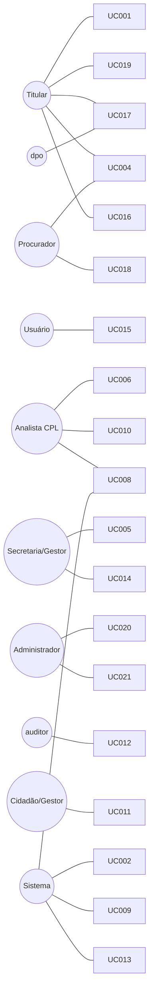

# Compra Mais — Casos de Uso (UC)

**Projeto:** Compra Mais (Programa de Compras Municipalizadas — Prefeitura de Rio Branco)
**Fonte de verdade:** este diretório (`spec/docs/`), versionado no git — ver [index.md](index.md).
**Rastreável a:** [prd.md](prd.md) (RF/RN/RNF/RBAC) · [architecture/ARCHITECTURE-SPINE.md](architecture/ARCHITECTURE-SPINE.md) (ADs) · [epics.md](epics.md) (histórias e critérios de aceite).

> **Papel deste documento.** Os casos de uso descrevem **ator → objetivo → fluxo** (principal, alternativos,
> exceções). Eles **não** são critérios de aceite: o comportamento testável (Given/When/Then) vive em
> [epics.md](epics.md), a fila canônica de histórias. UC dá a intenção e a jornada; o épico dá o teste. Quando
> houver divergência entre os dois, o PRD ([prd.md](prd.md)) arbitra.
>
> **Atores são papéis (RBAC §15), não cargos.** "Analista CPL", "Secretaria/Gestor", "Administrador",
> "Titular", "Procurador", "auditor", "dpo", "Sistema". A lista de **cargos** operacionais é parametrizável
> (RF023); os **papéis** (permissões efetivas) são o invariante (AD-35).
>
> **Antecessor.** Supersede o rascunho v1.0 em [`../source/06-CasosUso.md`](../source/06-CasosUso.md) (2026-06-22,
> pré-convergência), que permanece apenas como **insumo histórico bruto** — não é canônico.

---

## Controle de Versão

| Versão | Data | Autor | Alteração |
|---|---|---|---|
| 1.0 | 2026-06-22 | Equipe de Análise | Rascunho inicial (14 UCs) — em `source/06-CasosUso.md` |
| 2.0 | 2026-07-02 | Party Mode | Versão canônica alinhada ao **PRD v2.4**: atores por papel (RBAC §15); ciclo de vida do Edital (RN014); Termo de Aceite conclui o credenciamento no MVP e **UC007 (liveness) marcado R2 condicional a RIPD** (RN016, RF012); inativação lógica (RN015); **novos UC015–UC021** para RF015–RF023 e Procurador (RN010) |
| 2.1 | 2026-07-09 | Solicitante + Tech Lead | **UC007 (Prova de Vida/Liveness) ratificado para o MVP condicional a RIPD** (RF012 reativado): UC007 detalhado com fluxo principal/alternativos/exceções; entra **desligado por feature flag** preservando UC004/Termo de Aceite; RIPD produzido ([lgpd/RIPD-prova-de-vida.md](lgpd/RIPD-prova-de-vida.md)); rastreável a Story 5.6 (épicos) |

---

## Sumário

| Bloco | Casos de Uso |
|---|---|
| **A. Cadastro & Identidade do Fornecedor** | UC001, UC018, UC019, UC015 |
| **B. Editais** | UC005 |
| **C. Credenciamento & Covalidação** | UC003, UC004, UC002, UC006, UC007 *(condicional a RIPD)*, UC016 |
| **D. Distribuição & Malote** | UC008, UC009, UC010 |
| **E. Transparência, Auditoria & Notificações** | UC011, UC012, UC013, UC014 |
| **F. LGPD** | UC017 |
| **G. Administração (catálogos & usuários)** | UC020, UC021 |

**Convenção de status do Fornecedor:** `Requerente → Pendente de Análise → Credenciado → Apto` (por edital), com
`Em Correção` no laço de covalidação. **Ciclo do Edital (RN014):** `Rascunho → Aberto → Em Análise → Em Distribuição → Homologado → Em Execução`.

---

## A. Cadastro & Identidade do Fornecedor

### UC001 — Cadastrar Fornecedor via CNPJ (Receita Federal)
**Objetivo:** permitir que empresas locais iniciem o onboarding informando apenas o CNPJ, com autopreenchimento oficial que reduz erro de digitação.
**Ator principal:** Fornecedor (Titular). **Apoio:** Sistema (integração Receita).
**Pré-condições:** CNPJ válido e ativo.
**Fluxo principal:**
1. O Titular acessa o Portal do Fornecedor e clica em "Cadastrar".
2. Informa o número do CNPJ.
3. O Sistema consulta a API da Receita e autopreenche **Razão Social, Nome Fantasia, Porte e CNAEs** (principal e secundários) — dados **somente leitura** (RN009).
4. O Titular informa contato (e-mail/senha) e o **endereço estruturado geolocalizável** para análise territorial (RF019).
5. O Sistema salva o registro com status inicial **Requerente** e registra o `timestamp` da sincronização (RF018).
**Fluxos alternativos:**
- **A1 — API indisponível:** o Sistema permite preenchimento manual, marcando o cadastro para **covalidação rigorosa posterior** (política `fail-open + flag`, RN002/AD-12).
**Exceções:** CNPJ inválido matematicamente → cadastro bloqueado.
**Pós-condições:** Fornecedor com acesso ao Portal; ainda **precisa credenciar-se** em um edital.
**Rastreabilidade:** RF001, RF018, RF019 · RN009, RN002 · RNF001, RNF005 · Prioridade **Must** · Complexidade Média.

### UC018 — Re-sincronizar Dados do CNPJ
**Objetivo:** atualizar sob demanda os dados oficiais do fornecedor com nova consulta à Receita.
**Ator principal:** Fornecedor (Titular ou Procurador).
**Pré-condições:** cadastro existente (UC001).
**Fluxo principal:**
1. Em "Minha Conta", o ator vê a data da **última sincronização** e seu status.
2. Aciona "Re-sincronizar".
3. O Sistema reconsulta a Receita e atualiza **Razão Social, CNAE e Porte** (campos travados para edição manual — RN009), registrando novo `timestamp`.
**Fluxos alternativos:** **A1 —** API indisponível: mantém os dados atuais e sinaliza a falha, sem sobrescrever.
**Exceções:** CNPJ tornou-se inativo/baixado → sinaliza para revisão da CPL.
**Pós-condições:** dados oficiais atualizados; **Nome Fantasia, Endereço e Telefone** seguem editáveis pelo fornecedor (RN009).
**Rastreabilidade:** RF018 · RN009 · Prioridade **Must** · Complexidade Baixa.

### UC019 — Gerir Procuradores da Empresa
**Objetivo:** permitir que o Titular autorize terceiros a agir em nome da empresa, com rastro de fraude.
**Ator principal:** Titular.
**Pré-condições:** empresa cadastrada; ator autenticado como **Titular** (responsável legal).
**Fluxo principal:**
1. O Titular abre "Procuradores" e **convida** um Procurador (identificação + e-mail).
2. O Sistema cria o vínculo **Procurador↔empresa** e concede o papel `Procurador`.
3. O Procurador passa a operar com **rastro de ator + empresa representada** em toda ação (AD-30).
**Fluxos alternativos:** **A1 —** o Titular **remove** um Procurador; vínculos e rastro anteriores são preservados (RN015, append-only).
**Exceções:** tentativa de um Procurador convidar outro Procurador → bloqueado (vínculo é prerrogativa do Titular, RN010).
**Pós-condições:** Procurador habilitado a operar; **direitos do titular LGPD (RF017/UC017) permanecem exclusivos do Titular**.
**Rastreabilidade:** RN010 · AD-30, AD-35 · Prioridade **Must** · Complexidade Média.

### UC015 — Autenticar e Gerir a Própria Senha
**Objetivo:** dar acesso recorrente seguro e autonomia sobre a própria credencial a qualquer usuário (fornecedor ou servidor).
**Ator principal:** Usuário autenticável (Titular, Procurador ou servidor interno).
**Pré-condições:** conta existente e ativa.
**Fluxo principal:**
1. O usuário informa credenciais (login/SSO) e, quando exigido, **MFA**.
2. O Sistema autentica e abre a sessão conforme o **papel** (RBAC §15).
**Fluxos alternativos:**
- **A1 — Esqueci a senha:** o usuário solicita reset; o Sistema envia link/token e permite definir nova senha.
- **A2 — Troca da própria senha (autenticado):** o usuário informa **senha atual + nova senha**; o Sistema valida a senha atual antes de trocar.
**Exceções:** senha atual incorreta (A2) ou token expirado (A1) → operação recusada, sem revelar existência da conta.
**Pós-condições:** sessão ativa ou credencial atualizada; evento registrado.
**Rastreabilidade:** RF015 · RBAC §15 · RNF (segurança) · Prioridade **Must** · Complexidade Média.

---

## B. Editais

### UC005 — Criar Edital Individualizado
**Objetivo:** criar um chamamento individualizado (1 edital = 1 demanda de 1 secretaria), governando seu ciclo de vida.
**Ator principal:** Secretaria/Gestor.
**Pré-condições:** ator com papel `Secretaria/Gestor`; catálogos base disponíveis (UC020).
**Fluxo principal:**
1. Em "Editais", clica em "Novo Edital".
2. Preenche objeto, valor unitário e vigência; **vincula obrigatoriamente 1 Secretaria demandante** (selecionada do catálogo — RF020/AD-16).
3. Adiciona lotes/itens com quantidades e **CNAEs exigidos** (subclasse 7 dígitos, do catálogo — RF021/RF003).
4. Salva como **Rascunho**; ao publicar, o edital passa a **Aberto** e aparece na vitrine do fornecedor (RN014).
**Fluxos alternativos:**
- **A1 — Edição pós-publicação:** a Secretaria altera qualquer campo (inclusive CNAE/quantitativos) **com auditoria antes/depois** (RN012); mudança de CNAE **reavalia a vitrine imediatamente**, mantendo o prazo; reabertura/extensão é **manual e auditada**.
**Exceções:** tentativa de associar **duas** secretarias → bloqueado (RN007, individualização orçamentária).
**Pós-condições:** edital progride no ciclo `Aberto → Em Análise → Em Distribuição → Homologado → Em Execução`, com cada transição auditada (AD-37).
**Rastreabilidade:** RF008 · RN007, RN012, RN014 · AD-16, AD-37 · Prioridade **Must** · Complexidade Média.

---

## C. Credenciamento & Covalidação

### UC003 — Visualizar Editais Compatíveis (Filtro CNAE)
**Objetivo:** exibir ao fornecedor **apenas** editais compatíveis com seu ramo (CNAE).
**Ator principal:** Fornecedor.
**Pré-condições:** fornecedor autenticado.
**Fluxo principal:**
1. O fornecedor acessa a vitrine de editais.
2. O Sistema cruza os CNAEs válidos do CNPJ (principal ou secundários) com os **CNAEs exigidos** do edital, por **match exato de subclasse (7 dígitos)** (RF003/RN001).
3. Exibe somente editais **Abertos** e compatíveis; incompatíveis ficam **ocultos e bloqueados inclusive por link direto**.
**Fluxos alternativos:** **A1 —** nenhum compatível: exibe "Não há editais abertos para o seu segmento no momento".
**Pós-condições:** fornecedor vê apenas oportunidades elegíveis.
**Rastreabilidade:** RF003 · RN001, RN014 · Prioridade **Must** · Complexidade Baixa.

### UC004 — Solicitar Credenciamento e Enviar Documentação
**Objetivo:** submeter proposta e documentos comprobatórios ao órgão central e concluir o credenciamento no MVP por **Termo de Aceite**.
**Ator principal:** Fornecedor.
**Pré-condições:** edital **Aberto**; fornecedor aprovado no filtro CNAE (UC003).
**Fluxo principal:**
1. Seleciona o edital e clica em "Iniciar Credenciamento".
2. O Sistema exibe itens/lotes; o fornecedor informa sua **capacidade produtiva** (teto declarado — base do water-filling, RN005).
3. O fornecedor faz **upload dos documentos exigidos** (tipos definidos no catálogo RF022) — cifrados em repouso (RF002/RNF).
4. O fornecedor **assina o Termo de Aceite**; o Sistema registra o aceite na trilha e muda o status para **Pendente de Análise** (RN016).
**Fluxos alternativos:**
- **A1 — Documento reutilizável válido:** o Sistema importa do repositório sem exigir reenvio (RF002).
- **A2 — Cancelamento pelo fornecedor:** **antes da distribuição**, o fornecedor pode cancelar o credenciamento (RN016). Após homologação, saída só por substituição de desistente (RN004).
**Exceções:** arquivo acima do tamanho/format inválido → rejeitado.
**Pós-condições:** documentos na fila de covalidação da CPL.
**Rastreabilidade:** RF002 · RN016, RN005, RN004 · Prioridade **Must** · Complexidade Média. *(Etapa "Prova de vida"/liveness = UC007, R2.)*

### UC002 — Validar Situação de Inadimplência
**Objetivo:** checar débitos/sanções em bases oficiais e aplicar **bloqueio transitório** nas portas do processo.
**Ator principal:** Sistema (background). **Apoio:** Analista CPL (fallback manual).
**Pré-condições:** fornecedor em uma porta do processo (credenciamento → distribuição → contrato).
**Fluxo principal:**
1. Em cada porta, o Sistema consulta PGM/SICAF e bases de sanções.
2. Retorno "Nada Consta" → prossegue.
**Fluxos alternativos:**
- **A1 — Débito/penalidade/inidoneidade:** aplica bloqueio **transitório** conforme o estado (débito regularizável enquanto ativo; penalidade até a data; inidoneidade pelo termo) — **nunca permanente** (preserva o direito de regularização LC 123, RN002). Data de fim: usa a base oficial quando disponível; **CPL registra manualmente** como fallback.
- **A2 — API indisponível:** `fail-open` **com flag obrigatória para a CPL** (RN002/AD-12).
**Pós-condições:** fornecedor liberado ou bloqueado transitoriamente com motivo auditável.
**Rastreabilidade:** RF011 · RN002 · AD-12 · Prioridade **Must** · Complexidade Alta.

### UC006 — Analisar e Covalidar Documentação (Antifraude)
**Objetivo:** verificação humana de documentos declaratórios, com parecer de habilitação/inabilitação.
**Ator principal:** Analista CPL (`CPL`).
**Pré-condições:** fornecedor **Pendente de Análise** com documentos submetidos.
**Fluxo principal:**
1. O Analista abre a fila de pendências — que exibe o **tempo decorrido por documento** (não há SLA fixo, RN011).
2. Abre o visualizador de PDF e analisa integridade (ex.: Balanço do exercício exigido, RN006).
3. Clica em **Aprovar** por documento; ao aprovar o conjunto, o status vai a **Credenciado**; a ação é logada (quem/quando).
**Fluxos alternativos:**
- **A1 — Reprovar:** o Sistema **exige justificativa** (RN003); o fornecedor entra em **Em Correção** e é notificado (laço com UC016).
**Exceções:** reprovar sem justificativa → bloqueado.
**Pós-condições:** fornecedor apto ao cálculo de distribuição ou em fila de correção.
**Rastreabilidade:** RF004 · RN003, RN006, RN011 · RNF003 · Prioridade **Must** · Complexidade Média.

### UC007 — Validar Identidade por Prova de Vida (Liveness) · **Ratificado para o MVP condicional a RIPD (2026-07-09)**
**Objetivo:** confirmar a presença de uma pessoa viva no **ato do envio** do credenciamento, mitigando fraude por terceiros (procurador/contador agindo sem o titular — vetor de origem de AD-30).
**Ator principal:** Fornecedor (Titular ou Procurador). **Apoio:** Sistema (provedor de liveness); Analista CPL (fallback manual).
**Status:** **ratificado para o MVP em 2026-07-09** pelo solicitante, **condicionado ao RIPD** ([RIPD-prova-de-vida.md](lgpd/RIPD-prova-de-vida.md), LGPD Art. 11 — dado biométrico sensível). Substitui o status anterior "fora do MVP" (RF012 removida) — ver histórico em [VALIDACAO-MOCKUPS.md](VALIDACAO-MOCKUPS.md) §G5. Entra **desligado por padrão** (feature flag `LIVENESS_ENABLED`), preservando a conclusão por **Termo de Aceite** (UC004/RN016) enquanto o RIPD não for operacionalizado; quando ligado, a prova de vida é **pré-requisito do Termo de Aceite**.
**Pré-condições:** credenciamento **iniciado** (UC004, capacidade declarada); fornecedor autenticado; **consentimento específico** do titular para o tratamento biométrico registrado (LGPD, base do RIPD).
**Fluxo principal:**
1. Após os documentos (UC004 passo 3) e **antes** do Termo de Aceite, o Sistema apresenta a etapa de **Prova de Vida**.
2. O ator inicia a captura de liveness; o Sistema envia a amostra ao **provedor de liveness** (ACL, AD-4).
3. O provedor retorna um **veredito + score**; acima do limiar → **aprovada**. O Sistema registra veredito, score, provedor e `timestamp` na trilha (AD-18) — **sem** reter a imagem/vídeo (minimização, RIPD).
4. Com a prova **aprovada**, o fornecedor assina o **Termo de Aceite** (RN016) e o credenciamento conclui (**Pendente de Análise**).
**Fluxos alternativos:**
- **A1 — Falha de liveness (abaixo do limiar):** veredito **reprovada**; o Sistema permite **repetir** a captura; o Termo permanece bloqueado enquanto não houver aprovação.
- **A2 — Provedor indisponível:** política **`fail-open + flag` obrigatória para a CPL** (AD-12) — a prova fica **`indisponivel`** e o credenciamento pode prosseguir, mas entra sinalizado para **covalidação manual da identidade** pela CPL (nunca auto-aprovação silenciosa).
**Exceções:** ausência de consentimento específico para biometria → etapa bloqueada (não há tratamento sem base legal, RIPD). Feature flag desligada → a etapa não é apresentada e o credenciamento conclui por Termo de Aceite (UC004).
**Pós-condições:** prova de vida registrada (aprovada / indisponível-com-flag) e vinculada ao credenciamento; trilha auditável do veredito; imagem/vídeo não retidos.
**Rastreabilidade:** RF012 *(reativado condicional a RIPD)* · RN016 · AD-4, AD-12, AD-30 · [RIPD-prova-de-vida.md](lgpd/RIPD-prova-de-vida.md) · ver [VALIDACAO-MOCKUPS.md](VALIDACAO-MOCKUPS.md) §G5 · Prioridade **Must (condicional a RIPD)** · Complexidade Alta.

### UC016 — Contestar / Regularizar (Tela Única)
**Objetivo:** dar ao fornecedor um único ponto para correção de CNAE, recurso de reprovação e regularização fiscal.
**Ator principal:** Fornecedor. **Apoio:** Secretaria/CPL (julga a procedência).
**Pré-condições:** fornecedor autenticado com uma pendência (reprovação, débito regularizável) **ou** discordância sobre CNAE de um edital.
**Fluxo principal:**
1. O fornecedor abre "Contestação/Regularização" e escolhe o tipo.
2. **Recurso de reprovação:** reenvia documento corrigido/argumento → volta à fila da CPL (UC006).
3. **Regularização fiscal:** anexa comprovante; reavaliação na próxima porta (UC002).
4. **Contestação de CNAE do edital:** qualquer fornecedor **cadastrado e ativo** contesta o CNAE exigido; a Secretaria/CPL **acata ou recusa com justificativa** (RN012).
**Pós-condições:** pendência encaminhada com decisão auditável.
**Rastreabilidade:** RF016 · RN012, RN002, RN003 · Prioridade **Must** · Complexidade Média.

---

## D. Distribuição & Malote

### UC008 — Distribuir Demanda Equitativamente (Motor)
**Objetivo:** ratear as cotas do edital entre fornecedores habilitados respeitando o teto de cada um.
**Ator principal:** Sistema (gatilho automático ou manual). **Apoio:** Analista CPL.
**Pré-condições:** edital em **Em Distribuição**; há fornecedores **Credenciados** com capacidade informada.
**Fluxo principal:**
1. A CPL aciona "Calcular Distribuição".
2. O Sistema aplica o **Motor (§8 do PRD): water-filling iterativo + maiores restos (Hamilton) + desempate determinístico**, respeitando o **teto declarado** de cada fornecedor (RN005) e redistribuindo o excedente.
3. Gera a **matriz de alocação** (itens por CNPJ).
**Fluxos alternativos:** **A1 —** oferta combinada < demanda → alerta de **déficit de abastecimento**.
**Exceções:** parâmetro de desempate não ratificado → usa o default de config (§16), sinalizando.
**Pós-condições:** alocação calculada; ao **Homologar**, a alocação **congela** (AD-10, RN014).
**Rastreabilidade:** RF005 · RN005 · §8, AD-10 · Prioridade **Must** · Complexidade Alta. *(Bloqueado até ratificação Item×Lote — ver [index.md](index.md).)*

### UC009 — Gerir Cadastro de Reserva (Segunda Demanda)
**Objetivo:** acomodar fornecedores retardatários em fila de espera sem refração retroativa na distribuição já feita.
**Ator principal:** Sistema. **Apoio:** Analista CPL (substituições).
**Pré-condições:** distribuição inicial (UC008) já ocorrida; fornecedor retardatário aprovado (UC006).
**Fluxo principal:**
1. Ao aprovar um credenciamento fora da janela inicial, o Sistema detecta que a distribuição já ocorreu.
2. Insere o fornecedor no pool **Cadastro de Reserva**; a distribuição anterior permanece **intacta** (RN004).
**Fluxos alternativos:** **A1 — Substituição:** desistência/falha de titular → a CPL aciona a promoção do primeiro da reserva (ordem `regra_reserva`, §16/AD-25).
**Pós-condições:** fila estruturada garantindo isonomia (LC 123).
**Rastreabilidade:** RF006 · RN004 · AD-25 · Prioridade **Must** · Complexidade Alta.

### UC010 — Gerar Malote Digital Estruturado (Exportação SEI)
**Objetivo:** consolidar a documentação validada em um arquivo ordenado e otimizado para upload no SEI.
**Ator principal:** Analista CPL.
**Pré-condições:** fornecedor **Apto**, com todos os documentos aprovados.
**Fluxo principal:**
1. A CPL clica em "Exportar Malote SEI".
2. Um worker em background mescla/comprime os PDFs na ordem **CNPJ → Documento do fornecedor → Anexos do edital → Certidões** (RN008).
3. O Sistema respeita o **limite em MB** parametrizado (`SEI_MALOTE_LIMITE_MB`, §16) sem tornar ilegível.
4. Disponibiliza o download.
**Fluxos alternativos:** **A1 —** excede o limite: **fragmenta** em Parte 1/Parte 2 (fragmentação parametrizável, RF007).
**Pós-condições:** dossiê estruturado pronto para o SEI.
**Rastreabilidade:** RF007 · RN008 · RNF002 · Prioridade **Must** · Complexidade Alta.

---

## E. Transparência, Auditoria & Notificações

### UC011 — Consultar Painel Público de Transparência
**Objetivo:** dar à sociedade e a gestores uma visão macro **não-identificável** do programa.
**Ator principal:** Cidadão / Gestor Municipal / Representante FIEAC.
**Pré-condições:** nenhuma (público).
**Fluxo principal:**
1. O ator acessa o portal público.
2. O Sistema exibe **apenas agregados**: editais vigentes (contagem), secretarias e segmentos (CNAEs), montantes por setor. Projeções calculadas **sob demanda** (RN013).
**Fluxos alternativos:** **A1 —** filtro básico por período.
**Exceções:** o portal **não** expõe fornecedores, valores individuais nem dados pessoais (evita reidentificação, RN013).
**Pós-condições:** transparência sem vazamento.
**Rastreabilidade:** RF010 · RN013 · RNF006 · Prioridade **Should** · Complexidade Média.

### UC012 — Consultar Trilha de Auditoria
**Objetivo:** demonstrar a órgãos de controle **quem, quando e o quê** foi alterado.
**Ator principal:** `auditor` (somente leitura). **Também:** Administrador.
**Pré-condições:** ator com papel `auditor` ou `Administrador`.
**Fluxo principal:**
1. O auditor informa um edital, fornecedor ou intervalo de datas.
2. O Sistema exibe a timeline append-only (AD-18/AD-38).
**Fluxos alternativos:** **A1 — Exportar** CSV/JSON; acima de `AUDITORIA_EXPORT_TETO` o Sistema **sinaliza e conclui via streaming/paginação (não corta)** (§16).
**Exceções:** na consulta/exportação por perfil de controle **não há mascaramento de PII** — a salvaguarda é o RBAC (`auditor` read-only), não a redação (RNF007).
**Pós-condições:** evidência íntegra para o Tribunal de Contas.
**Rastreabilidade:** RF014 · RNF003, RNF007 · AD-18, AD-38 · Prioridade **Must** · Complexidade Média.

### UC013 — Enviar Notificações de Vencimento
**Objetivo:** evitar inativação por lapso de validade de documentos temporários.
**Ator principal:** Sistema (job agendado).
**Pré-condições:** fornecedores habilitados com documentos que têm data de validade (tipos com regra de validade, RF022).
**Fluxo principal:**
1. O job varre diariamente e identifica certidões que expiram em X dias.
2. Dispara alertas por **e-mail/SMS**; o fornecedor é orientado a renovar.
**Pós-condições:** fornecedor ciente da pendência.
**Rastreabilidade:** RF009 · RF022 · Prioridade **Could** · Complexidade Baixa. *(Gateway de envio — LAC-07.)*

### UC014 — Consultar Painel Administrativo Interno
**Objetivo:** visão consolidada de pendências para priorização operacional.
**Ator principal:** Secretaria/Gestor e Analista CPL.
**Pré-condições:** ator autenticado com papel interno.
**Fluxo principal:**
1. Acessa "Painel Administrativo".
2. O Sistema exibe métricas: cadastros pendentes, documentos em análise, editais por estado do ciclo (RN014), vencimentos próximos.
3. Filtra por secretaria, status documental e prazo.
**Pós-condições:** visibilidade operacional imediata.
**Rastreabilidade:** RF013 · RN014 · Prioridade **Should** · Complexidade Média.

---

## F. LGPD

### UC017 — Exercer Direitos do Titular (LGPD)
**Objetivo:** atender pedidos de **acesso, correção e exclusão** de dados pessoais.
**Ator principal:** Titular (o próprio; **não** delegável a Procurador). **Atendente:** `dpo` (Encarregado, Art. 41); `Administrador` como fallback.
**Pré-condições:** requisitante autenticado como **Titular**.
**Fluxo principal:**
1. O Titular abre "Meus dados / Privacidade" e solicita acesso, correção ou exclusão.
2. O `dpo` recebe a solicitação, avalia a base legal por categoria de dado (§16) e **atende ou recusa** com justificativa.
3. Exclusão respeita a **retenção legal por categoria** (cadastral/fiscal/contratual) — o que não pode ser apagado é **inativado** preservando histórico (RN015).
**Exceções:** a **CPL não atende** direitos do titular (RNF007); pedido roteado ao `dpo`.
**Pós-condições:** solicitação resolvida e registrada na trilha.
**Rastreabilidade:** RF017 · RN015 · RNF007 · AD (LGPD) · Prioridade **Must** · Complexidade Média.

---

## G. Administração (catálogos & usuários)

### UC020 — Manter Catálogos Base *(CRUD agrupado)*
**Objetivo:** manter as entidades paramétricas que alimentam editais, upload e covalidação.
**Ator principal:** Administrador.
**Escopo (uma jornada, três catálogos):**
- **RF020 — Secretarias:** Nome, Sigla, Responsável; selecionável na criação de editais (1 Edital → 1 Secretaria, AD-16).
- **RF021 — CNAE / Setores:** código + descrição; base do "CNAE exigido" do edital e do match do fornecedor (RF003).
- **RF022 — Tipos de Documento:** Nome, formato aceito, regra de validade/"sem validade", categoria, exigência de exercício (p/ Balanço); parametriza o upload (RF002) e a covalidação (RF004).
**Pré-condições:** ator com papel `Administrador`.
**Fluxo principal:**
1. Em "Catálogos", escolhe a entidade e **Criar/Editar** um item.
2. O Sistema valida unicidade (ex.: sigla/código) e persiste.
**Fluxos alternativos:** **A1 — Inativar:** a **exclusão é lógica** — o item vira **Inativo**, preservando histórico e referências existentes; some das listas de seleção mas os vínculos passados permanecem íntegros (RN015).
**Exceções:** duplicidade de chave → bloqueado.
**Pós-condições:** catálogos consistentes disponíveis aos demais fluxos.
**Rastreabilidade:** RF020, RF021, RF022 · RN015 · AD-16, AD-38 · Prioridade **Must** · Complexidade Média.

### UC021 — Gerir Usuários Internos (Servidores)
**Objetivo:** administrar as contas dos servidores da Prefeitura e seus papéis.
**Ator principal:** Administrador.
**Pré-condições:** ator com papel `Administrador`.
**Fluxo principal:**
1. Em "Usuários", **cria/edita** um servidor e atribui um **cargo** que **mapeia num papel RBAC** (§15) — ex.: Analista CPL → `CPL`, Secretário(a) → `Secretaria/Gestor`, Auditor → `auditor`, DPO → `dpo`.
2. Pode **resetar a senha** do usuário (o usuário troca a própria senha em UC015).
**Fluxos alternativos:** **A1 — Inativar:** exclusão lógica preservando o rastro de ações do usuário (RN015).
**Exceções:** este fluxo é **distinto do autocadastro do fornecedor** (UC001/UC015) — não cria fornecedores.
**Pós-condições:** quadro de servidores e permissões efetivas atualizado.
**Rastreabilidade:** RF023 · RBAC §15, RN015 · AD-35 · Prioridade **Must** · Complexidade Média.

---

## Matriz de Casos de Uso

| UC | Nome | Bloco | Ator principal | RF | Prioridade | Compl. |
|---|---|---|---|---|---|---|
| UC001 | Cadastrar Fornecedor via CNPJ | A | Titular | RF001, RF018, RF019 | Must | Média |
| UC018 | Re-sincronizar Dados do CNPJ | A | Fornecedor | RF018 | Must | Baixa |
| UC019 | Gerir Procuradores da Empresa | A | Titular | RN010 | Must | Média |
| UC015 | Autenticar e Gerir a Própria Senha | A | Usuário | RF015 | Must | Média |
| UC005 | Criar Edital Individualizado | B | Secretaria/Gestor | RF008 | Must | Média |
| UC003 | Visualizar Editais Compatíveis (CNAE) | C | Fornecedor | RF003 | Must | Baixa |
| UC004 | Solicitar Credenciamento + Termo de Aceite | C | Fornecedor | RF002 | Must | Média |
| UC002 | Validar Situação de Inadimplência | C | Sistema | RF011 | Must | Alta |
| UC006 | Analisar e Covalidar Documentação | C | Analista CPL | RF004 | Must | Média |
| UC007 | Prova de Vida (Liveness) | C | Fornecedor | RF012 | **Must (cond. RIPD)** | Alta |
| UC016 | Contestar / Regularizar | C | Fornecedor | RF016 | Must | Média |
| UC008 | Distribuir Demanda (Motor) | D | Sistema | RF005 | Must | Alta |
| UC009 | Gerir Cadastro de Reserva | D | Sistema | RF006 | Must | Alta |
| UC010 | Gerar Malote SEI | D | Analista CPL | RF007 | Must | Alta |
| UC011 | Painel Público de Transparência | E | Cidadão/Gestor | RF010 | Should | Média |
| UC012 | Consultar Trilha de Auditoria | E | auditor | RF014 | Must | Média |
| UC013 | Notificações de Vencimento | E | Sistema | RF009 | Could | Baixa |
| UC014 | Painel Administrativo Interno | E | Secretaria/CPL | RF013 | Should | Média |
| UC017 | Exercer Direitos do Titular (LGPD) | F | Titular / dpo | RF017 | Must | Média |
| UC020 | Manter Catálogos Base (CRUD) | G | Administrador | RF020, RF021, RF022 | Must | Média |
| UC021 | Gerir Usuários Internos | G | Administrador | RF023 | Must | Média |

**Cobertura de RF:** RF001–RF023 mapeados; **RF012** reativado como **UC007 (Must condicional a RIPD)** — Story 5.6 em [epics.md](epics.md), com feature flag desligada por padrão. Os critérios de aceite testáveis de cada UC vivem em [epics.md](epics.md).

---

## Diagrama de contexto (atores × casos de uso)

---
*Documento canônico — `spec/docs/casos-de-uso.md`. Alinhado ao PRD v2.4. Supersede `source/06-CasosUso.md` v1.0 (insumo histórico).*
