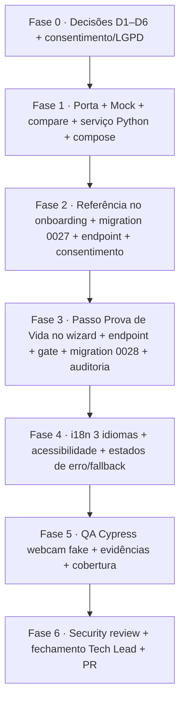

# Plano de Desenvolvimento — Prova de Vida no Credenciamento (UC007)

> **Status:** proposta técnica (Tech Lead) · aguardando confirmação das decisões abertas
> **Branch alvo (Gitflow):** `feature/prova-de-vida-credenciamento` (a partir de `develop`)
> **Rastreabilidade:** UC007 (biometria/liveness, R2) · UC004 (credenciamento) · RN016 (Termo) · AD-19 (PII cifrada) · AD-28 (migrations forward-only) · LGPD art. 5º II / art. 11 (dado biométrico sensível)
> **Contexto herdado:** a migration `0024_credenciamentos_passo_atual.sql` já registra que o protótipo de UI prevê **5 passos** e que "a prova de vida/biometria (UC007) é R2, fora do MVP". Este plano **traz o UC007 para o escopo**. O protótipo `spec/Prototipo/portal-fornecedor.html` já antecipa o passo.

---

## 1. Objetivo e escopo

Adicionar **verificação facial 1:1** ao fluxo do fornecedor, em dois pontos:

1. **Captura da referência (cadastro):** ao cadastrar-se, o responsável **obrigatoriamente** fornece uma foto do rosto. O backend extrai um **template biométrico** (embedding facial) e o persiste **cifrado** vinculado ao fornecedor.
2. **Prova de vida (credenciamento):** um **novo passo** no wizard, **depois de Documentos e antes do Termo de Aceite**. O usuário captura uma foto pela **webcam**; o backend extrai o template, **compara** com a referência salva e **libera o Termo apenas se houver correspondência**.

O wizard passa de **4 → 5 passos**: `Capacidade → Documentos → **Prova de Vida** → Termo → Concluído`.

### 1.1. Fora do escopo (explícito)
- Reconhecimento **1:N** (buscar o rosto em toda a base). Aqui é **1:1** (comparar com a referência do próprio fornecedor).
- Verificação de identidade contra base oficial (Gov.br, Serpro, etc.).

---

## 2. Ajuste de terminologia (importante) — "hash do rosto" vs. template biométrico

O enunciado fala em "gerar um hash do rosto". **Tecnicamente não é um hash.** ArcFace/InsightFace produz um **embedding** (vetor de ~512 floats). A verificação é por **similaridade de cosseno contra um limiar**, não por igualdade de hash:

- Um **hash criptográfico** (SHA-256) muda completamente com 1 pixel diferente → **impossível** comparar duas fotos distintas da mesma pessoa.
- O **embedding** aproxima vetores do mesmo rosto e afasta vetores de rostos diferentes → é isso que permite "reconhecer".

**Neste plano, "hash do rosto" = template biométrico (embedding), armazenado cifrado.**

## 2.1. Ajuste de expectativa (crítico) — "prova de vida" ≠ anti-spoofing

O mecanismo descrito (tirar uma foto na webcam e comparar com a foto salva) é **verificação de correspondência facial (face match)**, **não** prova de vida real. Sem uma camada de **anti-spoofing/liveness**, o fluxo é **derrotável por uma foto impressa ou uma tela** exibindo o rosto do responsável.

> **⚠️ Risco aceito conscientemente (D2 = face match puro no MVP).** A entrega inicial faz **apenas correspondência facial, sem liveness**. Isso é adequado como MVP/prova de conceito, mas **não deve ir a produção pública em escala** sem uma camada de liveness. Fica registrada a recomendação do Tech Lead de tratar a adição de liveness (desafio ativo e/ou anti-spoof passivo) como **item obrigatório de release seguinte**, antes de uso real com valor jurídico.

---

## 3. Decisões

**Resolvidas:** **D1 = Serviço Python (InsightFace)** · **D2 = face match puro no MVP** (liveness diferido — ver §2.1). Demais pendentes de confirmação.

| # | Decisão | Definição | Observação |
|---|---------|-----------|--------------|
| **D1** ✅ | **Onde roda a extração do embedding?** | **Serviço Python dedicado com InsightFace** (SCRFD detecção + ArcFace `buffalo_l`), containerizado, atrás de uma **porta hexagonal**. | Adiciona uma linguagem ao stack (hoje 100% TS/Node); isolado, sem estado, modelos na build, mock nos testes. |
| **D2** ✅ | **Nível de liveness/anti-spoofing** | **Face match puro no MVP** (sem liveness). | Risco aceito (§2.1). Liveness (desafio ativo e/ou anti-spoof passivo) fica como **release seguinte obrigatória** antes de produção pública. |
| **D3** | **De quem é o rosto de referência?** | **Responsável legal (titular)** do fornecedor. Se um **procurador** conduzir o credenciamento, ele precisa de **referência própria** e a prova de vida compara com a dele. | Sempre exigir o titular presente. |
| **D4** | **Onde captura a referência?** | Etapa **obrigatória de onboarding** logo após o signup (tela `AuthPanel` / primeiro acesso), antes de habilitar credenciamentos. | Aproveitar o campo de **avatar** já existente (`usuarios.avatar`, migration 0026) como fonte da referência — mais simples, porém mistura "foto de perfil" com "biometria" (evitar por clareza jurídica). |
| **D5** | **Política de retenção da foto crua** | **Não** armazenar a imagem crua; guardar **apenas o template cifrado**. Minimização de dados (LGPD). | Guardar a imagem cifrada por um TTL curto para auditoria/contestação. |
| **D6** | **Fallback quando falha** | Após **N=3** tentativas sem correspondência (ou sem câmera), **bloquear o passo** e **encaminhar para verificação manual da CPL** — nunca travar o cidadão permanentemente. | Bloqueio rígido; suporte manual fora do sistema. |

### 3.1. Por que **não** calcular o embedding no browser
Se o cliente calcula o vetor e envia "o resultado", um cliente malicioso simplesmente **envia um vetor que casa** — a verificação perde o valor. A **imagem** deve ir ao servidor e o **servidor** extrai o template. (O browser só faz captura da webcam.)

---

## 4. Arquitetura da solução

Encaixe limpo no padrão **Hexagonal (Ports & Adapters)** já usado no backend. A fronteira de ML fica **mínima**: só a **extração de template** cruza a porta; a **comparação por cosseno é matemática pura em TS** (fica na aplicação/domínio).

```mermaid
flowchart LR
  subgraph Browser
    W[Webcam / getUserMedia] --> IMG[Imagem JPEG]
  end
  IMG -->|POST imagem| API[Fastify Controller]
  subgraph Backend TS (hexagonal)
    API --> UC[Caso de uso:\nVerificarProvaDeVida]
    UC -->|extrairTemplate imagem| PORT[[Porta:\nReconhecimentoFacialGateway]]
    UC -->|cosseno template_a x template_b| MATH[compararCosseno TS puro]
    UC --> REPO[[Porta:\nBiometriaRepository]]
    UC --> AUD[Auditoria UC012]
  end
  PORT --> ADP{Adapter}
  ADP -->|prod| PY[Serviço Python\nInsightFace/ArcFace\ncontainer interno]
  ADP -->|test/dev| MOCK[MockGateway\ndeterminístico]
  REPO --> PG[(PostgreSQL\ntemplate cifrado AD-19)]
```

### 4.1. Nova porta e adapters
- **Porta** `ReconhecimentoFacialGateway`:
  - `extrairTemplate(imagem: Buffer): Promise<ResultadoExtracao | null>`
    - `ResultadoExtracao = { template: Float32Array /*512*/, qualidade: number, vivacidade?: number }`
    - Retorna `null` (ou erro tipado) para: **nenhum rosto**, **múltiplos rostos**, **qualidade baixa**.
- **Adapter de produção** `ReconhecimentoFacialHttpGateway` → chama o serviço Python interno (HTTP, rede interna do compose, sem exposição pública).
- **Adapter de teste** `ReconhecimentoFacialMockGateway` → determinístico (deriva um vetor semente do conteúdo da imagem): "mesma imagem → casa; imagem diferente → não casa". Permite rodar **toda a suíte offline no container** (DEC-STR-34), espelhando o padrão `ReceitaMockGateway`.
- **Comparação** `compararCosseno(a, b): number` → utilitário TS puro (sem porta), testável sem modelo.

### 4.2. Serviço Python (se D1 = InsightFace)
- Imagem `python:3.12-slim` + `insightface` + `onnxruntime` (CPU) + `fastapi`/`uvicorn`.
- Endpoint interno `POST /extract` → recebe imagem, devolve `{ template, qualidade, vivacidade? }`.
- **Modelos baixados na build da imagem** (`buffalo_l`), para os testes rodarem **offline** (sem download em runtime).
- Adicionado ao `docker-compose.yml` como serviço `face` + profile `test` com um modo mock/leve.
- **Sem estado, sem banco** — apenas cálculo. Todo dado sensível persiste no backend TS.

---

## 5. Modelo de dados (migrations forward-only, AD-28)

Próximos números livres: **0027**, **0028**.

### 5.1. `0027_fornecedor_biometria.sql` — referência biométrica
```sql
CREATE TABLE IF NOT EXISTS fornecedor_biometria (
  fornecedor_id  uuid PRIMARY KEY REFERENCES fornecedores(id),
  usuario_id     uuid NOT NULL,            -- responsável que forneceu a referência
  template       text NOT NULL,            -- embedding CIFRADO (PiiCipher AES-256-GCM, AD-19): base64(iv|tag|ciphertext) de float32[512]
  modelo         text NOT NULL,            -- versionamento, ex.: 'arcface-buffalo_l-r50'
  dim            smallint NOT NULL,        -- 512
  consentimento_id uuid,                   -- vínculo ao consentimento LGPD (domínio consentimento.ts)
  criado_em      timestamptz NOT NULL DEFAULT now(),
  atualizado_em  timestamptz NOT NULL DEFAULT now()
);
```
> Reusa o **PiiCipher** (`src/shared/crypto/pii-cipher-aes.ts`) já usado no avatar (0026) e nos documentos. **Nenhuma foto crua** é gravada (D5).

### 5.2. `0028_credenciamentos_prova_vida.sql` — resultado do gate no agregado
```sql
-- passo_atual NÃO tem CHECK constraint → ampliar 4→5 passos não exige alteração de constraint.
ALTER TABLE credenciamentos ADD COLUMN IF NOT EXISTS prova_vida jsonb;
-- prova_vida = { status: 'aprovada'|'reprovada'|'manual', score: number, modelo, tentativas, verificadoEm }
```
> Espelha o padrão do `termo jsonb` já existente. O gate "só avança ao Termo se `prova_vida.status = aprovada` (ou `manual` liberada pela CPL)".

---

## 6. Backend — mudanças por camada

| Camada | Mudança |
|---|---|
| **Domínio** | `credenciamento.ts`: value object `ProvaDeVida` + transição `registrarProvaDeVida(status, score)`; regra "Termo exige prova de vida aprovada". Novo agregado/VO `BiometriaFornecedor` (template, modelo, dim). `compararCosseno` util. |
| **Aplicação (UC)** | `RegistrarBiometriaReferencia` (onboarding) · `VerificarProvaDeVida` (wizard) · atualizar `SolicitarCredenciamento.aceitarTermo()` para **exigir** prova aprovada. |
| **Portas** | `ReconhecimentoFacialGateway`, `BiometriaRepository`. |
| **Adapters HTTP** | Novas rotas (§7). |
| **Adapters Repo** | `biometria-repository-pg.ts` + `biometria-repository-memory.ts`. |
| **Adapter Gateway** | `reconhecimento-facial-http.ts` (prod) + `reconhecimento-facial-mock.ts` (test). |
| **Auditoria (UC012)** | Registrar **toda** tentativa (aprovada/reprovada/manual, score, modelo) — trilha imutável. |
| **Consentimento** | Vincular ao domínio `consentimento.ts` (LGPD): consentimento versionado, com finalidade e retenção. |
| **DI/bootstrap** | `server.ts`: compor gateway conforme env (`FACE_PROVIDER=insightface|mock`), espelhando `RECEITA_PROVIDER`. |

---

## 7. Contrato de API (novos endpoints)

| Método | Caminho | Descrição | Corpo / Resposta |
|---|---|---|---|
| `POST` | `/fornecedores/:id/biometria` | Cadastra a **referência** (onboarding). Extrai template, cifra, persiste. | body: `{ imagem: base64 }` → `201 { status: 'ok' }` / `422 { codigo: 'rosto_nao_detectado' \| 'multiplos_rostos' \| 'qualidade_baixa' }` |
| `GET` | `/fornecedores/:id/biometria` | Existe referência? (para o wizard decidir se pode iniciar) | `{ possuiReferencia: boolean, modelo }` |
| `POST` | `/credenciamentos/:id/prova-de-vida` | **Verificação** do passo. Extrai template da webcam, compara, grava resultado, aplica gate. | body: `{ imagem: base64, desafio? }` → `200 { status: 'aprovada' \| 'reprovada' \| 'manual', score, tentativasRestantes }` |

> **RBAC:** mesmas regras do credenciamento (posse `titular`/`procurador` do vínculo). O backend **responde em inglês** com `codigo` estável; o frontend mapeia para PT-BR/EN/ES (convenção do projeto).

---

## 8. Frontend — mudanças

### 8.1. Novo passo no wizard (`Credenciamento.tsx`)
- Inserir `PassoProvaDeVida` entre `PassoDocumentos` e `PassoTermo`.
- `PASSOS` vira 5 itens; `Stepper` reflete `1..5`; `passo_atual` domínio `1..5` (backfill lógico no front: `aceito → 5`).
- **Gate:** botão "Continuar" do novo passo só habilita após `status = aprovada` (ou `manual`).
- Retomada: mapear `passoAtual` do backend para o novo `step` (revisar o `Math.min(2, …)` atual).

### 8.2. Componente de captura por webcam (novo no Design System)
- `CapturaFacial.tsx`: `navigator.mediaDevices.getUserMedia({ video })` → `<video>` + captura de frame em `<canvas>` → JPEG.
- Estados de erro tratados: **sem câmera / permissão negada**, **nenhum rosto**, **múltiplos rostos**, **baixa luz/qualidade**, **N tentativas esgotadas → fallback manual (D6)**.
- **MVP (D2 = face match):** captura de **um frame** e envio; **sem** desafio ativo. Nasce preparado para receber a camada de liveness numa release seguinte, sem reescrita.
- **Acessibilidade:** `aria-label`, foco, alternativa textual, instruções claras; nada de texto hardcoded.

### 8.3. Captura de referência no onboarding (D4)
- Etapa obrigatória pós-signup usando o mesmo `CapturaFacial` → `POST /fornecedores/:id/biometria`.
- **Consentimento LGPD** explícito antes da captura (checkbox + link para `/privacidade`).

### 8.4. i18n (obrigatório nos 3 idiomas)
- Novas chaves `credenciamento.provaVida.*` e `onboarding.biometria.*` em `pt-BR.json`, `en.json`, `es.json` (título, instruções, erros, consentimento, fallback).

---

## 9. Segurança, privacidade e LGPD (bloqueante para produção)

- **Dado biométrico é sensível** (LGPD art. 11) → recomenda-se **RIPD/DPIA** e **consentimento específico** (aproveitar `consentimento.ts` + tela `/privacidade`).
- **Cifragem em repouso** do template (reuso AD-19 / PiiCipher). **Chave** via `PII_ENCRYPTION_KEY` (já existe).
- **Minimização:** guardar template, **não** a foto crua (D5).
- **Direito à exclusão / revogação de consentimento** → apagar template.
- **Serviço Python sem exposição pública** (rede interna do compose); **sem persistência** no serviço de ML.
- **Auditoria** de todas as tentativas (UC012).
- Registrar nova **Decisão de Arquitetura** (proposta **AD-33**: "biometria facial — template cifrado, compare por cosseno, liveness tier D2").
- Rodar `/security-review` antes do PR.

---

## 10. Testes (TDD, tudo em container — DEC-STR-34)

- **Unit (Vitest):** `compararCosseno` (casos limítrofes), transições do domínio (gate Termo↔prova), `VerificarProvaDeVida` com `MockGateway` (aprovada/reprovada/limiar/tentativas).
- **Integração:** repositório PG cifrado (Testcontainers), controllers com mock gateway.
- **Contrato:** os 3 endpoints novos.
- **E2E (Cypress):** webcam **fake** via flags do Chrome (`--use-fake-device-for-media-stream --use-fake-ui-for-media-stream` + `--use-file-for-fake-video-capture`) para cobrir captura, gate e fallback.
- **Determinismo offline:** `FACE_PROVIDER=mock` nos testes; o modelo real só num profile de integração dedicado (ou smoke com imagem-fixture embarcada). O adapter real fica **excluído do gate de cobertura**, como os demais gateways.
- Manter o gate **90% linhas/funções, 85% branches**.

---

## 11. Faseamento e entregáveis



| Fase | Entregável | Dono principal |
|---|---|---|
| 0 | Decisões confirmadas + RIPD/consentimento | Tech Lead + BA + DBA |
| 1 ✅ | Porta, mock, `compararCosseno`, adapter HTTP, serviço Python (build+smoke ok), compose, env | Senior Dev |
| 2 🔶 | **Back pronto** (migration 0027 + `POST /fornecedores/:id/biometria` + repo cifrado). Falta o front (onboarding). | Senior Dev + UX |
| 3 🔶 | **Back pronto** (gate no agregado + `POST /credenciamentos/:id/prova-de-vida` + migration 0028). Falta o front (passo webcam) e a trilha UC012. | Senior Dev |
| 4 | i18n + a11y + estados de erro | Senior Dev + UX |
| 5 | Validação QA + evidências Cypress | QA Expert |
| 6 | Security review + aprovação final | Tech Lead |

---

## 12. Riscos principais

| Risco | Impacto | Mitigação |
|---|---|---|
| Face match sem liveness é burlável por foto/tela | **Alto** (fraude em compra pública) | **Risco aceito no MVP (D2).** Liveness marcada como release seguinte obrigatória antes de produção; auditoria de todas as tentativas desde já |
| Polyglot (Python) aumenta ops/CI | Médio | Serviço isolado, sem estado, modelos na build da imagem, mock determinístico nos testes |
| Falso rejeite trava fornecedor legítimo | Alto (exclusão indevida) | D6: N tentativas → verificação manual CPL; limiar calibrado e auditado |
| LGPD — dado biométrico sensível | Alto (jurídico) | Consentimento específico, cifragem, minimização, RIPD, exclusão |
| Limiar de cosseno mal calibrado | Médio | Limiar **configurável por env**, calibração com amostras, auditoria de score |
| Webcam indisponível/negada | Médio | Fallback manual + mensagens claras + a11y |

---

## 13. Próximo passo imediato

D1 e D2 travadas. Pendentes menores (D3 rosto de referência, D4 onde captura, D5 retenção, D6 fallback) podem ser confirmadas junto ao BA/LGPD **em paralelo** à Fase 1, pois não bloqueiam o começo.

Próximo: abrir a branch `feature/prova-de-vida-credenciamento` (a partir de `develop`) e iniciar a **Fase 1** por TDD — porta `ReconhecimentoFacialGateway` + `MockGateway` determinístico + `compararCosseno` — que independe do serviço Python real e já destrava os testes offline.
