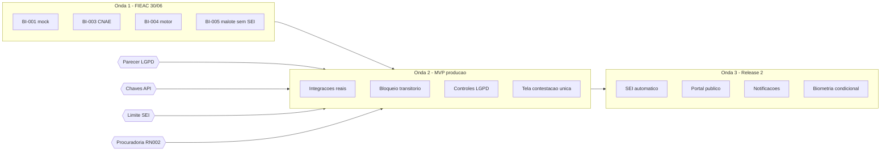

# Compra Mais - Plataforma de Compras Municipalizadas

## Plano de Sequenciamento de Releases

---

**Projeto:** Compra Mais
**Cliente:** Prefeitura Municipal de Rio Branco
**Versão:** 1.0
**Data:** 2026-06-29
**Autores:** John (Product Manager), Mary (Business Analyst), Paige (Technical Writer) — sessão BMad Party Mode
**Insumo:** [matriz-lacunas.md](matriz-lacunas.md) (v2.0) e `source/07-Backlog.md`

---

## Controle de Versão

| Versão | Data | Autor | Alteração |
|---|---|---|---|
| 1.0 | 2026-06-29 | John / Mary / Paige (Party Mode) | Sequenciamento inicial em 3 ondas a partir dos mergulhos da matriz de lacunas |

---

## Premissa Central

O Backlog original (`07-Backlog.md`) tratava praticamente tudo como **Must Have**, o que tornava o prazo da FIEAC (30/06/2026) inviável. Este plano **não inventa escopo** — reordena o Backlog existente em **três ondas**, separando o que tem dependência externa (chaves de API, parecer LGPD, número do SEI) do que é construível imediatamente.

**Descoberta-chave:** a demo da FIEAC pode rodar com **dados sintéticos** — sem tratar dado pessoal real, a única bloqueadora remanescente (LGPD, LAC-09) **não bloqueia a apresentação de amanhã**; ela volta a valer no MVP de produção.

---

## Onda 1 — Demo FIEAC (30/06/2026)

**Objetivo:** apresentar o filme completo do produto com dados sintéticos, sem integrações reais nem dado pessoal.

| Item Backlog | Funcionalidade | Observação |
|---|---|---|
| BI-001 | Cadastro via CNPJ + autopreenchimento | Mock da Receita Federal |
| BI-003 | Filtro de editais por CNAE | — |
| BI-004 | Motor de Distribuição (water-filling + Hamilton) | **Pronto** — algoritmo resolvido na sessão (ver matriz LAC-04) |
| BI-005 | Geração do malote ordenado | Limite via config; **sem** upload real no SEI |
| — | Tela de fallback manual visível | Requisito de UX (Sally) |

**Não depende de:** chaves de API reais · parecer LGPD · número real do SEI.

**Portão de qualidade:** roteiro de demo roda fim-a-fim com seed; motor determinístico e reproduzível; **zero dado real**.

---

## Onda 2 — MVP de Produção (gated)

**Objetivo:** as mesmas funcionalidades, agora com integrações reais, fallbacks e conformidade — para operação real da CPL.

| Item Backlog | Funcionalidade | Gate / Dependência |
|---|---|---|
| BI-001 / BI-006 | Cadastro real + bloqueio de inadimplência | Integrações reais (LAC-17); bloqueio **transitório** + fail-closed (LAC-08) |
| BI-002 | Upload documental + repositório reutilizável | Cifra em repouso (LAC-09) |
| BI-004 | Motor em produção | Validação de capacidade declarada (LAC-04e) |
| BI-005 | Malote com limite real | Número do SEI na config (LAC-05); **upload manual** pelo servidor |
| — | Tela única de contestação / regularização / direitos LGPD | Unifica LAC-08 + LAC-09 + LAC-11 + LAC-12 |
| — | Bloco RNF-LGPD (retenção, descarte, segregação) | **Parecer LGPD — LAC-09** |

**Gates de go-live (institucionais):**
1. 🔴 **Parecer LGPD** + DPO designado + RIPD (LAC-09)
2. 🔴 **Chaves/contratos de interoperabilidade** PGM/SICAF/Receita (LAC-17)
3. 🔴 **Limite em MB do SEI** informado pela TI (LAC-05)
4. ⚖️ **Decisão da Procuradoria** sobre bloqueio transitório (LAC-08)

**Portão de qualidade:** contratos (Pact) verdes contra APIs reais; LGPD auditada; bloqueio transitório testado nos 3 estados (débito / penalidade / inidoneidade); fragmentação do malote testada no limite real.

---

## Onda 3 — Release 2

**Objetivo:** automações e painéis que foram (corretamente) retirados do caminho crítico do MVP.

| Item Backlog | Funcionalidade | Dependência |
|---|---|---|
| — | **Transferência automática para o SEI** (BPMN diagrama 8) | Era o maior risco do MVP — adiada |
| BI-009 | Portal público de transparência (FIEAC) | Stack de BI definida (LAC-20) |
| BI-008 | Dashboard administrativo interno | — |
| — | Notificações SMS/e-mail | Gateway contratado (LAC-07) |
| — | ~~Biometria facial + RIPD~~ → **antecipada à Onda 2 (MVP) condicional a RIPD** (ratificação 2026-07-09) | RIPD produzido ([lgpd/RIPD-prova-de-vida.md](lgpd/RIPD-prova-de-vida.md)); entra desligada por feature flag |
| BI-007 | Maturidade do workflow de covalidação | — |

**Portão de qualidade:** SEI automático com retry/idempotência; RIPD aprovado (se biometria); SLA definido para o portal público.

---

## Mapa de Dependências (resumo visual)

---

## Próximos Passos

1. **Validar o sequenciamento** com SMGA/CPL e Gabinete (especialmente: demo = dados sintéticos; produção = pós-gates).
2. **Disparar os 4 gates institucionais** em paralelo (reunião única de interoperabilidade cobre LAC-17 + parte da LAC-09).
3. **Alimentar o `bmad-prd`** com este plano + a matriz de lacunas como base de escopo e roadmap.

---

## Documentos Relacionados

- [Matriz de Lacunas de Requisitos](matriz-lacunas.md)
- [07 - Backlog](../source/07-Backlog.md)
- [06 - Casos de Uso](../source/06-CasosUso.md)
- [08 - BPMN](../source/08-BPMN.md)

---

*Documento produzido em sessão BMad Party Mode (roster software-development) — 2026-06-29.*
