# Manual do Administrador — Compra Mais

**Programa Compra Mais · Prefeitura de Rio Branco**
Guia do **Painel Administrativo** para a equipe interna — da gestão de editais ao fornecimento, incluindo
configuração da plataforma, governança e auditoria.

> As telas deste manual são reais, capturadas do sistema em funcionamento (ambiente de demonstração). Os
> dados (empresas, editais, valores) são apenas exemplos. Cada seção indica **qual perfil** acessa a tela.

---

## Sumário

1. [O Painel Administrativo e os perfis](#1-o-painel-administrativo-e-os-perfis)
2. [Acesso à plataforma](#2-acesso-à-plataforma)
3. [Dashboard — visão geral](#3-dashboard--visão-geral)
4. [O fluxo operacional](#4-o-fluxo-operacional)
5. [Gestão de Editais](#5-gestão-de-editais)
6. [Credenciamento em Edital](#6-credenciamento-em-edital)
7. [Análise Documental](#7-análise-documental)
8. [Distribuição Inteligente](#8-distribuição-inteligente)
9. [Cadastro de Reserva](#9-cadastro-de-reserva)
10. [Desistências](#10-desistências)
11. [Malote SEI](#11-malote-sei)
12. [Fornecedores](#12-fornecedores)
13. [Contestações de CNAE](#13-contestações-de-cnae)
14. [Atendimento LGPD](#14-atendimento-lgpd)
15. [Relatórios](#15-relatórios)
16. [Catálogos](#16-catálogos)
17. [Secretarias](#17-secretarias)
18. [Setores Industriais (CNAE)](#18-setores-industriais-cnae)
19. [Tipos de Arquivos](#19-tipos-de-arquivos)
20. [Usuários internos](#20-usuários-internos)
21. [Administração de Telas por Perfil](#21-administração-de-telas-por-perfil)
22. [Auditoria](#22-auditoria)
23. [Glossário e boas práticas](#23-glossário-e-boas-práticas)

---

## 1. O Painel Administrativo e os perfis

O **Painel Administrativo** é a área interna do Compra Mais, usada pela equipe da Prefeitura para
conduzir todo o ciclo das compras municipalizadas — **do edital ao fornecimento** — e para **administrar
a plataforma** (usuários, catálogos, permissões, auditoria).

O acesso é **por papel (perfil)**. Cada papel enxerga apenas as **telas** pertinentes à sua função. Os
papéis internos são:

| Perfil | Papel no processo | Telas típicas |
|---|---|---|
| **Administrador** | Superusuário da plataforma | Usuários, Secretarias, Setores, Tipos de Arquivos, Auditoria, **Telas por perfil**, Malote, Relatórios |
| **Secretaria / Gestor (SMGA)** | Operação das compras | Dashboard, Fornecedores, Credenciamento, Análise Documental, Distribuição, Reserva, Desistências, Malote, Catálogos, Editais, Contestações, LGPD, Relatórios |
| **Analista CPL** | Fluxo de editais e habilitação | Gestão de Editais, Credenciamento, Análise Documental |
| **Auditor** | Fiscalização | Auditoria |
| **Encarregado (DPO)** | Privacidade / LGPD | Atendimento LGPD |
| **Somente leitura** | Consulta | Painel (visão macro) |

> **Quem enxerga o quê é configurável** pelo Administrador, na tela **Telas por Perfil** (seção 21). O
> Administrador nunca perde o acesso a essa tela (proteção anti‑lockout).

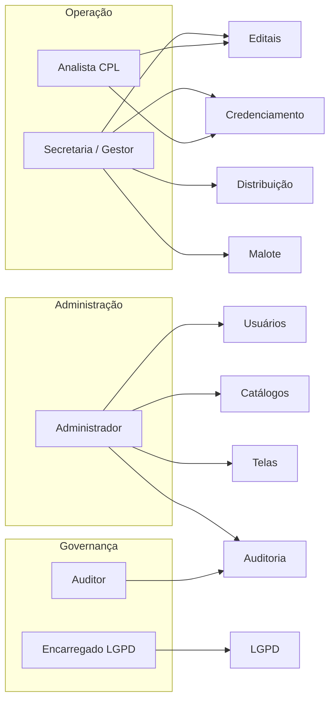
```mermaid
flowchart LR
    subgraph Operação
      SMGA[Secretaria / Gestor]
      CPL[Analista CPL]
    end
    subgraph Administração
      ADM[Administrador]
    end
    subgraph Governança
      AUD[Auditor]
      DPO[Encarregado LGPD]
    end
    SMGA --> Editais & Credenciamento & Distribuição & Malote
    CPL --> Editais & Credenciamento
    ADM --> Usuários & Catálogos & Telas & Auditoria
    DPO --> LGPD
    AUD --> Auditoria
```

---

## 2. Acesso à plataforma

Os usuários internos entram com **e-mail e senha institucionais**. Após o login, cada perfil é levado à
sua **tela inicial** (a primeira tela visível ao papel).

> Esqueceu a senha? Use **Esqueci minha senha** para redefini-la por e-mail. A gestão de contas internas
> é feita pelo Administrador em **Usuários** (seção 20).

---

## 3. Dashboard — visão geral

*(perfil SMGA / Gestor)*

O **Dashboard** (menu **Painel**) resume a operação das compras municipalizadas.

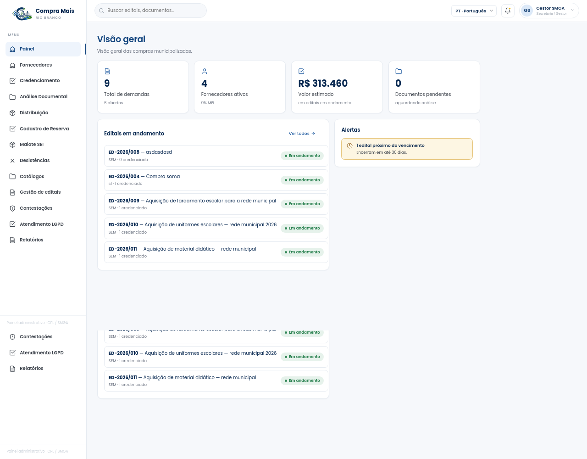

- **Indicadores**: *Total de demandas* (e quantas abertas), *Fornecedores ativos* (e % MEI), *Valor
  estimado* em editais em andamento e *Documentos pendentes* aguardando análise.
- **Editais em andamento**: lista com número, objeto, secretaria e nº de credenciados.
- **Alertas**: destaques como *editais próximos do vencimento*.

Use-o como ponto de partida do dia: ele aponta o que exige ação (análises pendentes, editais a vencer).

---

## 4. O fluxo operacional

Do cadastro da demanda ao fornecimento, o caminho é:

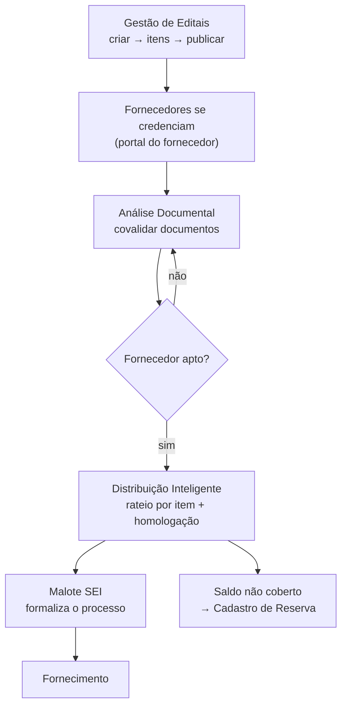
```mermaid
flowchart TD
    A["Gestão de Editais<br/>criar → itens → publicar"] --> B["Fornecedores se credenciam<br/>(portal do fornecedor)"]
    B --> C["Análise Documental<br/>covalidar documentos"]
    C --> D{"Fornecedor apto?"}
    D -- sim --> E["Distribuição Inteligente<br/>rateio por item + homologação"]
    D -- não --> C
    E --> F["Malote SEI<br/>formaliza o processo"]
    E --> G["Saldo não coberto<br/>→ Cadastro de Reserva"]
    F --> H["Fornecimento"]
```

As próximas seções detalham cada etapa.

---

## 5. Gestão de Editais

*(perfis SMGA e CPL)*

Aqui você **cria e administra os editais** (as demandas). Um edital nasce em **rascunho**, recebe
**itens** (do catálogo de materiais/serviços, com unidade, quantidade e preço-teto) e, quando pronto, é
**publicado** — passando a aparecer na vitrine dos fornecedores compatíveis.

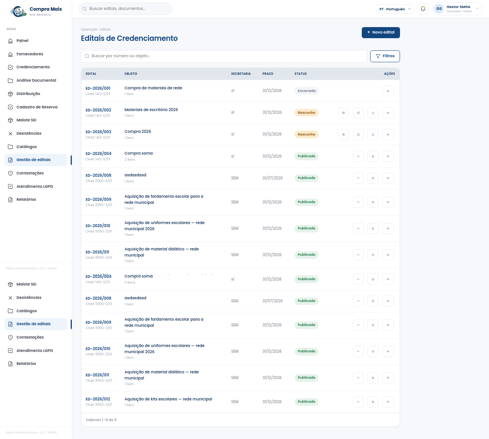

Passo a passo para publicar um edital:

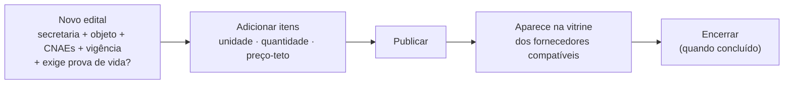
```mermaid
flowchart LR
    A["Novo edital<br/>secretaria + objeto + CNAEs + vigência<br/>+ exige prova de vida?"] --> B["Adicionar itens<br/>unidade · quantidade · preço-teto"]
    B --> C["Publicar"]
    C --> D["Aparece na vitrine<br/>dos fornecedores compatíveis"]
    D --> E["Encerrar<br/>(quando concluído)"]
```

- **CNAEs-alvo** definem quais empresas verão o edital (compatibilidade por ramo).
- **Itens** só são editáveis enquanto o edital está em **rascunho**.
- **Vigência** (prazo) controla o encerramento; o edital pode ser **despublicado**/ **encerrado**.
- **Exigir prova de vida (biometria):** no cadastro do edital há a opção **"Exigir prova de vida
  (biometria)"**. Quando **marcada**, o credenciamento naquele edital só conclui o Termo de Aceite após
  o fornecedor **aprovar a verificação facial** (UC007); quando **desmarcada** (padrão), o passo de prova
  de vida **não** é exigido e o fornecedor assina o Termo direto. A opção é editável enquanto o edital
  está em **rascunho**.

---

## 6. Credenciamento em Edital

*(perfis SMGA e CPL)*

Mostra, por edital, os **fornecedores elegíveis** (compatíveis por CNAE e regulares) e o andamento das
solicitações de credenciamento. É a visão administrativa do que o fornecedor faz no portal.

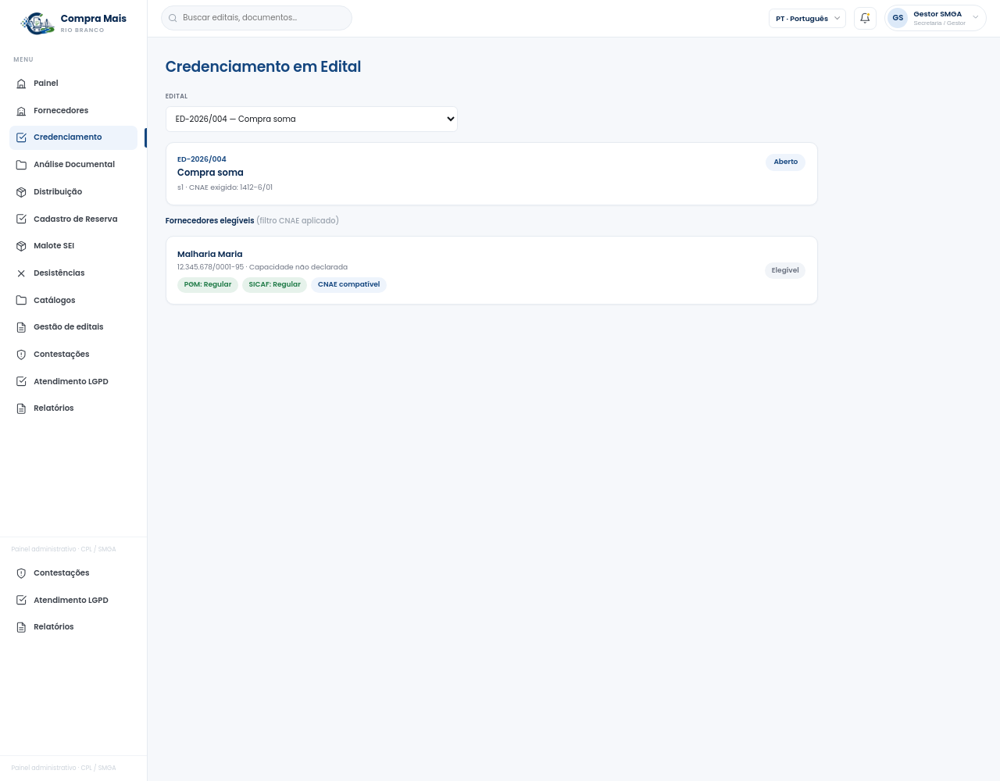

> A **regra de compatibilidade** (CNAE) e a **regularidade** (documentos) determinam quem pode se
> credenciar. Divergências de CNAE são tratadas em **Contestações** (seção 13).

---

## 7. Análise Documental

*(perfis SMGA e CPL)*

A **fila de análise** reúne os documentos enviados pelos fornecedores que aguardam validação
(**covalidação**). O analista **aprova** ou **reprova** cada documento, com motivo. Documentos aprovados
são **reaproveitados** entre editais; reprovados voltam ao fornecedor para correção.

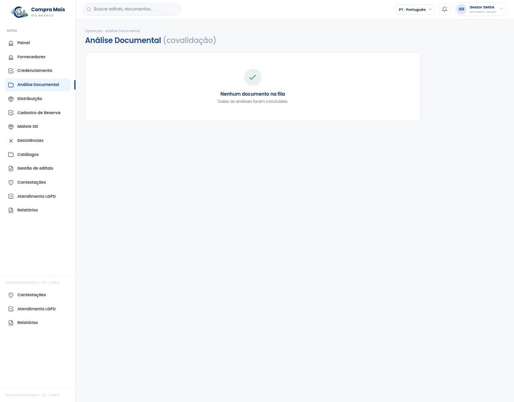

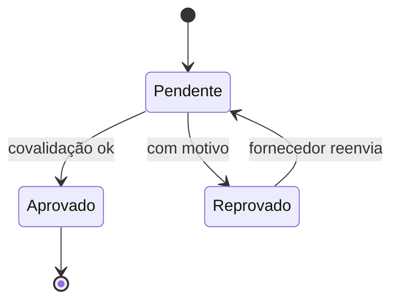
```mermaid
stateDiagram-v2
    [*] --> Pendente
    Pendente --> Aprovado: covalidação ok
    Pendente --> Reprovado: com motivo
    Reprovado --> Pendente: fornecedor reenvia
    Aprovado --> [*]
```

---

## 8. Distribuição Inteligente

*(perfil SMGA)*

O coração do programa: o **rateio equitativo** da demanda entre os fornecedores **aptos**. Selecione um
edital publicado para ver e **homologar** o rateio.

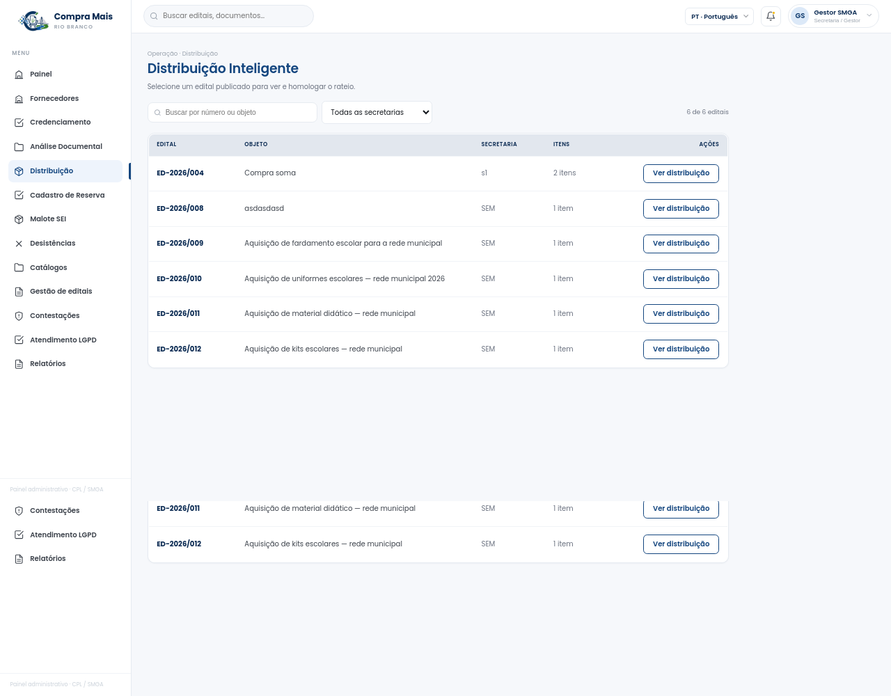

Ao abrir um edital, o **detalhe do rateio** mostra os totais, o rateio **por item** e eventual
**déficit** (quando a capacidade declarada não cobre a demanda):

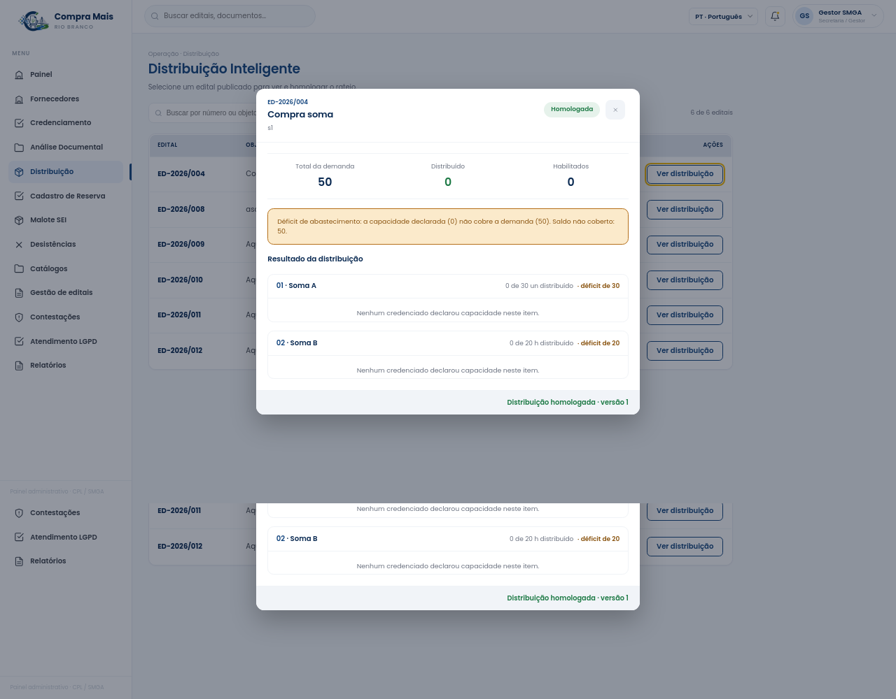

- **Total da demanda**, **Distribuído** e **Habilitados** (fornecedores aptos).
- **Resultado da distribuição por item**: quanto coube a cada fornecedor, respeitando o **teto** que ele
  declarou.
- **Déficit de abastecimento**: saldo não coberto — vai para o **Cadastro de Reserva**.
- **Homologar** congela a matriz (append-only, versionada) — *"Distribuição homologada · versão N"*.

O motor é **determinístico e reprodutível**: a mesma entrada gera o mesmo rateio (com registro de hash e
regra de desempate para auditoria).

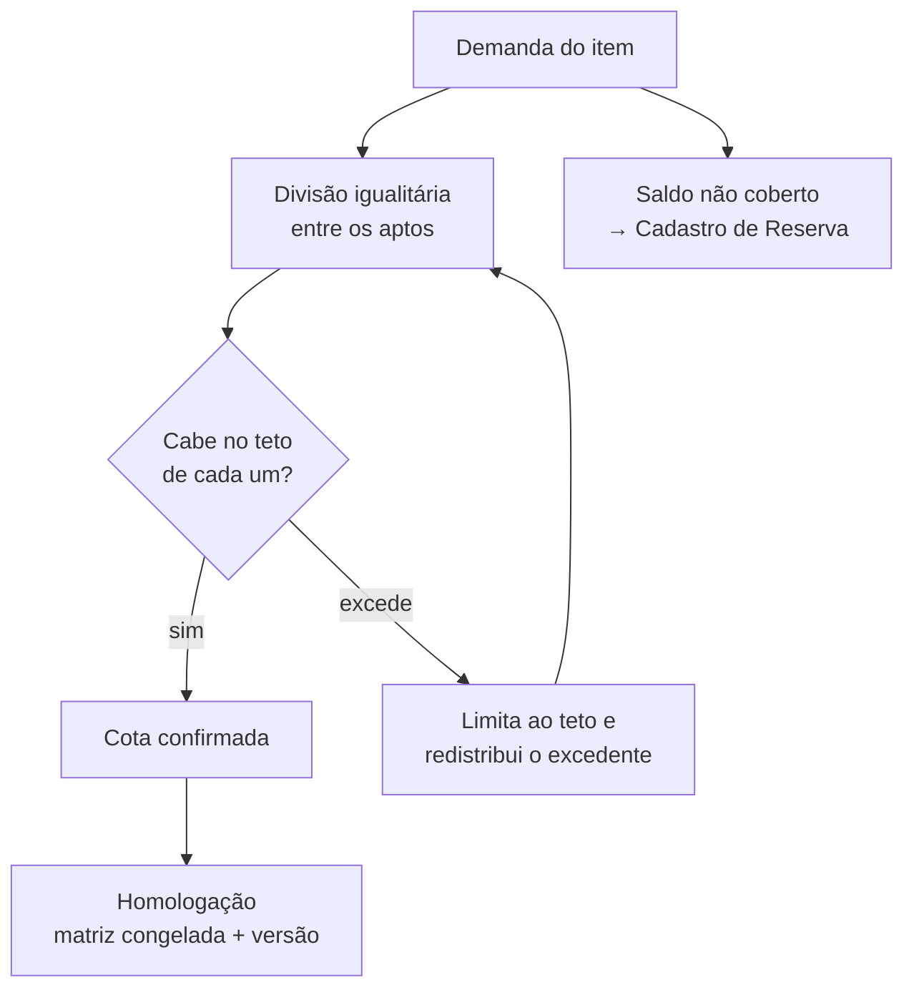
```mermaid
flowchart TD
    A[Demanda do item] --> B[Divisão igualitária<br/>entre os aptos]
    B --> C{Cabe no teto<br/>de cada um?}
    C -- sim --> D[Cota confirmada]
    C -- excede --> E[Limita ao teto e<br/>redistribui o excedente]
    E --> B
    D --> F[Homologação<br/>matriz congelada + versão]
    A --> G[Saldo não coberto<br/>→ Cadastro de Reserva]
```

---

## 9. Cadastro de Reserva

*(perfil SMGA)*

Fila cronológica com o **saldo não atendido** e os **retardatários** (quem se credenciou após a
distribuição). É acionada em uma **2ª demanda**, preservando a ordem de chegada.

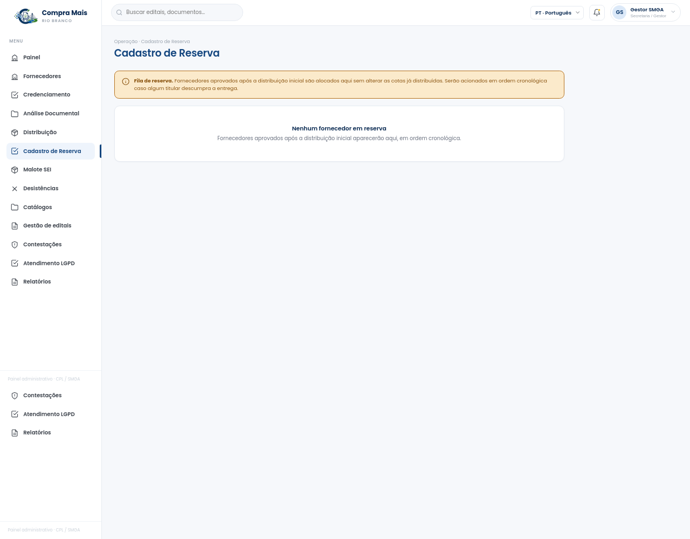

---

## 10. Desistências

*(perfil SMGA)*

Registra e acompanha **desistências** de fornecedores em editais/cotas, liberando saldo para
redistribuição conforme as regras do programa.

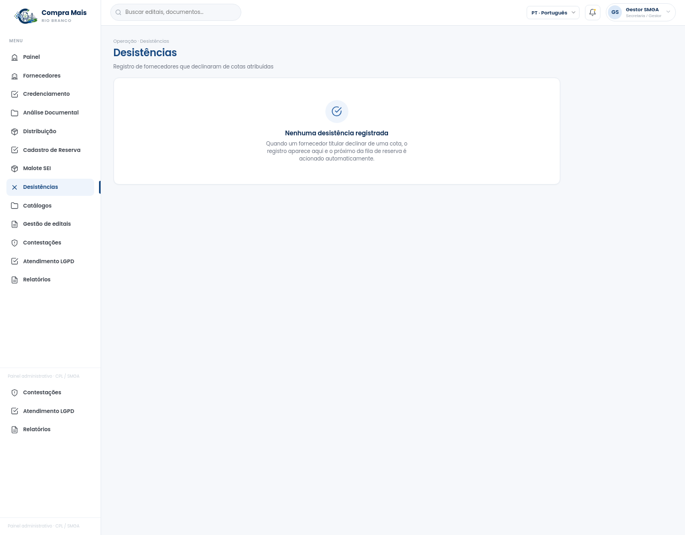

---

## 11. Malote SEI

*(perfis SMGA e Administrador)*

Gera o **malote** (conjunto de peças documentais) e o integra ao **SEI** (Sistema Eletrônico de
Informações), formalizando o processo administrativo. Suporta **exportação idempotente** e o
**envio/consulta** de processos no SEI.

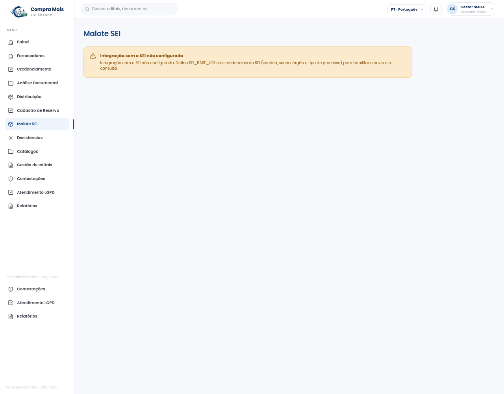

> A integração real com o SEI depende de configuração (URL, usuário, órgão). Sem ela, opera em modo
> seguro (*mock*) até a habilitação pela TI.

---

## 12. Fornecedores

*(perfil SMGA)*

Diretório das **empresas cadastradas**, com CNPJ, razão social, **porte** (ME/MEI/EPP), **situação
cadastral** e **status de credenciamento**. Permite busca, filtros e a consulta detalhada de cada
fornecedor.

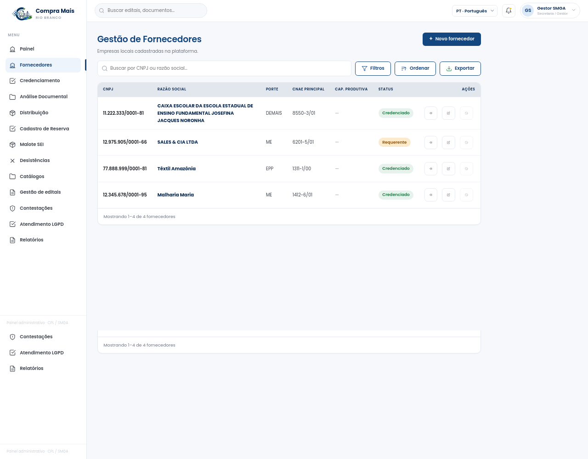

---

## 13. Contestações de CNAE

*(perfil SMGA)*

Quando um fornecedor entende que **deveria** ser compatível com um edital, ele abre uma **contestação de
CNAE**. Aqui o gestor **acata** (ajustando os CNAEs-alvo) ou **recusa** (com justificativa).

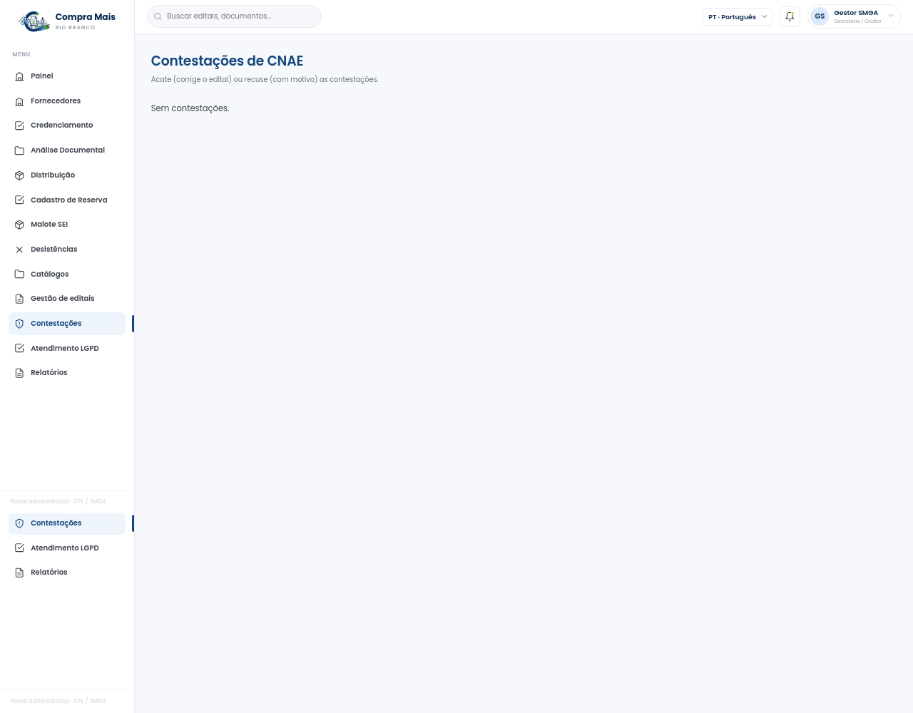

---

## 14. Atendimento LGPD

*(perfil Encarregado/DPO e Administrador)*

Central de **direitos do titular** (LGPD): solicitações de **acesso, correção ou exclusão** de dados
pessoais. O Encarregado **atende**, **recusa** (com motivo) ou **descarta** após a retenção legal.

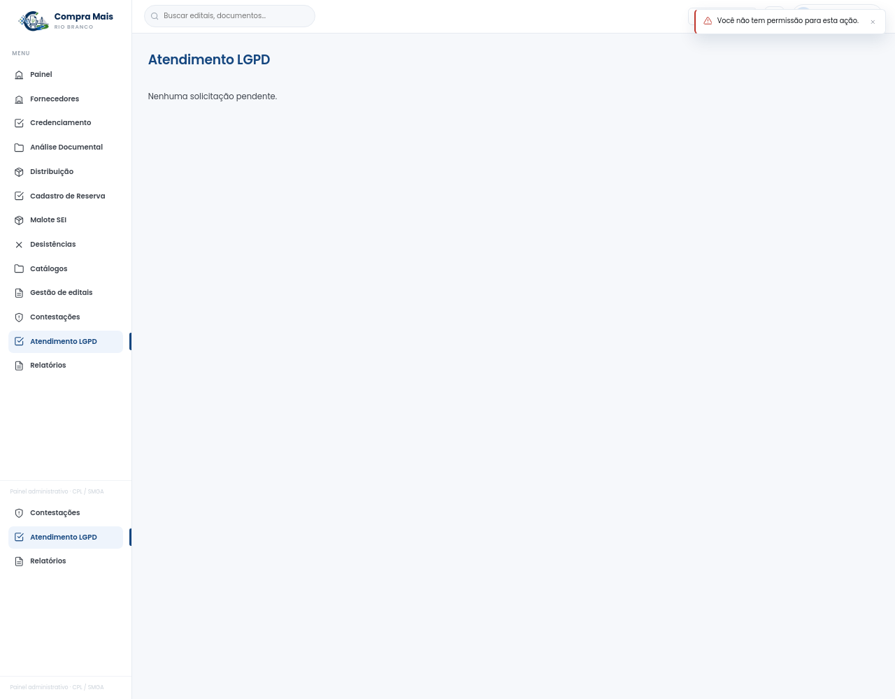

> A exclusão só é permitida após o **prazo de retenção legal** da categoria de dado; antes disso o
> sistema bloqueia o descarte.

---

## 15. Relatórios

*(perfil SMGA)*

Central de **relatórios gerenciais dos processos**. Escolha o relatório no **seletor**, filtre por
**período** e **secretaria**, e **exporte** em **PDF** (com cabeçalho: logo, título, emissão e período),
**CSV** ou **JSON**.

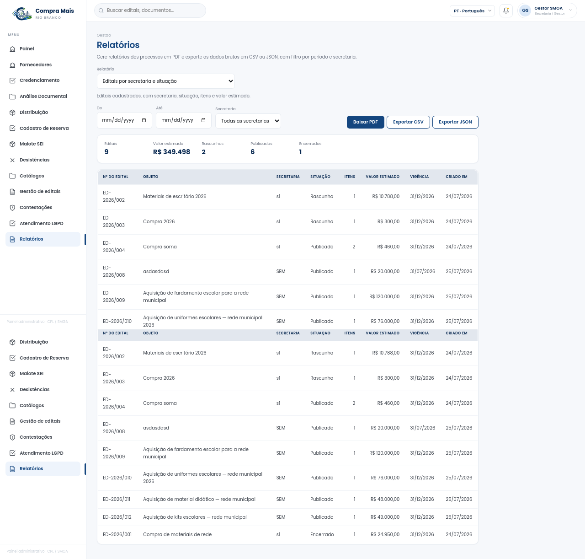

Relatórios disponíveis: **Editais por secretaria e situação**, **Distribuições e investimento**, **Rateio
de cotas por fornecedor**, **Fornecedores credenciados por porte**, **Participação por porte (MEI/ME)** e
**Bloqueios ativos**.

---

## 16. Catálogos

*(perfis SMGA e Administrador)*

Mantém os **dados de referência** usados em todo o sistema: **materiais e serviços** (base dos itens de
edital), unidades de medida e correlatos. Mudanças aqui refletem nos formulários de edital.

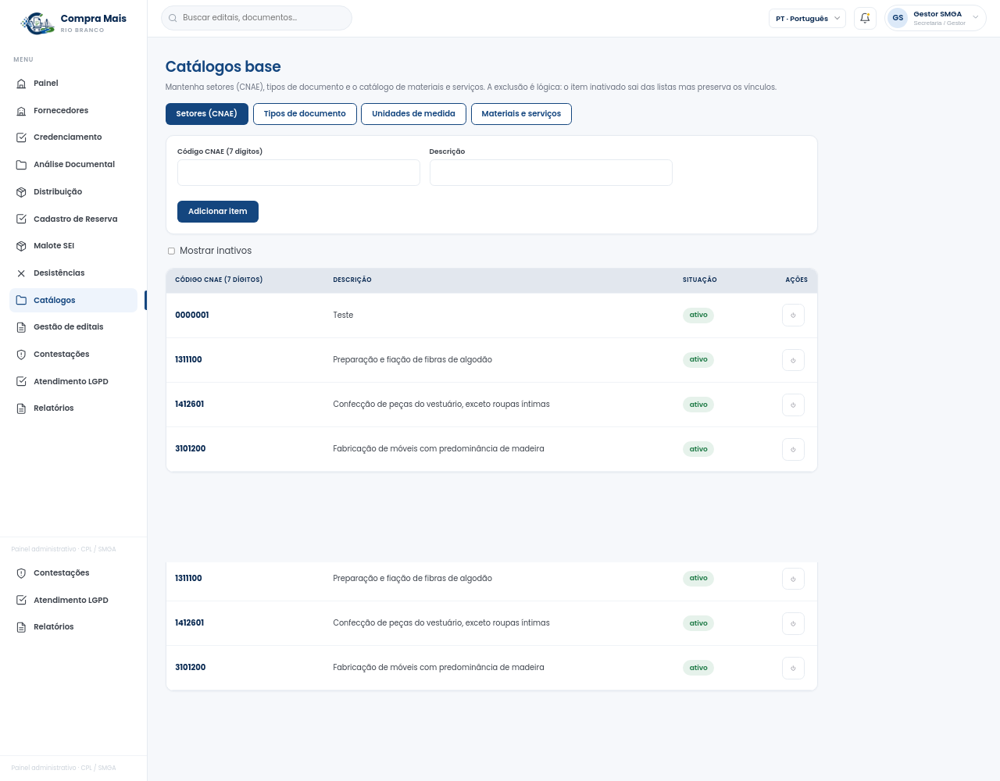

---

## 17. Secretarias

*(perfil Administrador)*

Cadastro das **secretarias demandantes** (sigla, nome, responsável, contato). Cada edital pertence a uma
secretaria; os relatórios e o rateio agrupam por ela.

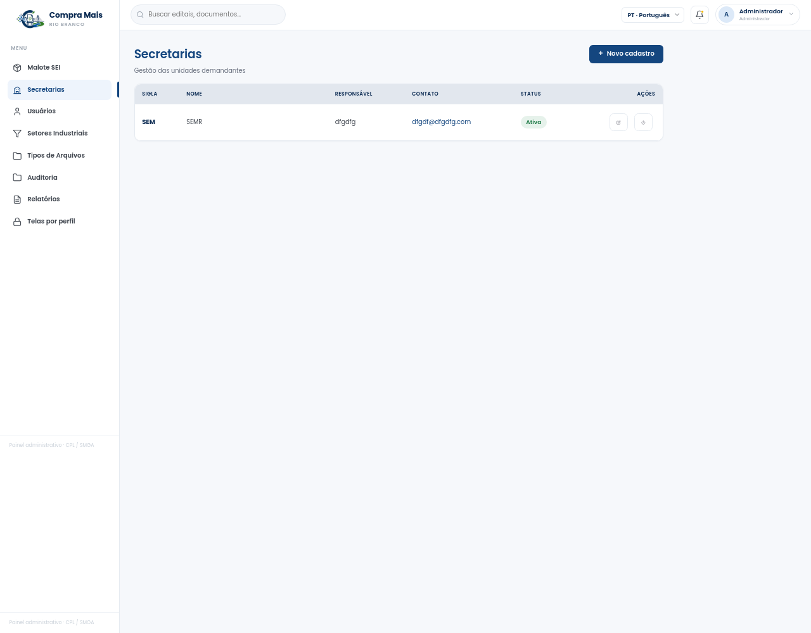

---

## 18. Setores Industriais (CNAE)

*(perfil Administrador)*

Catálogo de **CNAEs** atendidos (código + descrição). É a base da **compatibilidade** entre editais e
empresas e da rotulação dos segmentos na Transparência.

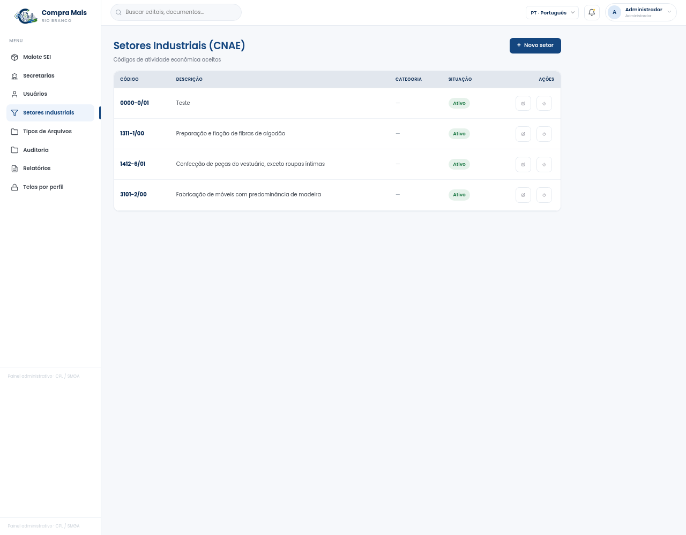

---

## 19. Tipos de Arquivos

*(perfil Administrador)*

Define os **tipos de documento** exigidos no credenciamento (ex.: Cartão CNPJ, FGTS, CNDT), se são
**obrigatórios** e se **exigem validade**. É o que gera a lista de documentos que o fornecedor precisa
enviar.

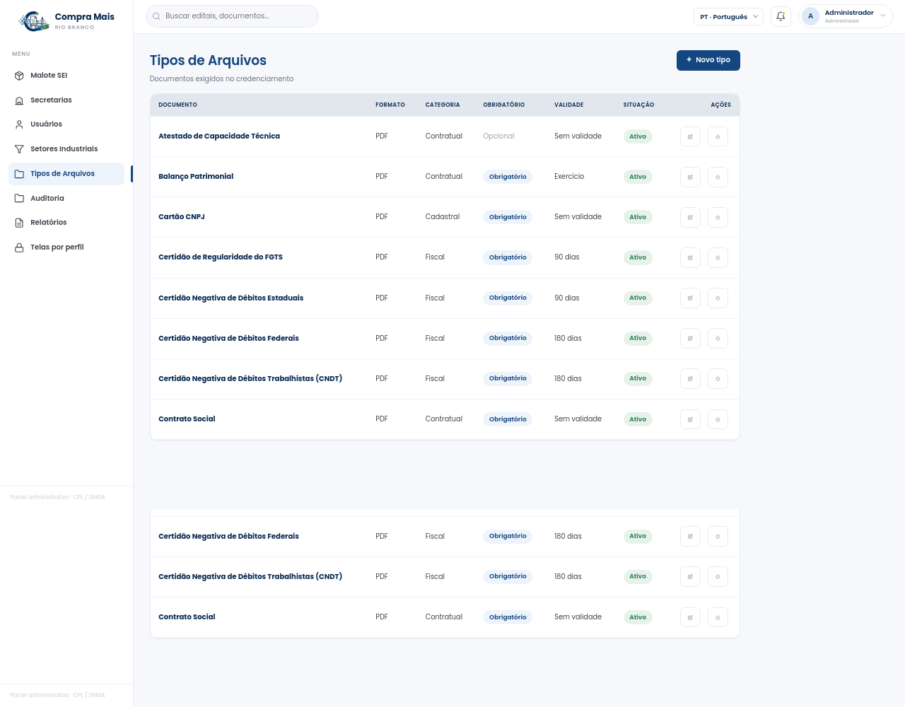

### Inativar ou excluir um tipo

Cada linha tem três ações: **editar**, **inativar/reativar** e **excluir**.

| Ação | O que faz | Quando usar |
|---|---|---|
| **Inativar** | O tipo some das listas de seleção, mas continua no sistema e pode ser reativado. Os documentos já enviados com ele seguem intactos. | Regra geral: um documento que deixou de ser exigido. |
| **Excluir** | Remove o tipo **definitivamente**. Não há como desfazer. | Cadastro feito por engano, que nunca chegou a ser usado. |

A **exclusão é exclusiva do Administrador** — os demais perfis (inclusive a Secretaria, que pode criar,
editar e inativar) não veem o botão. O sistema pede confirmação e recusa a exclusão nestes casos:

- **o tipo ainda está ativo** — inative primeiro; é o passo que tira o tipo de circulação;
- **já existe documento enviado com esse tipo** — apagá-lo deixaria o histórico do fornecedor apontando
  para um tipo inexistente. Use **inativar**;
- **é um tipo exigido pelo sistema** (ex.: *Foto do Responsável*, usado pela prova de vida) — pode ser
  editado, mas nunca excluído.

Toda exclusão fica registrada na **Auditoria**, com o autor e a data.

---

## 20. Usuários internos

*(perfil Administrador)*

Cria e administra as **contas da equipe** (nome, e-mail, **papel**, secretaria/cargo). É aqui que se
concede ou revoga o acesso de um analista, gestor, auditor ou DPO.

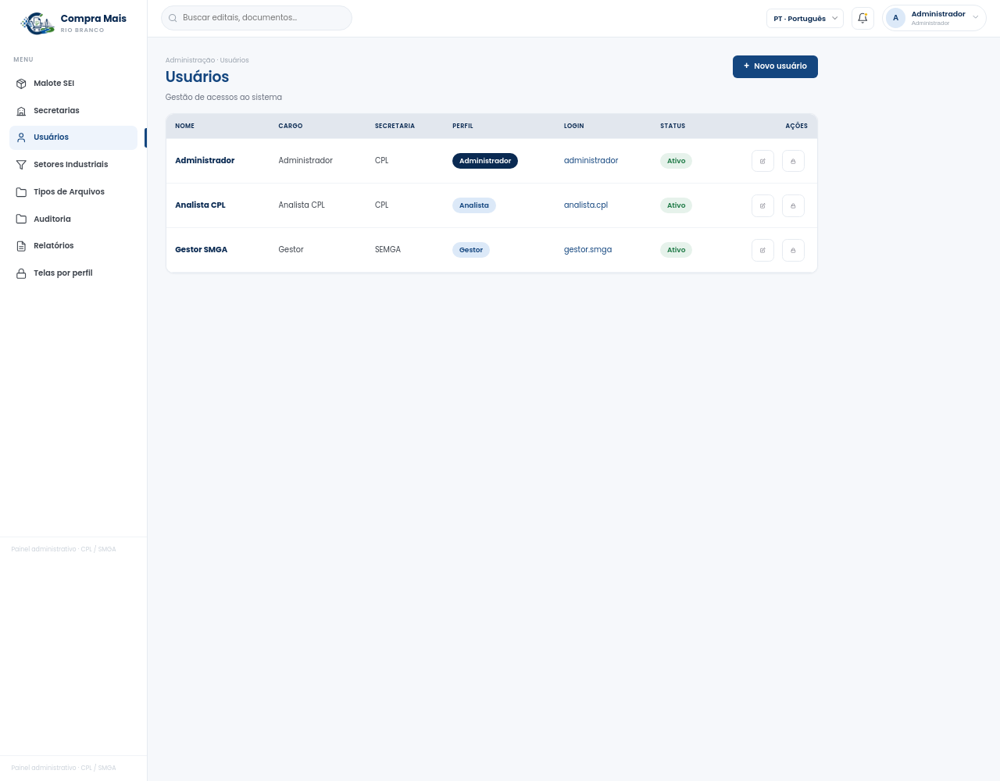

---

## 21. Administração de Telas por Perfil

*(perfil Administrador)*

Controla **quais telas** do Painel cada **papel** enxerga — uma matriz **perfil × tela**. Marque/desmarque
para ajustar o acesso. As permissões do próprio Administrador também são editáveis, mas ele **nunca perde
o acesso a esta tela** (proteção anti-lockout).

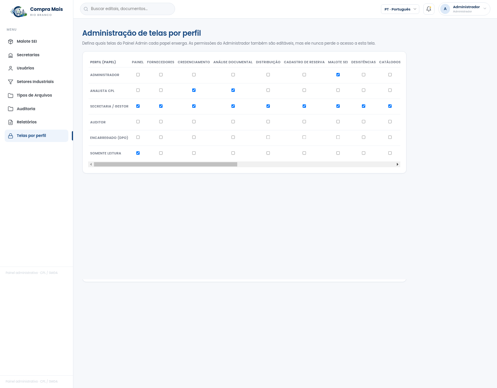

> Esta é a **fonte de verdade** do que cada perfil vê no menu e pode abrir. O controle real dos **dados**
> é sempre reforçado no servidor (RBAC): ocultar uma tela e negar o acesso ao dado andam juntos.

---

## 22. Auditoria

*(perfis Administrador e Auditor)*

**Trilha append-only** de tudo o que acontece no sistema: quem fez, o quê e quando. É imutável (nada é
apagado) e serve à fiscalização e à prestação de contas. Permite **filtrar** por evento/período e
**exportar** (CSV/JSON).

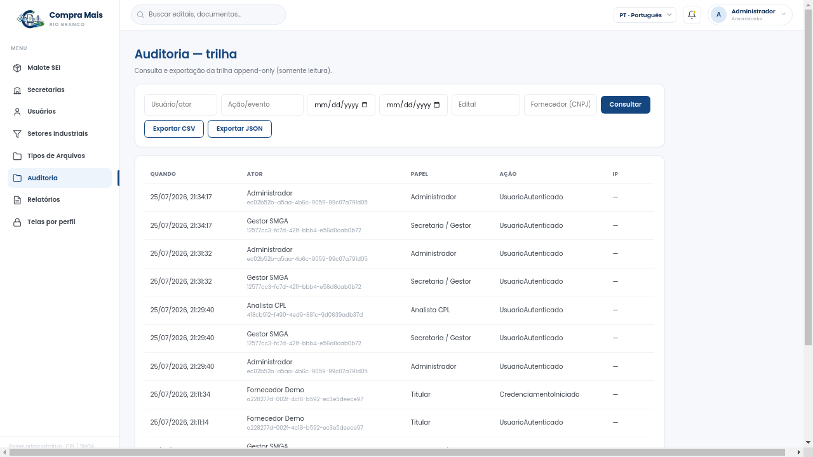

> Ações sensíveis — publicação de edital, homologação de distribuição, aceite de termo, covalidação de
> documento, atendimento LGPD — ficam registradas com ator, data e finalidade.

---

## 23. Glossário e boas práticas

| Termo | Significado |
|---|---|
| **Edital** | Uma **demanda** de compra de uma secretaria (1 edital = 1 demanda). |
| **CNAE** | Ramo de atividade; define a compatibilidade entre editais e empresas. |
| **Covalidação** | Análise/validação de um documento enviado pelo fornecedor. |
| **Apto** | Fornecedor com credenciamento aprovado, que entra no rateio. |
| **Rateio / Distribuição** | Divisão **igualitária** da demanda entre os aptos, limitada ao **teto** de cada um. |
| **Homologar** | Congelar a matriz de distribuição (versão imutável, auditável). |
| **Déficit** | Saldo da demanda não coberto pela capacidade declarada. |
| **Cadastro de Reserva** | Fila que recebe o saldo não atendido e retardatários (2ª demanda). |
| **Malote / SEI** | Conjunto de peças formalizado no Sistema Eletrônico de Informações. |
| **RBAC / Telas por perfil** | Controle de quais telas e dados cada papel acessa. |
| **Trilha de auditoria** | Registro imutável (append-only) de todas as ações. |

**Boas práticas do dia a dia**

1. Comece pelo **Dashboard** — ele aponta análises pendentes e editais a vencer.
2. Antes de **distribuir**, garanta que a **Análise Documental** está em dia (só aptos entram no rateio).
3. **Homologue** a distribuição apenas quando o rateio estiver correto — a matriz vira versão imutável.
4. Mantenha os **Catálogos**, **Tipos de Arquivos** e **Setores (CNAE)** atualizados: eles alimentam os
   editais e a compatibilidade.
5. Conceda acesso pelo **menor privilégio** necessário em **Usuários** e **Telas por Perfil**.
6. Em dúvidas de conformidade, consulte a **Auditoria** — nada se perde.

---

> **Precisa de ajuda?** Use os canais de suporte da Prefeitura de Rio Branco. Este manual acompanha a
> **Versão 2.0** do Compra Mais. Para o guia da empresa fornecedora, veja o
> [Manual do Fornecedor](manual-fornecedor.md).
