# Manual do Fornecedor — Compra Mais

**Programa Compra Mais · Prefeitura de Rio Branco**
Guia completo para a empresa participar das compras públicas municipais — do autocadastro ao fornecimento.

> Este manual foi escrito para qualquer pessoa, sem exigir conhecimento técnico. Cada etapa traz
> orientação passo a passo e telas reais do sistema. As imagens são do ambiente de demonstração; os
> dados (empresa, editais, valores) são apenas exemplos.

---

## Sumário

1. [O que é o Compra Mais](#1-o-que-é-o-compra-mais)
2. [Visão geral da jornada](#2-visão-geral-da-jornada)
3. [Etapa 1 — Autocadastro da empresa](#3-etapa-1--autocadastro-da-empresa)
4. [Etapa 2 — Acessar a plataforma (login)](#4-etapa-2--acessar-a-plataforma-login)
5. [Etapa 3 — A tela Início (seu painel)](#5-etapa-3--a-tela-início-seu-painel)
6. [Etapa 4 — Encontrar editais compatíveis](#6-etapa-4--encontrar-editais-compatíveis)
7. [Etapa 5 — Credenciar-se em um edital](#7-etapa-5--credenciar-se-em-um-edital)
8. [Etapa 6 — Manter seus documentos em dia](#8-etapa-6--manter-seus-documentos-em-dia)
9. [Etapa 7 — Acompanhar seus credenciamentos](#9-etapa-7--acompanhar-seus-credenciamentos)
10. [Etapa 8 — O fornecimento (demandas distribuídas)](#10-etapa-8--o-fornecimento-demandas-distribuídas)
11. [Notificações](#11-notificações)
12. [Minha conta, procuradores e privacidade](#12-minha-conta-procuradores-e-privacidade)
13. [Transparência](#13-transparência)
14. [Glossário](#14-glossário)
15. [Perguntas frequentes](#15-perguntas-frequentes)

---

## 1. O que é o Compra Mais

O **Compra Mais** é a plataforma digital de compras públicas da Prefeitura de Rio Branco. Ele conecta
as **empresas locais** (micro e pequenas empresas, MEIs e demais fornecedores) às **demandas das
secretarias** — de fardamento escolar a materiais e serviços.

A lógica é simples e justa:

- Cada **edital** representa **uma demanda** de uma secretaria (por exemplo, "1.000 conjuntos de
  fardamento escolar").
- Toda empresa **compatível** (pelo ramo de atividade — o **CNAE**) e **regular** (documentos em dia)
  pode se **credenciar**.
- A quantidade do edital é **dividida de forma igualitária** entre as empresas aptas, respeitando a
  **capacidade** que cada uma declara. Isso é o **rateio** — não há "leilão" nem menor preço: quem está
  apto participa do fornecimento.

> **Em uma frase:** cadastre a empresa → encontre editais do seu ramo → credencie-se → mantenha os
> documentos válidos → receba sua cota de fornecimento.

---

## 2. Visão geral da jornada

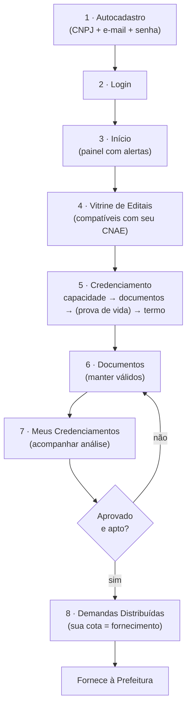
```mermaid
flowchart TD
    A["1 · Autocadastro<br/>(CNPJ + e-mail + senha)"] --> B["2 · Login"]
    B --> C["3 · Início<br/>(painel com alertas)"]
    C --> D["4 · Vitrine de Editais<br/>(compatíveis com seu CNAE)"]
    D --> E["5 · Credenciamento<br/>capacidade → documentos → (prova de vida) → termo"]
    E --> F["6 · Documentos<br/>(manter válidos)"]
    F --> G["7 · Meus Credenciamentos<br/>(acompanhar análise)"]
    G --> H{"Aprovado<br/>e apto?"}
    H -- sim --> I["8 · Demandas Distribuídas<br/>(sua cota = fornecimento)"]
    H -- não --> F
    I --> J["Fornece à Prefeitura"]
```

Cada etapa tem uma entrada no **menu lateral** do portal: **Início, Editais, Meus credenciamentos,
Documentos, Demandas distribuídas, Contestações, Procuradores, Privacidade.**

---

## 3. Etapa 1 — Autocadastro da empresa

O cadastro é **gratuito** e feito pela própria empresa (autocadastro). Você vai precisar do **CNPJ** e
de um **e-mail** e **senha** para acessar depois.

### Passo 1.1 — Abrir a tela de acesso

Ao entrar no endereço da plataforma, você verá a tela de acesso. Ela tem duas abas: **Entrar** (para
quem já tem conta) e **Criar conta** (para o primeiro acesso).

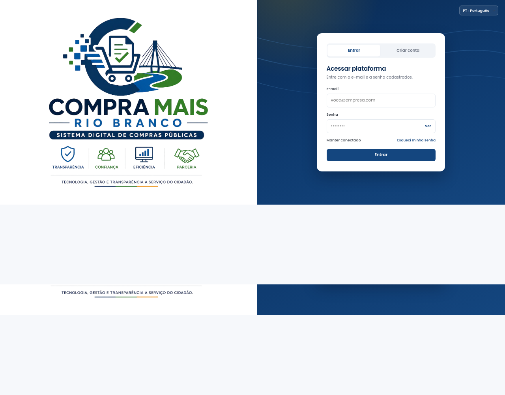

### Passo 1.2 — Escolher "Criar conta"

Clique na aba **Criar conta**. O formulário de autocadastro será exibido.

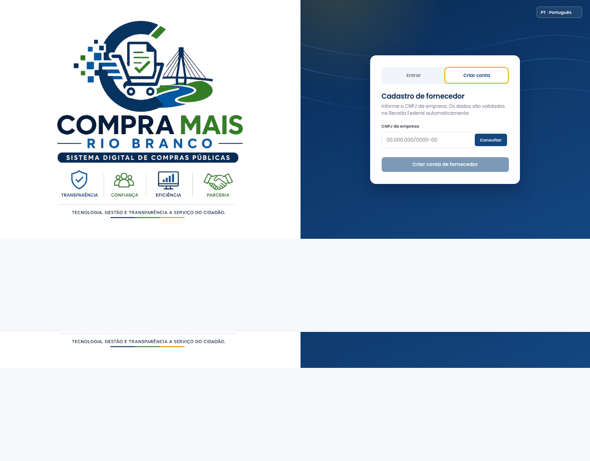

### Passo 1.3 — Informar o CNPJ e consultar

Digite o **CNPJ** da empresa e clique em **Consultar**. O sistema busca os dados oficiais na Receita
Federal e **preenche automaticamente**:

- **Razão social**, **porte** (ME, EPP, MEI…) e **situação cadastral**;
- o **quadro de sócios (QSA)**;
- o **endereço** da empresa (que você pode ajustar — número, complemento — ou atualizar por CEP).

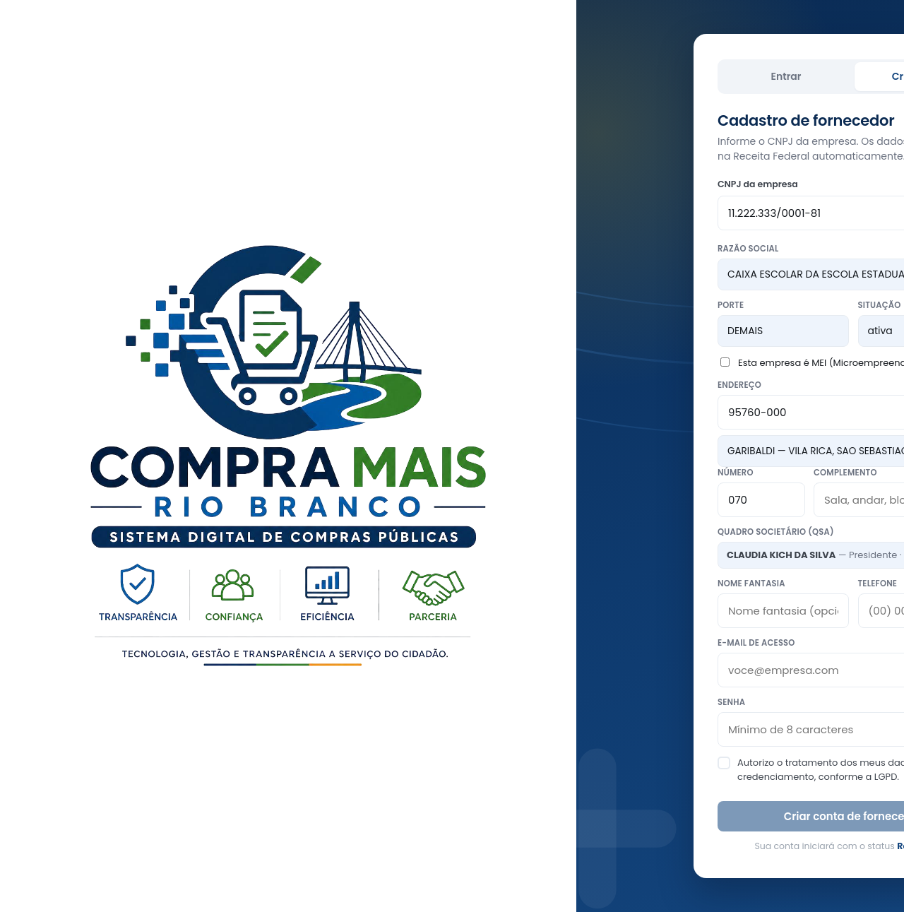

> **Sou MEI.** Se a empresa é MEI, marque a opção **Declarar MEI**. A Receita costuma classificar o MEI
> como "ME"; a sua declaração tem precedência e o porte passa a constar como **MEI**.
>
> **A Receita está indisponível?** Você pode **preencher os dados manualmente** e continuar o cadastro.

### Passo 1.4 — Definir e-mail, senha e concluir

Informe o **e-mail** e a **senha** de acesso, marque o **consentimento** (obrigatório — trata do uso dos
seus dados conforme a LGPD) e clique em **Criar conta**. Pronto: a conta é criada, você é autenticado e
entra direto no portal.

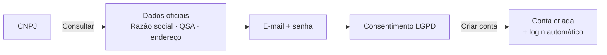
```mermaid
flowchart LR
    A[CNPJ] -->|Consultar| B[Dados oficiais<br/>Razão social · QSA · endereço]
    B --> C[E-mail + senha]
    C --> D[Consentimento LGPD]
    D -->|Criar conta| E[Conta criada<br/>+ login automático]
```

> **Guarde seu e-mail e senha.** Serão eles que você usará para entrar nas próximas vezes.

---

## 4. Etapa 2 — Acessar a plataforma (login)

Nas próximas vezes, use a aba **Entrar**: informe o **e-mail** e a **senha** cadastrados e clique em
**Entrar**. Se esquecer a senha, use **Esqueci minha senha** para redefini-la por e-mail.

---

## 5. Etapa 3 — A tela Início (seu painel)

Logo após entrar, você chega ao **Início** — um painel que resume a situação da sua empresa e destaca o
que precisa de atenção.

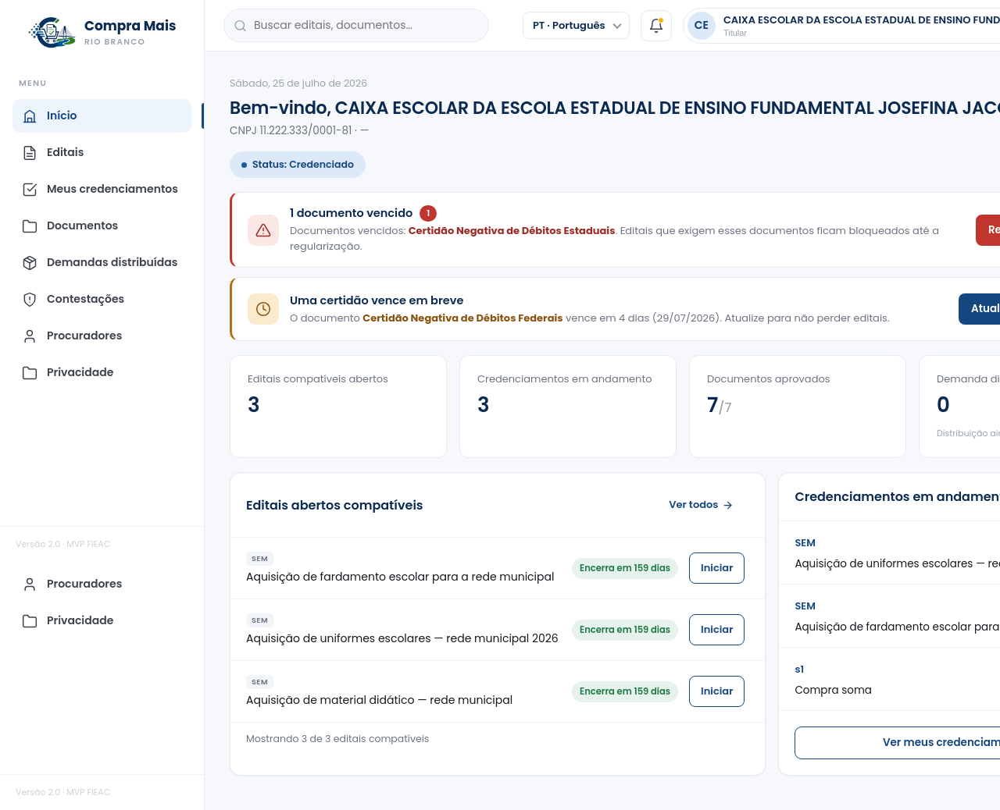

O que você encontra aqui:

- **Saudação e status** da empresa (ex.: *Status: Credenciado*).
- **Alertas de documentos**: documentos **vencidos** (em vermelho) e os que **vencem em breve** (em
  amarelo). Editais que exigem um documento vencido ficam **bloqueados até a regularização** — por isso
  vale manter tudo em dia.
- **Indicadores rápidos**: *Editais compatíveis abertos*, *Credenciamentos em andamento*, *Documentos
  aprovados* e *Demanda distribuída*.
- **Atalhos**: lista de **editais abertos compatíveis** (com botão **Iniciar**) e seus **credenciamentos
  em andamento**.

> **Dica:** o topo da tela tem uma **busca global** ("Buscar editais, documentos…"), um **seletor de
> idioma** (Português, English, Español) e o **sino de notificações**.

---

## 6. Etapa 4 — Encontrar editais compatíveis

No menu, clique em **Editais**. Você verá a **Vitrine de Editais** — a lista de oportunidades **do seu
ramo de atividade**.

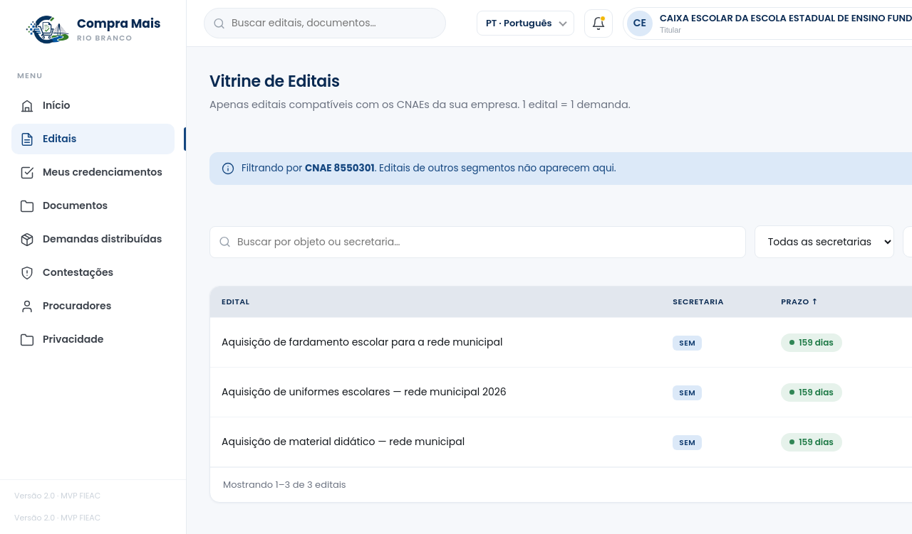

Pontos importantes:

- A vitrine mostra **apenas editais compatíveis com os CNAEs da sua empresa**. Uma faixa informa, por
  exemplo, *"Filtrando por CNAE 8550301"*. Editais de outros segmentos **não aparecem** aqui.
- **1 edital = 1 demanda.** Cada linha traz o **objeto** (o que será adquirido), a **secretaria**
  demandante e o **prazo** (ex.: *encerra em 159 dias*).
- Use a **busca** ("Buscar por objeto ou secretaria…") e o filtro **Todas as secretarias** para
  encontrar mais rápido.
- Para participar, clique no edital (ou em **Iniciar**) e siga para o **credenciamento**.

> **Minha empresa atua no ramo, mas o edital não aparece?** Pode ser divergência de CNAE. Nesses casos
> existe a **Contestação de CNAE** (menu **Contestações**), onde você solicita a revisão do
> enquadramento.

---

## 7. Etapa 5 — Credenciar-se em um edital

O **credenciamento** é um **assistente guiado**, sempre visível no topo da tela:
**Capacidade → Documentos → (Prova de vida) → Termo de Aceite → Concluído**.

> **O passo de Prova de vida é opcional e depende do edital.** A Prefeitura define, no cadastro de cada
> edital, se aquele credenciamento **exige prova de vida** (verificação facial). Quando **não exige**,
> esse passo **não aparece** e você segue direto dos **Documentos** para o **Termo de Aceite**.

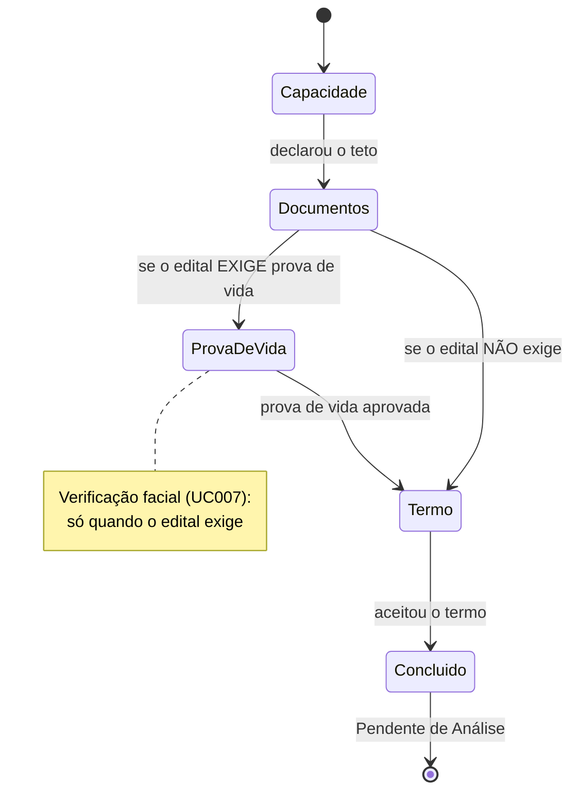
```mermaid
stateDiagram-v2
    [*] --> Capacidade
    Capacidade --> Documentos: declarou o teto
    Documentos --> ProvaDeVida: se o edital EXIGE prova de vida
    Documentos --> Termo: se o edital NÃO exige
    ProvaDeVida --> Termo: prova de vida aprovada
    Termo --> Concluido: aceitou o termo
    Concluido --> [*]: Pendente de Análise
    note right of ProvaDeVida
      Verificação facial (UC007):
      só quando o edital exige
    end note
```

### Passo 5.1 — Declarar a capacidade

Selecione **os itens do edital** que a sua empresa quer atender e, para cada um, informe a **quantidade
máxima** que consegue entregar — o seu **teto**.

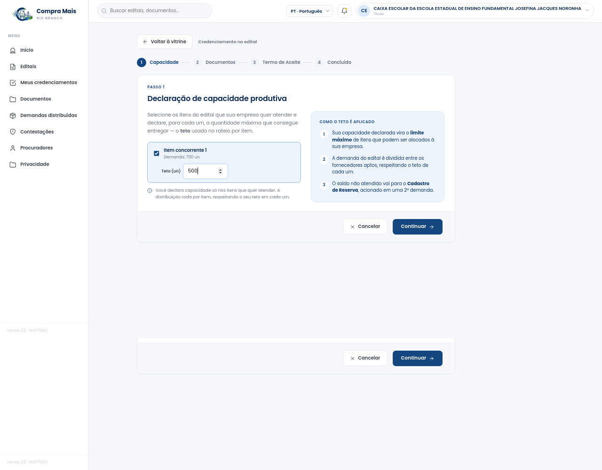

Como o teto é usado (o painel lateral explica):

1. A sua capacidade declarada vira o **limite máximo** de itens que podem ser alocados à sua empresa.
2. A demanda do edital é **dividida entre os fornecedores aptos**, respeitando o teto de cada um.
3. O saldo não atendido vai para o **Cadastro de Reserva**, acionado em uma 2ª demanda.

> Você declara capacidade **apenas nos itens que quer atender**. A distribuição roda **por item**,
> respeitando o seu teto em cada um.

### Passo 5.2 — Documentos exigidos

O sistema mostra a **lista de documentos** exigidos e o status de cada um. O melhor: **documentos
válidos enviados em editais anteriores são reaproveitados automaticamente** — você só anexa o que falta
ou o que está vencido.

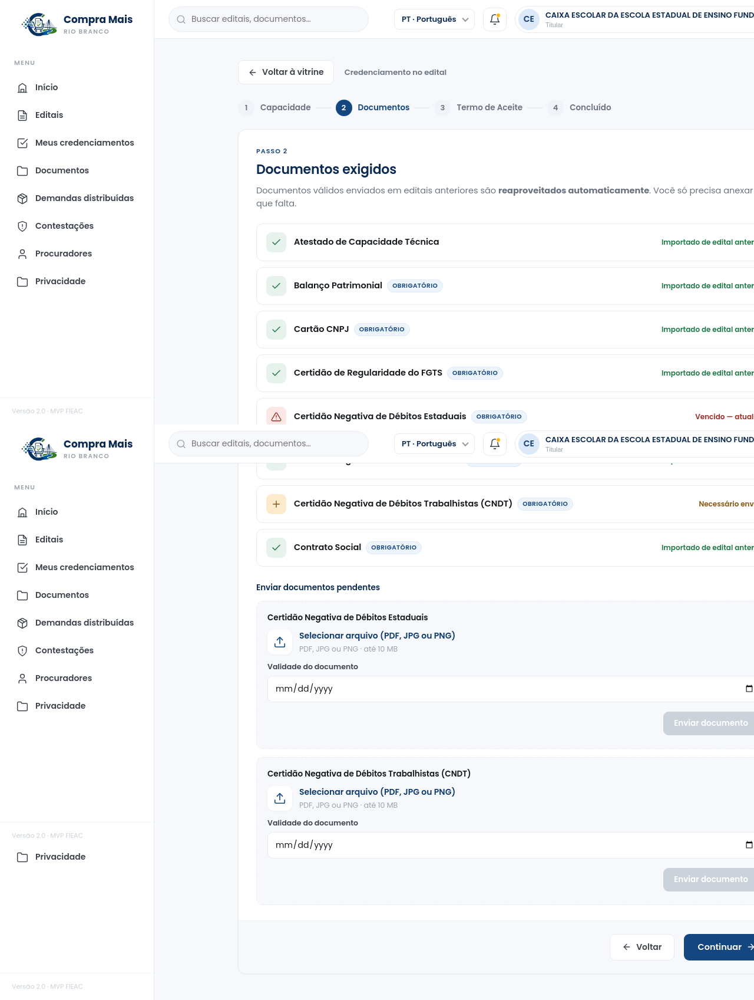

Os status possíveis:

- ✅ **Importado de edital anterior** — já enviado e válido, nada a fazer.
- ⚠️ **Vencido — atualizar** — envie a versão atualizada.
- ➕ **Necessário enviar** — documento obrigatório ainda não enviado.

Para enviar um pendente, use **Selecionar arquivo** (PDF, JPG ou PNG, até 10 MB) e informe a **validade
do documento**. Depois clique em **Continuar**.

### Passo 5.3 — Prova de vida (somente quando o edital exige)

**Alguns editais** exigem uma **prova de vida** (verificação facial) do responsável antes do Termo — uma
checagem de segurança que confirma que é uma pessoa real concluindo o credenciamento. **Quando o edital
exige, o Termo só pode ser aceito após a prova de vida ser aprovada.**

> Se o edital **não** exige prova de vida, este passo **não aparece** no assistente e você vai direto do
> passo **Documentos** para o **Termo de Aceite**. Você percebe pela barra de passos no topo da tela.

### Passo 5.4 — Termo de Aceite

No último passo, você assina o **Termo de Aceite**. Ele declara que as informações e documentos são
verdadeiros e que você concorda com as condições do edital (Lei Complementar 123 e regras do Compra
Mais). Marque **"Li e aceito o Termo de Aceite do credenciamento"** e clique em **Enviar
credenciamento**.

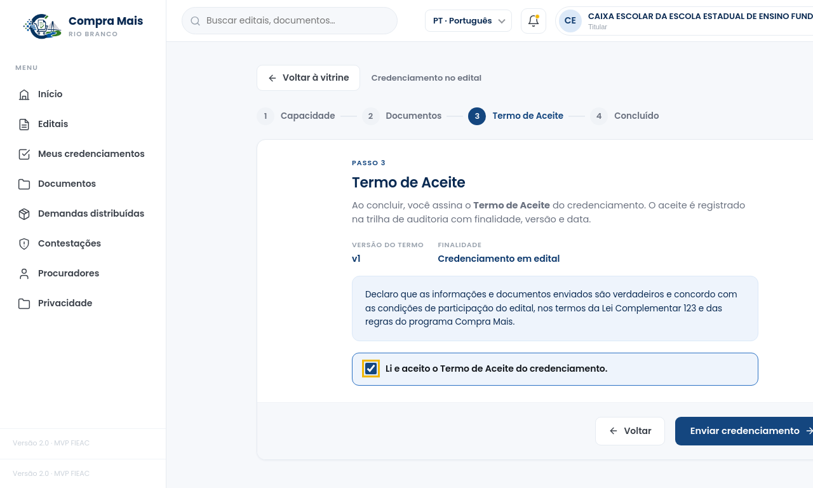

O aceite é registrado na **trilha de auditoria** com **finalidade, versão e data**.

### Passo 5.5 — Concluído: Pendente de Análise

Ao enviar, seu credenciamento fica **Pendente de Análise**. A partir daí a equipe da Prefeitura
analisa os documentos. Você acompanha tudo em **Meus credenciamentos** e recebe **notificações** sobre o
resultado.

---

## 8. Etapa 6 — Manter seus documentos em dia

A tela **Documentos** reúne todos os documentos da sua empresa, com **validade** e **status**. Como os
documentos são **reaproveitados** entre editais, mantê-los válidos aqui adianta (ou destrava) qualquer
credenciamento futuro.

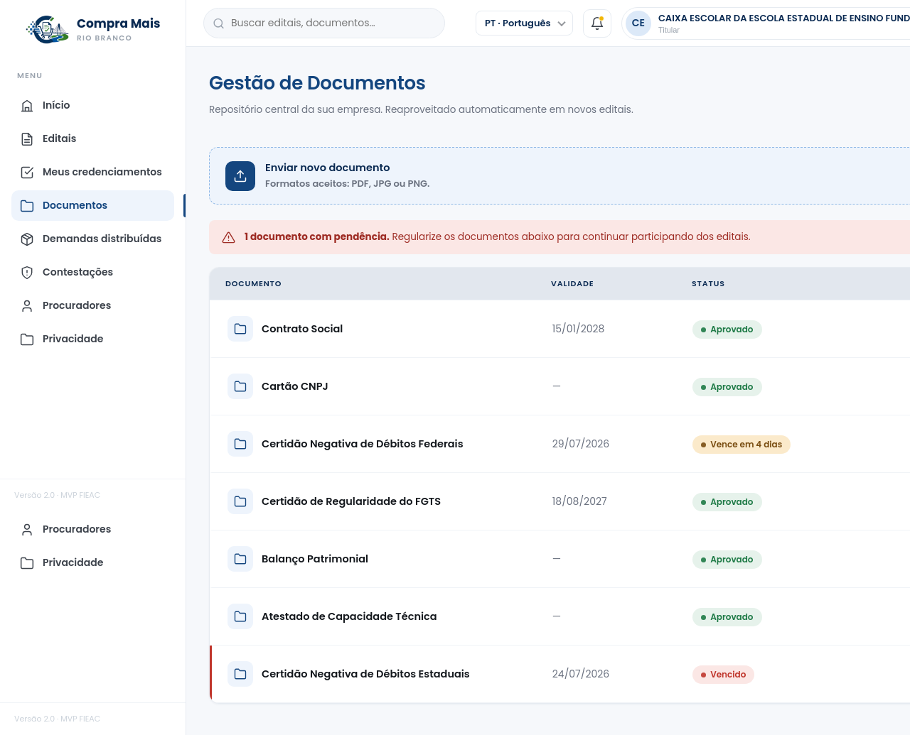

> **Por que isso importa?** Um documento **vencido** pode **bloquear** editais que o exigem. O **Início**
> e as **notificações** avisam quando algo vence — atualize antes do prazo para não perder oportunidades.

---

## 9. Etapa 7 — Acompanhar seus credenciamentos

Em **Meus credenciamentos** você vê todos os editais em que se credenciou e o **estágio** de cada um
(iniciado, pendente de análise, aprovado, em correção…).

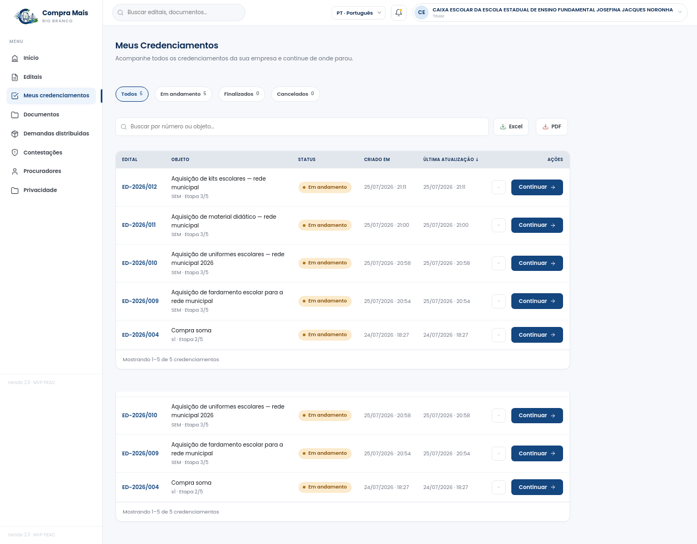

Clique em um item para ver o **detalhe**: o edital, a capacidade declarada, os documentos vinculados e o
histórico. Se algo for **reprovado**, aqui você vê o **motivo** e reenvia a correção.

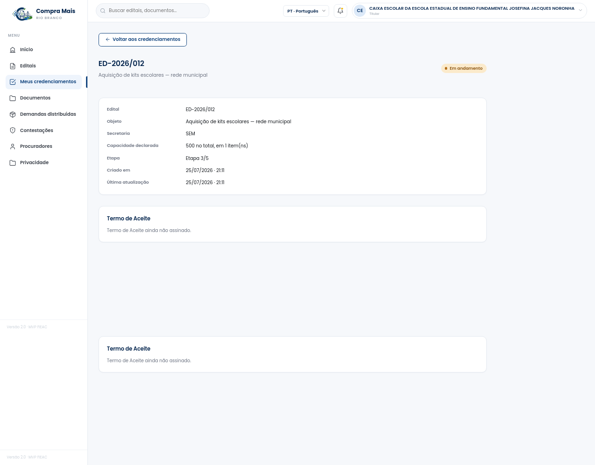

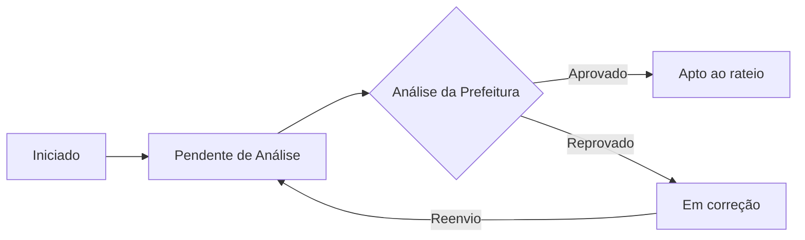
```mermaid
flowchart LR
    A[Iniciado] --> B[Pendente de Análise]
    B --> C{Análise da Prefeitura}
    C -->|Aprovado| D[Apto ao rateio]
    C -->|Reprovado| E[Em correção]
    E -->|Reenvio| B
```

---

## 10. Etapa 8 — O fornecimento (demandas distribuídas)

Quando um edital em que você está **apto** tem sua distribuição realizada, a sua **cota** aparece em
**Demandas distribuídas** — é o **fornecimento** propriamente dito.

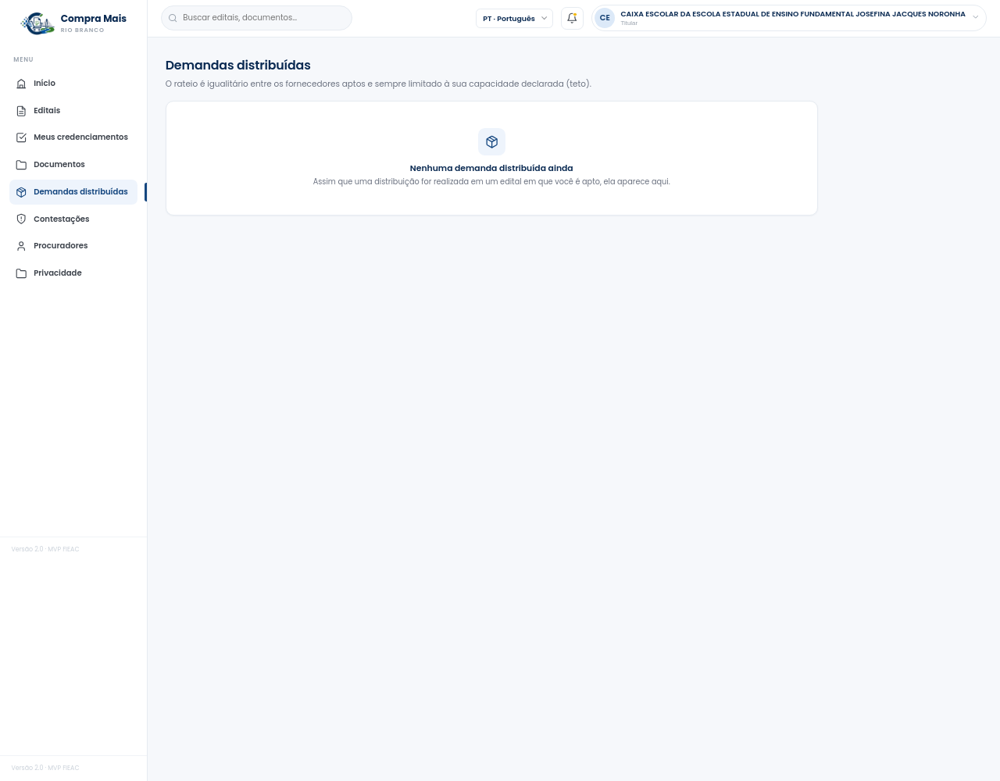

- Enquanto não houver distribuição, a tela mostra: *"Nenhuma demanda distribuída ainda. Assim que uma
  distribuição for realizada em um edital em que você é apto, ela aparece aqui."*
- **O rateio é igualitário** entre os fornecedores aptos e **sempre limitado à sua capacidade
  declarada (teto)**.

Como a Prefeitura divide a demanda (rateio equitativo):

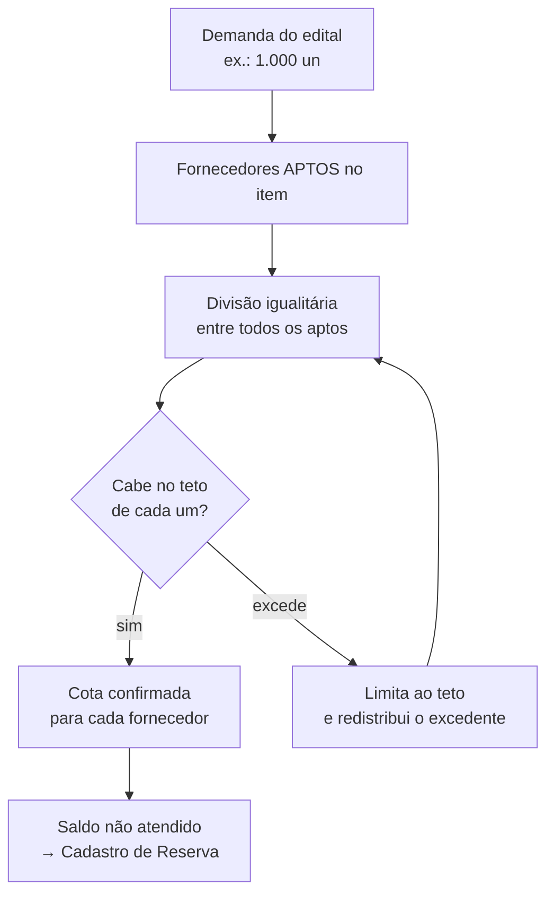
```mermaid
flowchart TD
    A[Demanda do edital<br/>ex.: 1.000 un] --> B[Fornecedores APTOS no item]
    B --> C[Divisão igualitária<br/>entre todos os aptos]
    C --> D{Cabe no teto<br/>de cada um?}
    D -- sim --> E[Cota confirmada<br/>para cada fornecedor]
    D -- excede --> F[Limita ao teto<br/>e redistribui o excedente]
    F --> C
    E --> G[Saldo não atendido<br/>→ Cadastro de Reserva]
```

Quando você recebe uma cota, também recebe uma **notificação**. A partir daí, o fornecimento segue as
orientações da secretaria demandante (entrega, prazos e comprovações).

---

## 11. Notificações

O **sino** no topo e a página **Notificações** avisam sobre o que importa: **resultado do
credenciamento**, **documento a vencer**, **novo edital compatível** e **cota recebida em uma
distribuição**.

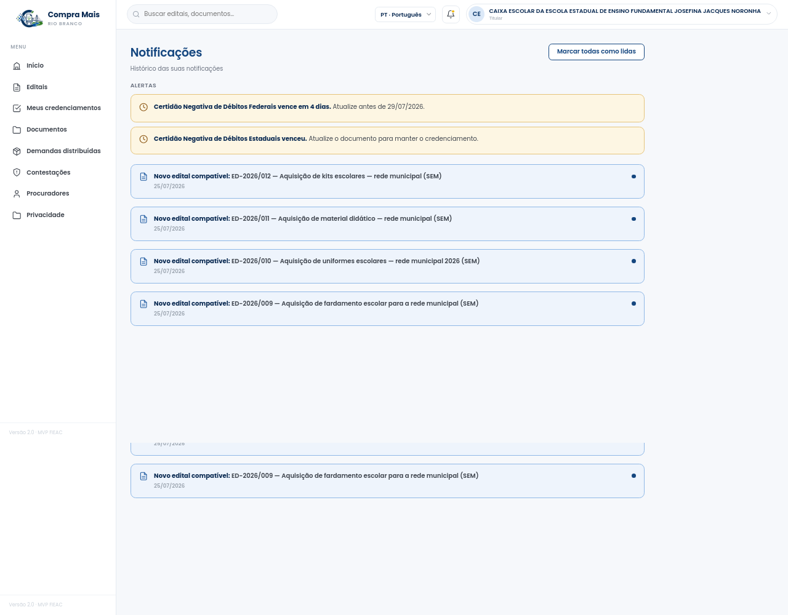

> Notificações **não lidas** aparecem destacadas e no contador do sino. Clique para abrir o item
> relacionado (o edital, o documento ou o credenciamento).

---

## 12. Minha conta, procuradores e privacidade

### Minha conta

Em **Minha conta** você revisa e ajusta os dados de acesso e do responsável, e **troca a senha**.

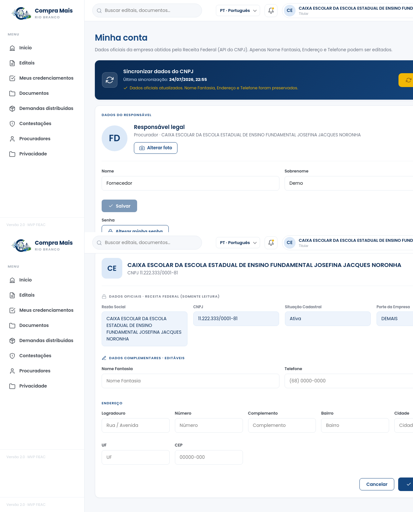

### Procuradores

O **titular** da empresa pode cadastrar **procuradores** — pessoas autorizadas a operar em nome da
empresa no portal. (Somente o titular gerencia procuradores.)

### Privacidade (LGPD)

Em **Privacidade**, o titular exerce seus **direitos previstos na LGPD** — como solicitar acesso,
correção ou exclusão de dados pessoais. O consentimento aceito no cadastro fica registrado e pode ser
consultado aqui.

---

## 13. Transparência

A área de **Transparência** apresenta, de forma pública, os números do programa: **investimento na
economia local**, **empresas participantes**, **participação por porte (MEI/ME)** e **editais**. É a
prestação de contas do Compra Mais à sociedade.

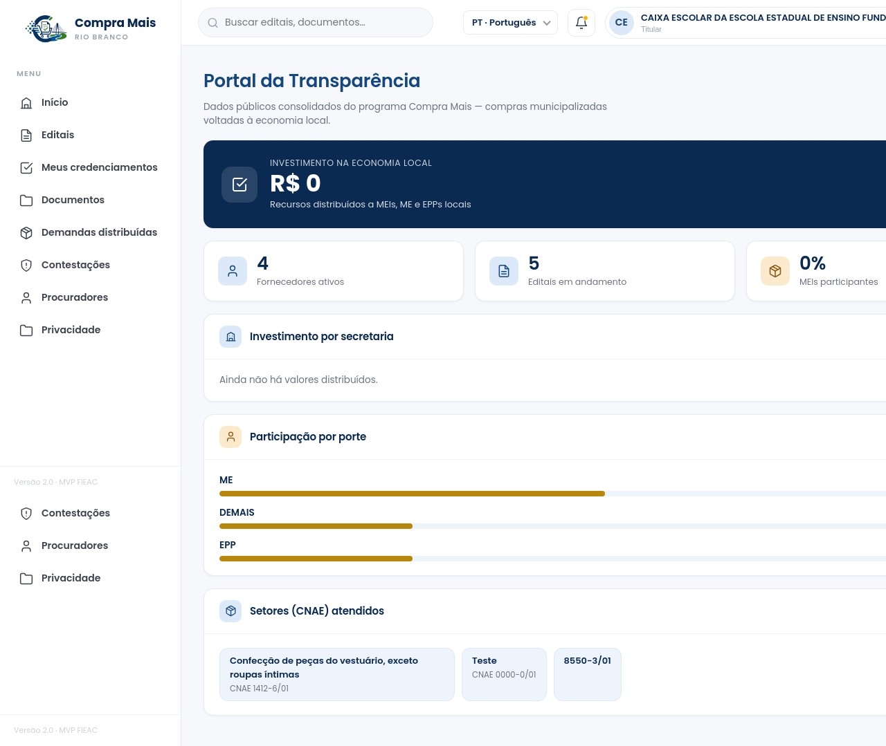

---

## 14. Glossário

| Termo | O que significa |
|---|---|
| **CNAE** | Código que identifica o **ramo de atividade** da empresa. Define quais editais são compatíveis com você. |
| **Edital** | Uma **demanda** de compra de uma secretaria. No Compra Mais, **1 edital = 1 demanda**. |
| **Credenciamento** | O processo de **se habilitar** em um edital (capacidade + documentos + termo; **prova de vida quando o edital exige**). |
| **Capacidade / Teto** | A **quantidade máxima** que você declara conseguir entregar de um item. Limita a sua cota no rateio. |
| **Rateio / Distribuição** | A divisão **igualitária** da demanda entre os fornecedores aptos, respeitando o teto de cada um. |
| **Apto** | Fornecedor com credenciamento **aprovado**, que entra no rateio. |
| **Cota** | A **quantidade** que coube à sua empresa em uma distribuição — o seu fornecimento. |
| **Cadastro de Reserva** | Fila que recebe o **saldo não atendido** e os retardatários, acionada em uma 2ª demanda. |
| **Prova de vida** | Verificação **facial** do responsável, exigida **por alguns editais** antes de assinar o Termo (definido no cadastro do edital). |
| **Termo de Aceite** | Declaração final que **conclui** o credenciamento e é registrada na auditoria. |
| **Titular / Procurador** | O **titular** representa a empresa; **procuradores** são autorizados por ele a operar no portal. |

---

## 15. Perguntas frequentes

**Preciso pagar para me cadastrar?**
Não. O cadastro e a participação no Compra Mais são gratuitos.

**Meu edital sumiu da vitrine. Por quê?**
A vitrine mostra só editais **compatíveis com o seu CNAE** e **abertos**. Se um documento obrigatório
venceu, editais que o exigem ficam **bloqueados** até você regularizar — verifique os alertas no
**Início** e na tela **Documentos**.

**Não consegui concluir o credenciamento no Termo.**
Verifique se os documentos obrigatórios estão válidos. **Se este edital exigir prova de vida**, o Termo
só é liberado após a verificação facial ser aprovada — o passo aparece no assistente entre Documentos e
Termo. Se o edital não exige, o passo não aparece e o Termo fica disponível direto após os Documentos.

**Enviei um documento em outro edital. Preciso enviar de novo?**
Não. Documentos **válidos** são **reaproveitados automaticamente**. Você só anexa o que falta ou o que
venceu.

**Como sei que recebi uma cota de fornecimento?**
Você recebe uma **notificação** e a cota aparece em **Demandas distribuídas**.

**Esqueci minha senha.**
Na tela de acesso, use **Esqueci minha senha** para redefini-la por e-mail.

---

> **Precisa de ajuda?** Use os canais de atendimento da Prefeitura de Rio Branco indicados no rodapé da
> plataforma. Este manual acompanha a **Versão 2.0** do Compra Mais.
