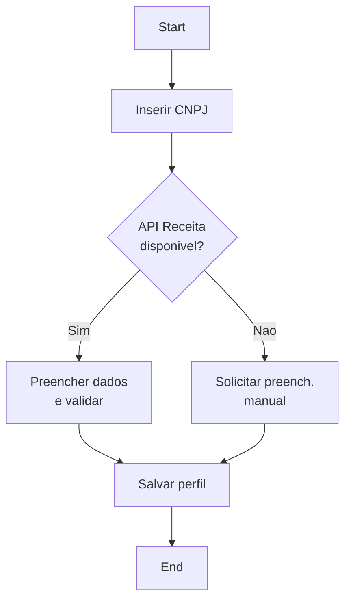
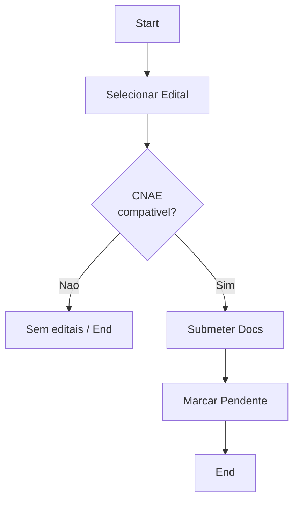
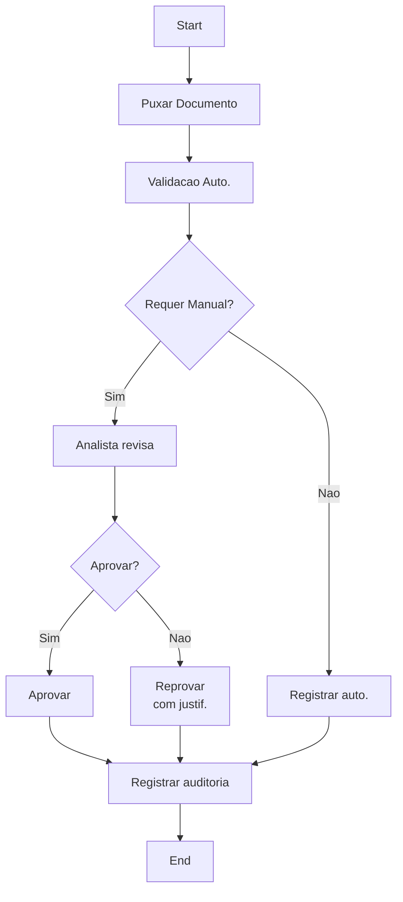
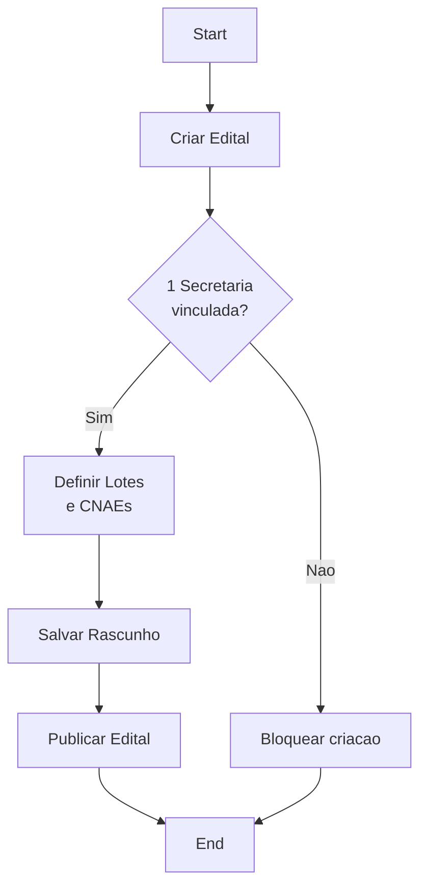
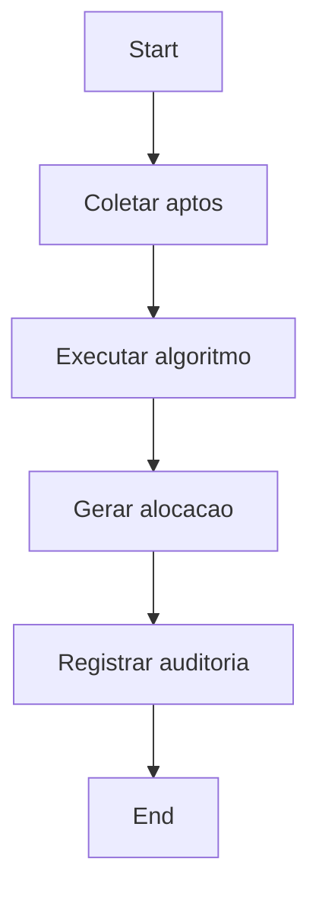
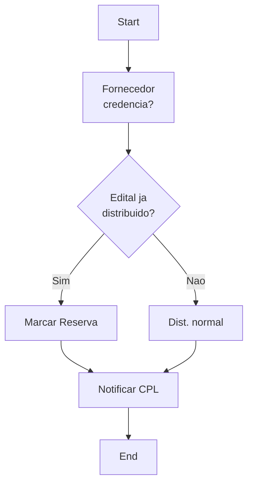
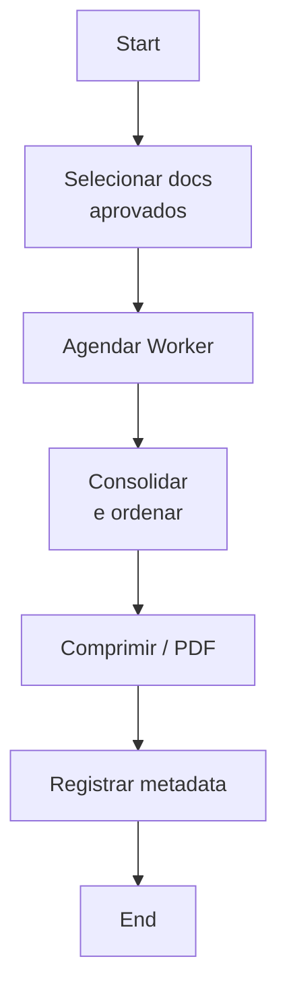
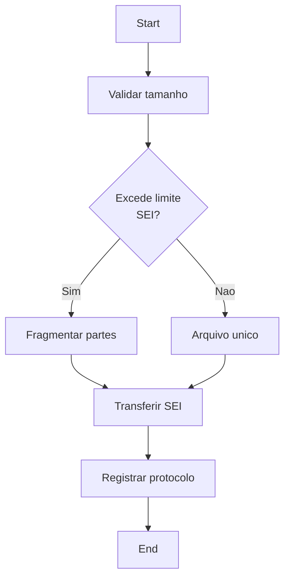

08 - BPMN
=============

Este documento modela, em nível simplificado, os principais processos do sistema Compra Mais com objetivo, atores, entradas, saídas, fluxo BPMN e diagrama Mermaid, além das regras de negócio associadas.

1) Cadastro de Fornecedor
-------------------------
Objetivo
- Permitir registro inicial de fornecedores via CNPJ, preenchendo dados oficiais e criando perfil no sistema.

Atores
- Fornecedor (usuário externo)
- Sistema (API)

Entradas
- CNPJ (entrada do usuário)
- Dados da Receita Federal (via API)

Saídas
- Perfil de Fornecedor criado (estado: Requerente)
- Registro em Catálogo/Cadastros base

Fluxo BPMN simplificado
- Início -> Inserir CNPJ -> Consultar Receita Federal -> Preencher dados / solicitar dados manuais (fallback) -> Salvar perfil -> Fim

Diagrama Mermaid

Regras de Negócio associadas
- RNF001 (Integrações/API)
- RNF005 (Disponibilidade)

---

2) Credenciamento
-----------------
Objetivo
- Permitir que o fornecedor manifeste interesse em um edital e submeta documentação para credenciamento.

Atores
- Fornecedor
- Sistema
- CPL/Analista (para etapas de covalidação)

Entradas
- Seleção de Edital
- Documentos digitais (PDFs)
- Dados cadastrais do fornecedor

Saídas
- Credenciamento submetido (status Pendente de Análise)
- Chamada a workflows de validação (automática e humana)

Fluxo BPMN simplificado
- Início -> Selecionar Edital -> Verificar CNAE (filtro) -> Submeter Documentos -> Status Pendente -> Fim

Diagrama Mermaid

Regras de Negócio associadas
- RF003 (Filtro por CNAE)
- RN001 (Filtro Restritivo por CNAE)
- RN002 (Tolerância Zero à Inadimplência) — verificação integrada no próximo processo

---

3) Análise e Covalidação
------------------------
Objetivo
- Realizar validação automática e humana dos documentos submetidos, registrando justificativas e trilhas de auditoria.

Atores
- CPL / Analista
- Sistema

Entradas
- Documentos submetidos
- Resultados de validação automática (checks de formato/assinatura)

Saídas
- Documento aprovado ou reprovado com justificativa
- Evento de auditoria gravado

Fluxo BPMN simplificado
- Início -> Puxar Documento -> Valid. Automática -> (Se crítico) abrir Covalidação Manual -> Aprovar/Reprovar com justificativa -> Registrar auditoria -> Fim

Diagrama Mermaid

Regras de Negócio associadas
- RF004 (Covalidação Humana)
- RN003 (Análise Crítica Antifraude)
- RN006 (Rigor do Balanço Patrimonial)
- RNF003 (Auditoria e Rastreabilidade)

---

4) Publicação de Edital
-----------------------
Objetivo
- Criar e publicar editais individualizados vinculados a uma única secretaria demandante.

Atores
- Administrador SMGA / CPL
- Sistema

Entradas
- Metadados do Edital (Objeto, Quantitativos, Vigência, Secretaria)

Saídas
- Edital publicado (estado: Aberto)
- Configuração de lotes/itens e CNAEs permitidos

Fluxo BPMN simplificado
- Início -> Criar Edital -> Validar restrições (1 Secretaria) -> Definir Lotes/Itens -> Salvar Rascunho -> Publicar -> Fim

Diagrama Mermaid

Regras de Negócio associadas
- RF008 (Criação de Editais Individualizados)
- RN007 (Rubricas Isoladas / Individualização)
- RNF004 (Conformidade Legal)

---

5) Distribuição Inteligente
---------------------------
Objetivo
- Calcular e aplicar a distribuição equitativa de quantitativos entre fornecedores credenciados, respeitando capacidade produtiva.

Atores
- Sistema (motor de distribuição)
- CPL / Administrador (observador)

Entradas
- Lista de fornecedores aptos
- Quantitativos por lote/item
- Capacidades declaradas pelos fornecedores

Saídas
- Alocação final por fornecedor (quantidades)
- Registro de distribuição (audit trail)

Fluxo BPMN simplificado
- Início -> Coletar aptos -> Executar algoritmo de rateio -> Gerar alocação -> Registrar resultados -> Fim

Diagrama Mermaid

Regras de Negócio associadas
- RF005 (Motor de Distribuição Equitativa)
- RN005 (Teto de Distribuição por Capacidade)
- RN004 (Ingressantes Retardatários) — afeta alocação de reservas

---

6) Cadastro de Reserva (Segunda Demanda)
---------------------------------------
Objetivo
- Inserir fornecedores tardios em uma fila de reserva sem alterar alocações já em execução.

Atores
- Sistema
- Fornecedor

Entradas
- Pedido de credenciamento tardio
- Estado do edital (distribuído/executando)

Saídas
- Registro em fila "Cadastro de Reserva/Segunda Demanda"
- Notificação interna para analistas

Fluxo BPMN simplificado
- Início -> Fornecedor aprovado após distribuição? -> Se sim, marcar como Reserva -> Inserir na fila -> Fim

Diagrama Mermaid

Regras de Negócio associadas
- RN004 (Ingressantes Retardatários / Cadastro de Reserva)
- RN007 (Individualização) — não altera contratos em execução

---

7) Geração de Malote
--------------------
Objetivo
- Consolidar documentos aprovados de fornecedores em um PDF/unidade processual ordenada e otimizada para tramitação no SEI.

Atores
- Administrador SMGA / CPL
- Sistema / Workers assíncronos

Entradas
- Documentos aprovados por fornecedor
- Ordenação legal (CNPJ, ID, Anexos, Certidões)

Saídas
- Malote PDF unificado e comprimido
- Metadados de exportação (tamanho, checksums)

Fluxo BPMN simplificado
- Início -> Selecionar registros aprovados -> Agendar worker de compressão -> Consolidar e ordenar -> Compressão -> Produzir arquivo final -> Fim

Diagrama Mermaid

Regras de Negócio associadas
- RF007 (Geração de Malote SEI)
- RNF002 (Performance / Compressão SEI)
- RN008 (Ordenação e Fragmentação de Malote)

---

8) Exportação para SEI
---------------------
Objetivo
- Disponibilizar o malote gerado para inserção/tramitação no sistema SEI municipal, respeitando limites técnicos e fragmentação quando necessário.

Atores
- Sistema (API de exportação)
- Administrador / Operador
- Sistema SEI (externo)

Entradas
- Arquivo de Malote (PDF/ZIP)
- Metadados (tamanho, índice)

Saídas
- Download/Upload para SEI
- Registro de protocolo (quando disponível)

Fluxo BPMN simplificado
- Início -> Validar tamanho -> Se maior que limite -> Fragmentar -> Transferir para SEI -> Registrar protocolo -> Fim

Diagrama Mermaid

Regras de Negócio associadas
- RNF002 (Compressão / limite SEI)
- RF007 (Formato e ordem do malote)
- RNF004 (Conformidade Legal) 

---

Observações finais
- Todas as trilhas de auditoria citadas nas atividades devem gravar eventos no repositório de Auditoria e Logs (ver [03-HDR.md](03-HDR.md)).
- Recomenda-se transformar cada fluxo em tasks menores para estimativa: integração com PGM/SICAF, worker de compressão, fragmentador SEI e UI de gestão de editais.

Documento gerado automaticamente com base nos artefatos 01–07. Deseja que eu exporte estes diagramas para PNG/SVG ou gere issues/epics a partir dos processos?