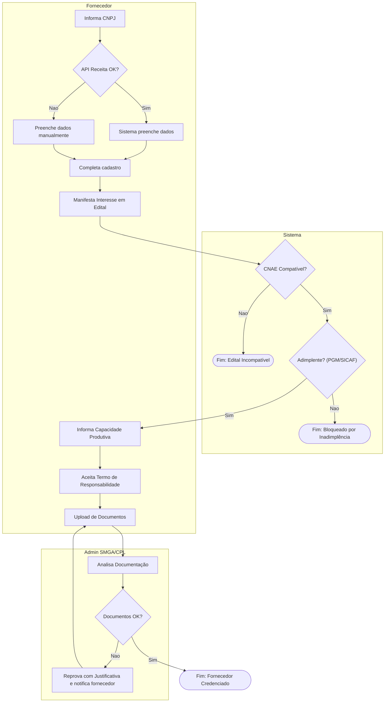
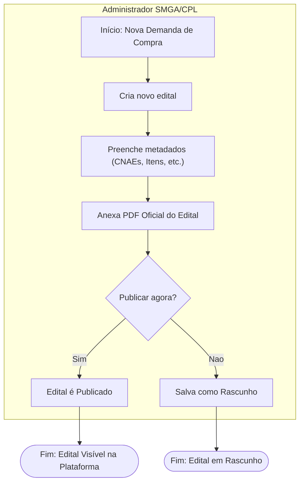
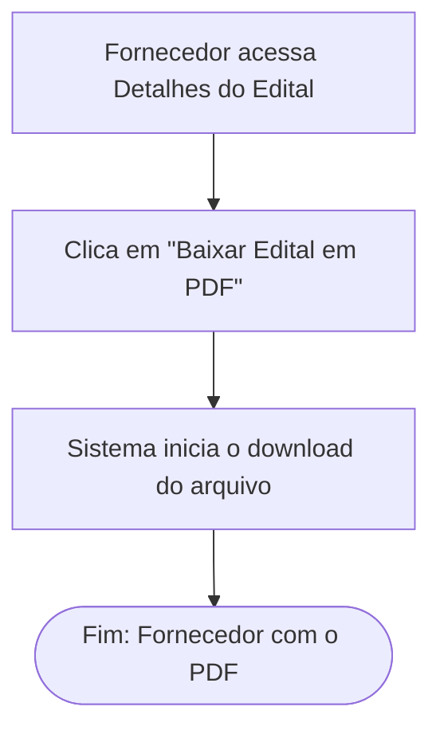
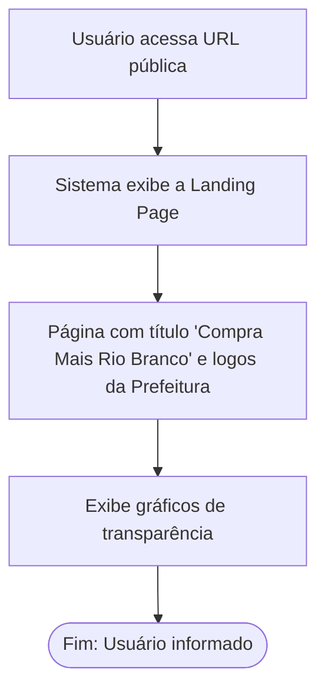

# Modelagem de Processos (BPMN) - Compra Mais v2

> ⚠️ **INSUMO (baseline v2 local) — NÃO CANÔNICO.** IDs (RF/RN/UC/FEATURE) são locais e podem colidir com os IDs globais canônicos. Use `spec/docs/` como fonte de verdade (ex.: `spec/docs/prd.md`, `spec/docs/casos-de-uso.md`).

**Projeto:** Compra Mais  
**Cliente:** Prefeitura Municipal de Rio Branco  
**Versão:** 2.0  
**Data:** 2026-07-03

---

Este documento apresenta a modelagem dos principais processos de negócio do sistema Compra Mais, utilizando a notação BPMN (Business Process Model and Notation) representada através de diagramas Mermaid. A versão 2.0 foi gerada a partir dos artefatos consolidados após a **Validação 01** (visitas 5 e 6), incorporando todas as novas regras, requisitos e fluxos aprovados pelo cliente.

O objetivo é fornecer uma representação visual clara e técnica dos processos, servindo como um guia unificado para as equipes de desenvolvimento, testes e produto.

---

# Processo BPMN – Cadastro e Credenciamento de Fornecedor

## Objetivo
Digitalizar o onboarding do fornecedor, desde o cadastro inicial na plataforma até a sua habilitação formal em um edital específico, incluindo validações automáticas de inadimplência e a covalidação humana de documentos.

## Participantes
- Fornecedor
- Sistema
- Administrador SMGA/CPL

## Evento Inicial
Fornecedor decide se cadastrar na plataforma Compra Mais.

## Atividades
1.  Fornecedor informa o CNPJ.
2.  Sistema consulta a API da Receita Federal e preenche dados cadastrais.
3.  Fornecedor completa o cadastro com dados de contato e senha.
4.  Fornecedor manifesta interesse em um edital compatível com seu CNAE.
5.  Sistema valida automaticamente a situação de inadimplência (PGM/SICAF).
6.  Fornecedor informa sua capacidade produtiva.
7.  Fornecedor lê e aceita o **Termo de Responsabilidade Legal** sobre a informação declarada.
8.  Fornecedor realiza o upload dos documentos exigidos pelo edital (ou o sistema reutiliza documentos válidos existentes).
9.  Administrador SMGA/CPL analisa a documentação submetida.
10. Administrador aprova ou reprova os documentos, com justificativa obrigatória em caso de reprovação.

## Decisões
- O CNPJ é válido?
- O fornecedor está adimplente?
- O Termo de Responsabilidade foi aceito?
- Os documentos estão em conformidade?

## Evento Final
Fornecedor obtém o status "Credenciado" no edital, tornando-se apto para a fase de distribuição, ou recebe uma notificação de pendência para correção.

## Regras de Negócio Relacionadas
- RN001, RN002, RN003, RN006

## Casos de Uso Relacionados
- UC001, UC002, UC004, UC006

## Histórias de Usuário Relacionadas
- HU-001, HU-002, HU-007, HU-009

## Telas do Protótipo Relacionadas
- Tela de Cadastro
- Fluxo de Credenciamento
- Painel do Administrador - Análise Documental

## Observações
A inclusão do **Termo de Responsabilidade (RF015)** é uma mudança crítica da Validação 01 para aumentar a segurança jurídica do processo. A nomenclatura de status também foi ajustada, diferenciando "Bloqueado por Inadimplência" de "Em Análise".



---

# Processo BPMN – Publicação e Gestão de Edital

## Objetivo
Permitir que o administrador da SMGA/CPL crie um novo edital de credenciamento, preenchendo seus metadados e, obrigatoriamente, anexando o documento PDF oficial gerado no SEI.

## Participantes
- Administrador SMGA/CPL

## Evento Inicial
Uma secretaria municipal protocola uma nova demanda de compra.

## Atividades
1.  Administrador acessa a área de gestão de editais e inicia a criação de um novo.
2.  Preenche os dados estruturados do edital (Objeto, Secretaria, CNAEs, Itens, Vigência).
3.  Realiza o **upload do arquivo PDF oficial** do edital.
4.  Salva o edital como "Rascunho" para revisão posterior ou o "Publica" diretamente.

## Decisões
- Publicar o edital imediatamente ou salvar como rascunho?

## Evento Final
Edital publicado na plataforma, tornando-se visível para os fornecedores com CNAE compatível.

## Regras de Negócio Relacionadas
- RN007

## Casos de Uso Relacionados
- UC005

## Histórias de Usuário Relacionadas
- HU-004, HU-005

## Telas do Protótipo Relacionadas
- Formulário de Criação de Edital

## Observações
A obrigatoriedade de anexar o PDF do edital (RF016) foi um novo requisito da Validação 01 para aumentar a transparência do processo.



---

# Processo BPMN – Download do Edital Oficial

## Objetivo
Garantir que o fornecedor possa consultar o documento completo e original do edital a qualquer momento.

## Participantes
- Fornecedor

## Evento Inicial
Fornecedor encontra um edital de interesse na plataforma.

## Atividades
1.  Fornecedor acessa a tela de detalhes do edital.
2.  Fornecedor localiza e clica no botão "Baixar Edital em PDF".
3.  O sistema inicia o download do arquivo PDF correspondente.

## Decisões
- N/A

## Evento Final
Fornecedor possui o arquivo PDF oficial do edital em seu dispositivo.

## Regras de Negócio Relacionadas
- N/A

## Casos de Uso Relacionados
- UC015

## Histórias de Usuário Relacionadas
- HU-006

## Telas do Protótipo Relacionadas
- Painel do Fornecedor - Detalhes do Edital

## Observações
Este é um processo simples, consequência direta da implementação da FEATURE-008 (Upload do Edital).



---

# Processo BPMN – Distribuição Inteligente e Cadastro de Reserva

## Objetivo
Realizar o rateio matemático das cotas de fornecimento de forma justa, equitativa e imutável, respeitando a capacidade produtiva de cada um. Além disso, gerenciar a fila de espera (Cadastro de Reserva) para fornecedores tardios.

## Participantes
- Administrador SMGA/CPL
- Sistema
- Fornecedor

## Evento Inicial
Administrador aciona o comando "Calcular Distribuição" após o fim do prazo de credenciamento.

## Atividades
1.  Sistema calcula a distribuição igualitária entre os fornecedores credenciados.
2.  Sistema verifica se a cota individual excede a capacidade produtiva declarada.
3.  Se exceder, o sistema trava a cota no limite do fornecedor e redistribui o excedente entre os demais.
4.  O resultado do cálculo é gravado e torna-se **imutável**, não podendo ser editado.
5.  O sistema notifica os fornecedores sobre o resultado.
6.  Na visão do fornecedor, o sistema **oculta o rateio global**, exibindo apenas a cota individual atribuída.
7.  Fornecedores que se credenciam após a distribuição são alocados no "Cadastro de Reserva".

## Decisões
- A cota individual excede a capacidade produtiva declarada?

## Evento Final
Cotas de fornecimento distribuídas e atribuídas. Fornecedores tardios são colocados em fila de espera.

## Regras de Negócio Relacionadas
- RN004, RN005, RN009

## Casos de Uso Relacionados
- UC008, UC009

## Histórias de Usuário Relacionadas
- HU-013, HU-014, HU-015, HU-016

## Telas do Protótipo Relacionadas
- Painel do Administrador - Distribuição de Edital
- Painel do Fornecedor - Resultado da Distribuição

## Observações
As regras de **vedação da edição manual (RN009)** e **ocultação do rateio global** foram pontos-chave definidos na Validação 01 para garantir isonomia e evitar conflitos.

```mermaid
flowchart TD
    A[Admin aciona "Calcular Distribuição"] --> B[Sistema calcula rateio igualitário];
    B --> C{Cota > Capacidade Declarada?};
    C -- Sim --> D[Ajusta cota para o limite e redistribui saldo];
    C -- Nao --> E[Mantém cota igualitária];
    D --> F[Grava resultado final imutável];
    E --> F;
    F --> G[Notifica fornecedores];
    
    subgraph Visão do Fornecedor
        G --> H[Exibe apenas a cota individual];
    end

    subgraph Cadastro de Reserva
        I[Novo fornecedor se credencia tardiamente] --> J[Sistema aloca em "Cadastro de Reserva"];
    end

    H --> K([Fim: Contrato iniciado]);
    J --> L([Fim: Aguardando em fila]);
```

---

# Processo BPMN – Solicitação e Aprovação de Desistência

## Objetivo
Estruturar um fluxo formal e seguro para que um fornecedor possa sair de um edital, exigindo a covalidação de um administrador da SMGA para garantir a segurança jurídica do ato.

## Participantes
- Fornecedor
- Administrador SMGA/CPL

## Evento Inicial
Fornecedor, já credenciado em um edital, decide que não deseja mais participar.

## Atividades
1.  Fornecedor clica no botão "Desistir" na tela do edital.
2.  Após confirmação, o sistema altera o status do fornecedor para "Pendente de Desistência".
3.  O sistema gera uma notificação no painel de pendências do administrador.
4.  Administrador analisa a solicitação.
5.  Administrador clica em "Confirmar Desistência" para formalizar o ato.
6.  O sistema altera o status do fornecedor para "Desistente" e registra na trilha de auditoria.
7.  Se aplicável, o sistema aciona o próximo fornecedor do Cadastro de Reserva.

## Decisões
- O administrador confirma a desistência?

## Evento Final
Fornecedor é formalmente removido do edital, e a vaga é potencialmente liberada para o Cadastro de Reserva.

## Regras de Negócio Relacionadas
- RN010

## Casos de Uso Relacionados
- UC016

## Histórias de Usuário Relacionadas
- HU-010, HU-011

## Telas do Protótipo Relacionadas
- Painel do Fornecedor - Detalhes do Edital
- Painel do Administrador - Pendências

## Observações
Este é um fluxo completamente novo, criado na Validação 01 para substituir uma ação que antes seria automática, adicionando uma camada de controle e segurança jurídica.

```mermaid
flowchart TD
    subgraph Fornecedor
        A[Clica em "Desistir" no Edital] --> B[Confirma intenção];
    end

    subgraph Sistema
        B --> C[Status: "Pendente de Desistência"];
        C --> D[Notifica Administrador];
    end

    subgraph "Admin SMGA/CPL"
        D --> E[Analisa solicitação no painel];
        E --> F{Aprovar Desistência?};
    end

    subgraph Sistema
        F -- Sim --> G[Status: "Desistente"];
        G --> H[Registra na Auditoria];
        H --> I{Havia cota alocada?};
        I -- Sim --> J[Aciona Cadastro de Reserva];
        I -- Nao --> K([Fim: Desistência Aprovada]);
        J --> K;
        F -- Nao --> L[Reverte status para o anterior (ex: Credenciado)];
        L --> M[Notifica Fornecedor sobre a Rejeição];
    end

    M --> N([Fim: Solicitação Rejeitada]);
```

---

# Processo BPMN – Geração de Malote SEI

## Objetivo
Automatizar e otimizar a criação do dossiê documental de um fornecedor para tramitação no sistema SEI.

## Participantes
- Administrador SMGA/CPL

## Evento Inicial
Necessidade de formalizar o processo de contratação de um fornecedor no SEI.

## Atividades
1.  Administrador acessa o perfil do fornecedor e clica em "Exportar Malote SEI".
2.  O sistema coleta todos os documentos aprovados do fornecedor.
3.  O sistema ordena os documentos na sequência definida (CNPJ, Identificação, Anexos, Certidões).
4.  O sistema comprime os arquivos em um único PDF/ZIP, otimizado para não exceder o limite de tamanho do SEI.

## Decisões
- N/A

## Evento Final
Arquivo de malote digital baixado pelo administrador, pronto para ser anexado ao SEI.

## Regras de Negócio Relacionadas
- RN008

## Casos de Uso Relacionados
- UC010

## Histórias de Usuário Relacionadas
- HU-017

## Telas do Protótipo Relacionadas
- Painel do Administrador - Detalhes do Fornecedor

## Observações
Este processo foi confirmado na validação como um dos principais ganhos de eficiência para a equipe da CPL.

```mermaid
flowchart TD
    subgraph "Admin SMGA/CPL"
        A[Clica em "Exportar Malote SEI"]
    end
    subgraph Sistema
        B[Coleta documentos aprovados]
        B --> C[Ordena arquivos conforme regra]
        C --> D[Comprime e otimiza para o limite do SEI]
        D --> E[Disponibiliza arquivo para download]
    end
    A --> B;
    E --> F([Fim: Malote gerado]);
```

---

# Processo BPMN – Consulta ao Portal de Transparência

## Objetivo
Oferecer à sociedade, gestores e órgãos de controle uma visão clara e pública sobre os investimentos e o impacto do programa Compra Mais.

## Participantes
- Cidadão / Gestor Municipal / FIEAC

## Evento Inicial
Usuário acessa a URL pública do portal Compra Mais.

## Atividades
1.  O sistema exibe a Landing Page com o título **"Compra Mais Rio Branco"**.
2.  A página utiliza as logomarcas e a identidade visual da Prefeitura.
3.  O sistema exibe indicadores e gráficos atualizados sobre o programa (valor total investido, número de empresas beneficiadas, etc.).

## Decisões
- N/A

## Evento Final
Usuário informado sobre os dados públicos do programa.

## Regras de Negócio Relacionadas
- N/A

## Casos de Uso Relacionados
- UC011

## Histórias de Usuário Relacionadas
- HU-019

## Telas do Protótipo Relacionadas
- Landing Page Pública

## Observações
Os ajustes de identidade visual e nomenclatura foram solicitados na Validação 01 para alinhar a comunicação do projeto.



---

# Resumo das Alterações da V2

Esta versão da modelagem de processos foi criada do zero para o projeto **Compra Mais**, incorporando as decisões da Validação 01. Ela substitui qualquer modelagem conceitual anterior.

## Processos Mantidos
Os conceitos de processos a seguir, derivados dos requisitos originais, foram mantidos e formalizados nesta versão:
- **Geração de Malote SEI:** O fluxo de exportação de documentos foi confirmado como essencial.

## Processos Atualizados
Os seguintes processos foram modelados já com as atualizações da Validação 01:
- **Cadastro e Credenciamento de Fornecedor:** Inclui a etapa obrigatória de aceite do "Termo de Responsabilidade Legal" e a diferenciação de status "Bloqueado" vs. "Em Análise".
- **Publicação e Gestão de Edital:** Inclui a etapa obrigatória de "Anexar PDF Oficial do Edital".
- **Distribuição Inteligente e Cadastro de Reserva:** Inclui as regras de "Vedação da Edição Manual de Cotas" e "Ocultação do Rateio Global" na visão do fornecedor.
- **Consulta ao Portal de Transparência:** Inclui os ajustes de identidade visual e nomenclatura da Landing Page.

## Processos Novos
Os seguintes processos foram criados para documentar fluxos que surgiram na Validação 01:
- **Download do Edital Oficial:** Detalha a jornada do fornecedor para obter o documento original do edital.
- **Solicitação e Aprovação de Desistência:** Modela o novo fluxo de covalidação para a saída de um fornecedor de um edital.

## Processos Removidos/Substituídos
- N/A (Este é o primeiro documento formal de BPMN para o projeto).

## Impactos da Validação 01
A Validação 01 foi crucial para solidificar regras de negócio que aumentam a segurança jurídica e a isonomia do sistema. Os principais impactos na modelagem foram a criação de etapas de controle (Termo de Responsabilidade, Covalidação de Desistência, Anexação de PDF) e a definição de regras de imutabilidade (Vedação da Edição Manual), que foram diretamente traduzidas para os diagramas de processo.

---

# Matriz de Rastreabilidade dos Processos

| Processo BPMN | Caso de Uso (UC) | História de Usuário (HU) | Requisito HDR (RF) | Funcionalidade do Backlog (FEATURE) |
| :--- | :--- | :--- | :--- | :--- |
| **Cadastro e Credenciamento** | UC001, UC002, UC004, UC006 | HU-001, HU-002, HU-007, HU-009 | RF001, RF002, RF004, RF011, RF015 | FEATURE-001, FEATURE-002, FEATURE-003, FEATURE-004, FEATURE-005, FEATURE-007 |
| **Publicação e Gestão de Edital** | UC005 | HU-004, HU-005 | RF008, RF016 | FEATURE-008 |
| **Download do Edital Oficial** | UC015 | HU-006 | RF016 | FEATURE-009 |
| **Distribuição Inteligente e Cadastro de Reserva** | UC008, UC009 | HU-013, HU-014, HU-015, HU-016 | RF005, RF006 | FEATURE-012, FEATURE-013, FEATURE-014, FEATURE-020 |
| **Solicitação e Aprovação de Desistência** | UC016 | HU-010, HU-011 | RF017 | FEATURE-010, FEATURE-011 |
| **Geração de Malote SEI** | UC010 | HU-017 | RF007 | FEATURE-017 |
| **Consulta ao Portal de Transparência** | UC011 | HU-019 | RF010 | FEATURE-015, FEATURE-016 |

---

# Fluxos Críticos do MVP

Com base na priorização "Must Have" definida no backlog, os seguintes processos são obrigatórios para a operação da primeira versão (MVP) do Compra Mais:

1.  **Cadastro e Credenciamento de Fornecedor:** É o coração do sistema, permitindo a entrada e habilitação dos fornecedores.
2.  **Publicação e Gestão de Edital:** Sem a criação de editais, não há demanda a ser distribuída.
3.  **Download do Edital Oficial:** Essencial para a transparência e para que o fornecedor conheça as regras.
4.  **Distribuição Inteligente e Cadastro de Reserva:** Garante a isonomia e a conformidade legal do rateio.
5.  **Solicitação e Aprovação de Desistência:** Fluxo essencial para a gestão do ciclo de vida do credenciamento.
6.  **Geração de Malote SEI:** Resolve uma dor operacional crítica da CPL, justificando a adoção do sistema.

O processo de **Consulta ao Portal de Transparência** (Should Have) é considerado para a Fase 2 do Roadmap, como uma melhoria de gestão e comunicação.
